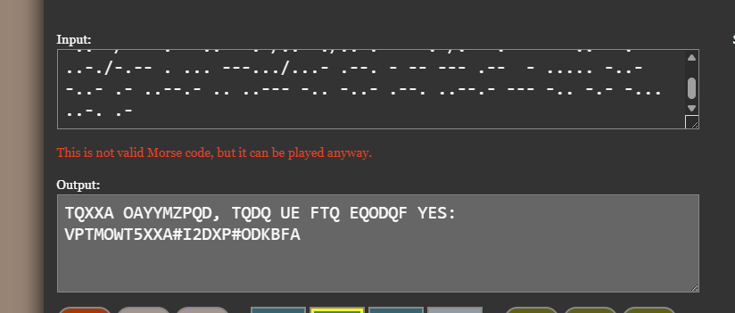
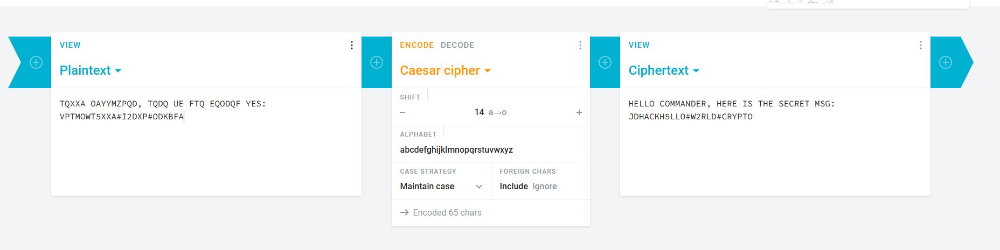

# Crypto
Mã morse dịch ra thành `TQXXA OAYYMZPQD, TQDQ UE FTQ EQODQF YES: VPTMOWT5XXA#I2DXP#ODKBFA`  
  

Trông có vẻ như mã caesar, đem kết quả vào caesar decipher, ta có kết quả `HELLO COMMANDER, HERE IS THE SECRET MSG: JDHACKH5LLO#W2RLD#CRYPTO`.  
  

