# T-rex Game (Web)
Đọc source-code, mình thấy trang web có đề cập đến robots.txt, thử truy cập xem sao.  
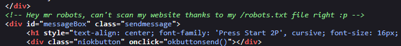 
`robtots.txt` sẽ có thêm đường dẫn nữa. Mình đã thử đi hướng này, nhưng chỉ là đánh lạc hướng.  

Chơi thử game, khi thua, trình duyệt gửi yêu cầu tới `/result` có tham số POST game là `fail`, thay đổi giá trị thành `win`.  
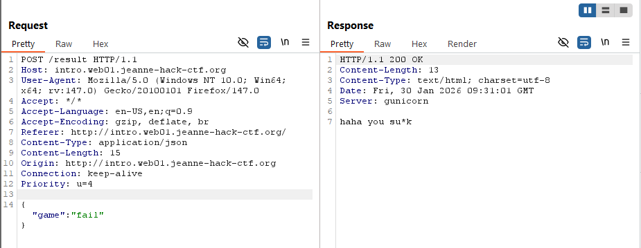  
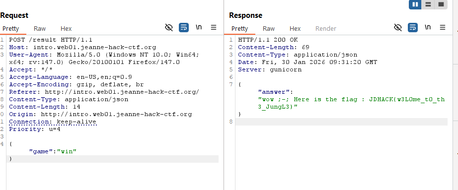   

**Flag JDHACK{w3L0me_t0_th3_JungL3}**

# No share (Web)
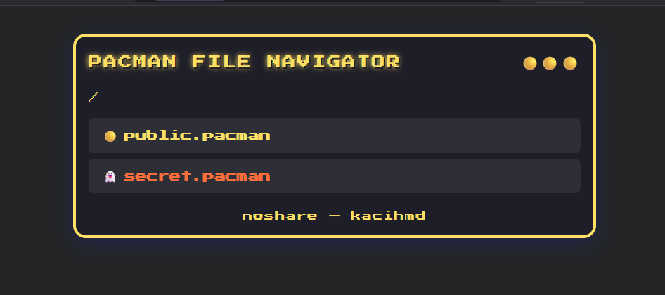 
Truy cập đường dẫn gốc, mình nhận được gói tin phản hồi có chứa thông tin IP, `public.pacman` sẽ có ip public còn `secret.pacman` sẽ có ip localhost.     
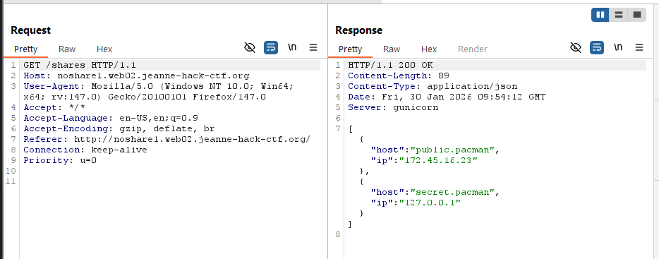  

Tìm được các endpoint
- `/api/folder?path=...&share=...`
- `/api/download?path=...&share=...`

Đề hint chức năng từ chối truy cập, trả về True False tùy vào chuỗi `secret.pacman` có tồn tại trong biến `share` hay không
```python
def deny(share):
    return 'secret.pacman' in share.lower()
```

Dựa vào hint, mình thử double URL encode dấu `.` trong chuỗi `secret.pacman`, kết quả là mình bypass thành công, đọc được nội dung thư mục. Payload `path=%2F&share=secret%25%32%65pacman`.  
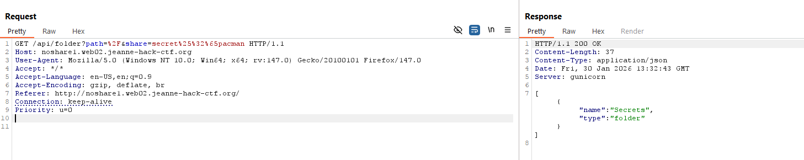  

Thay đổi biến path để xem nội dung thư mục. Sau một hồi, thì mình tìm được file `flag.txt`.  
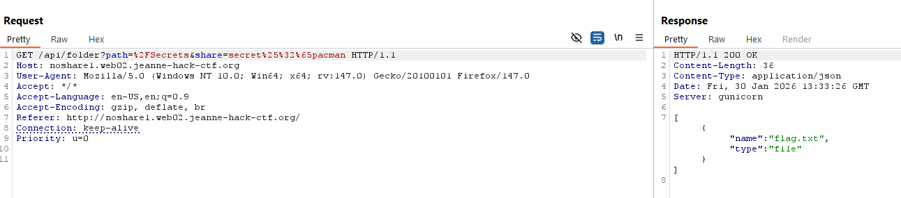  

Tới đây đổi thành endpoint `/api/download?path=...&share=...` để đọc file.  
Payload cuối cùng:
```
/api/download?path=%2FSecrets%2Fflag.txt&share=secret%25%32%65pacman
```

**Flag JDHACK{n0_sh4r3_4cc3ss_byp4ss3d}**  

# HTTP Methods Dungeon (Web)
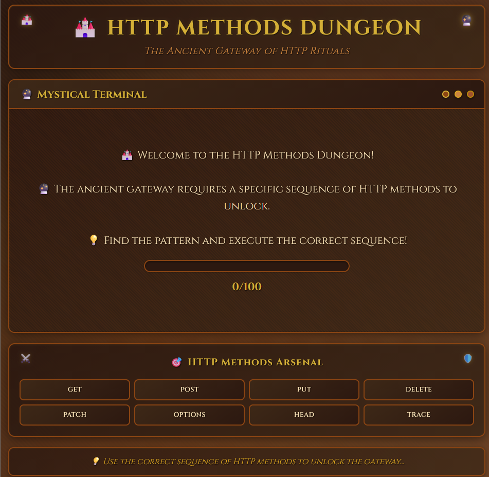 
Sau một hồi duyệt sơ thì mình không phát hiện được thêm endpoint nào. 

View page-source có đoạn code như sau. 
```js
document.querySelectorAll('.method-btn').forEach(btn => {
btn.addEventListener('click', function() {
    const method = this.dataset.method;
    fetch('/', {
        method: method,
        headers: {
            'Content-Type': 'application/json'
        }
    })
    .then(response => response.text())
    .then(html => {
        document.body.innerHTML = html;
    })
    .catch(error => {
        console.error('Error:', error);
    });
});
```
Đoạn code chỉ thêm event cho các button, khi nhấn sẽ gửi yêu cầu kèm với method trong mỗi button tới server để kiểm tra. 

Test từng method trên Burp thử, mình tìm được method chính xác đầu tiên là `TRACE`.  
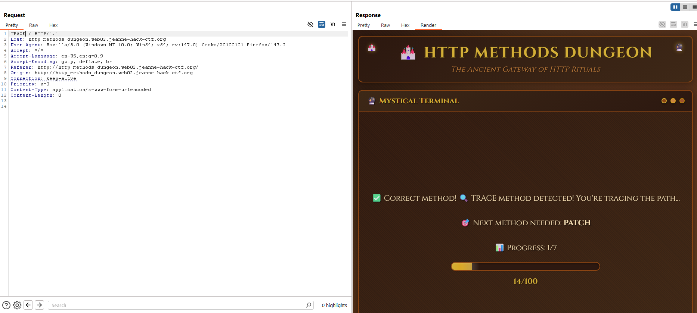  

Tiếp theo, server yêu cầu PATCH. Nếu sử dụng tiếp tục gói tin này để gửi, mình sẽ bị kẹt lại ở lv 1. Nên ta phải xài chức năng Request in Current Browser Session của Burp.  
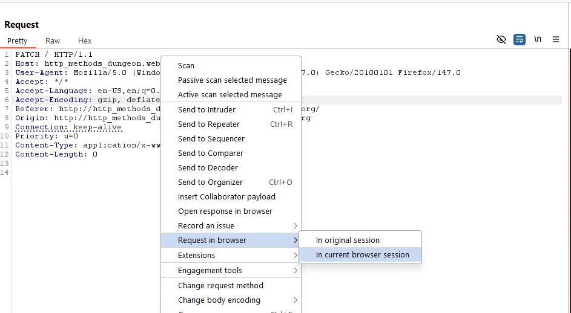  

Làm tương tự với các method được yêu cầu.  
Thứ tự: TRACE-PATCH-DELETE-OPTIONS-TRACE-PUT-PUT  

Cuối cùng, tìm được flag.  
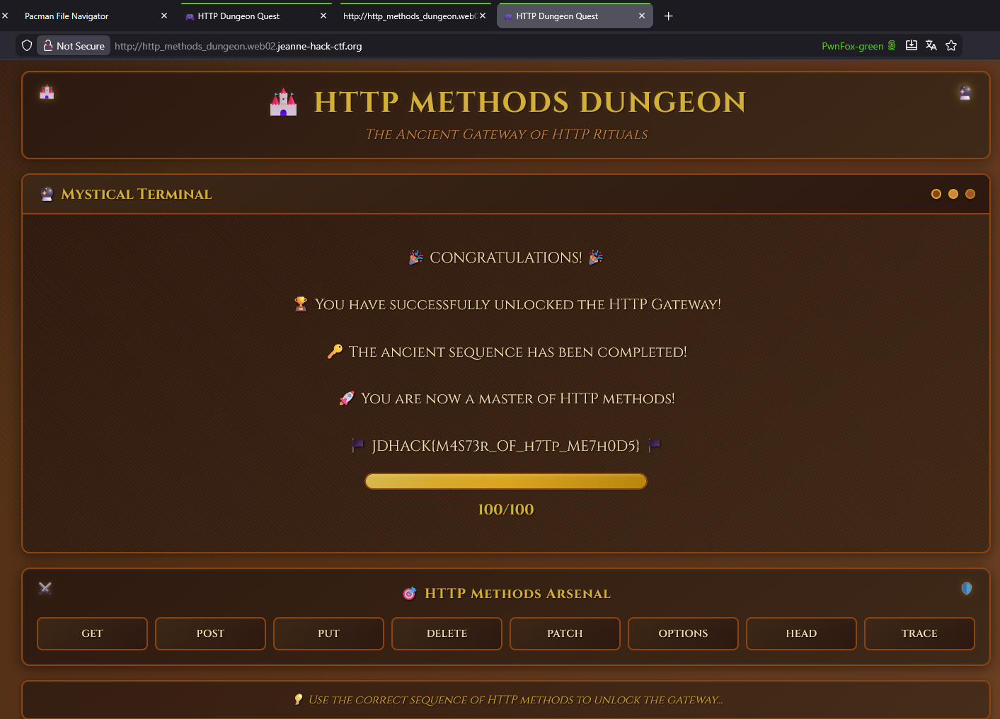  

**Flag JDHACK{M4S73r_OF_h7Tp_ME7h0D5}**

# Ocarina - Level 1 (Web)
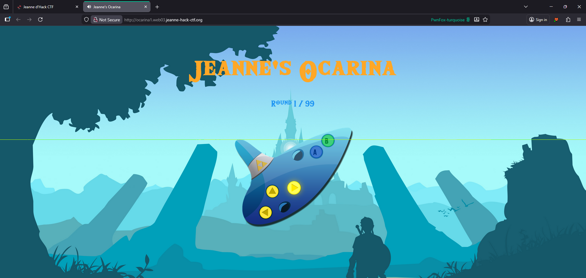  

Tìm được các endpoint sau:  
- `/set-name`

Xem source code, tìm được 2 file JS:  
- `preload.js`
- `game.js` 
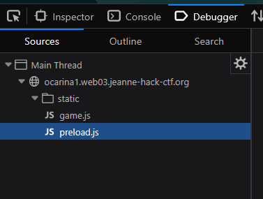  

File `game.js`  
Hàm `connect()` dòng 155 có định nghĩa cách thức qua màn.
```js
function connect() {
    ws = new WebSocket(`ws://${window.location.host}/ws`);
    
    ws.onmessage = function(event) {
        const data = JSON.parse(event.data);
        
        if (data.type === "sequence") {
            // Buffer or play the incoming sequence. Server sends next sequence immediately;
            // the client applies a 500ms inter-round delay before playing the next sequence.
            const incoming = { seq: data.data, round: data.round };
            if (delayBeforeNext) {
                // Store the sequence to play after the delay
                pendingSequence = incoming;
            } else {
                processSequence(incoming);
            }
        } else if (data.type === "timeout") {
            disableButtons();
            gameStarted = false;
            ws.close();
            showGameOverPopup("Time's up!");
        } else if (data.type === "gameover") {
            disableButtons();
            gameStarted = false;
            ws.close();
            showGameOverPopup("Wrong lullaby!");
        } else if (data.type === "result") {
            const result = data.data;
            // Verification is immediate; start the 500ms inter-round delay before playing next
            if (result.correct) {
                // start the small delay before playing any incoming sequence
                delayBeforeNext = true;
                if (playTimer) clearTimeout(playTimer);
                playTimer = setTimeout(() => {
                    delayBeforeNext = false;
                    if (pendingSequence) {
                        const p = pendingSequence;
                        pendingSequence = null;
                        processSequence(p);
                    }
                }, 1500);
            }
        }
    };
```
Đặc biệt là đoạn  
```js
else if (data.type === "result") {
            const result = data.data;
            // Verification is immediate; start the 500ms inter-round delay before playing next
            if (result.correct) {
                // start the small delay before playing any incoming sequence
                delayBeforeNext = true;
                if (playTimer) clearTimeout(playTimer);
                playTimer = setTimeout(() => {
                    delayBeforeNext = false;
                    if (pendingSequence) {
                        const p = pendingSequence;
                        pendingSequence = null;
                        processSequence(p);
                    }
                }, 1500);
            }
        }
```

JS này định nghĩa sẽ qua màn nếu `data.type === "result"`, reset lại các giá trị như timeout,... Ta cần chú ý thêm là mỗi khi qua màn, sẽ có delay `1500ms` của hàm `setTimout()`.  

Hàm `playNote()` ở dòng 277 sẽ là hàm xác thực chuỗi mà người chơi gửi có giống với chuỗi mà server tạo ra không.  
```js
function playNote(note) {
    // Play audio on every click
    const pa = (window.Preload && Preload.audioMap && Preload.audioMap[note]) ? Preload.audioMap[note] : null;
    if (pa) {
        try { pa.currentTime = 0; } catch(e){}
        pa.play().catch(err => console.warn('Playback failed for', note, err));
    }

    // Only record note in sequence if currently expecting player input
    if (!isPlaying) return;

    playerSequence.push(note);

    if (playerSequence.length === currentSequence.length) {
        // Send sequence to server for verification
        ws.send(JSON.stringify({ type: "verify", sequence: playerSequence }));
        isPlaying = false;
    }
}
```
Nếu người chơi nhập chiều dài chuỗi bằng với chiều dài của chuỗi server tạo ra sẽ tiến hành kiểm tra, bằng cách gửi WS `type: "verify", sequence: playerSequence`.   

Như mình thấy, chuỗi server tạo ra được lưu trong biến `currentSequence`. Vậy nếu mình gửi socket `type: "verify", sequence: currentSequence` thì sao.  
Mình có thể kiểm chứng điều này, trong lúc chơi, nếu mình nhập `currentSequence`, thì kết quả trả về là chuỗi để qua màn.  
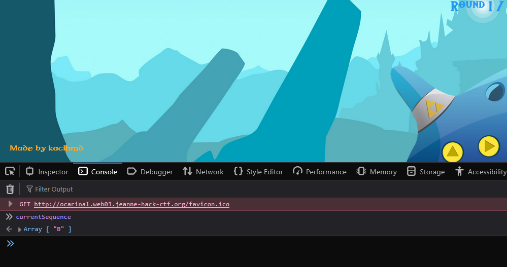  

Mình thử gửi payload trong devtool.  
```js
ws.send(JSON.stringify({
    type: "verify",
    sequence: currentSequence
}));
```

Gửi gói tin này sẽ lập tức cho ta qua màn, nhưng nếu gửi quá liên tục sẽ thua, do có delay 1500ms đã đề cập ở trên.  
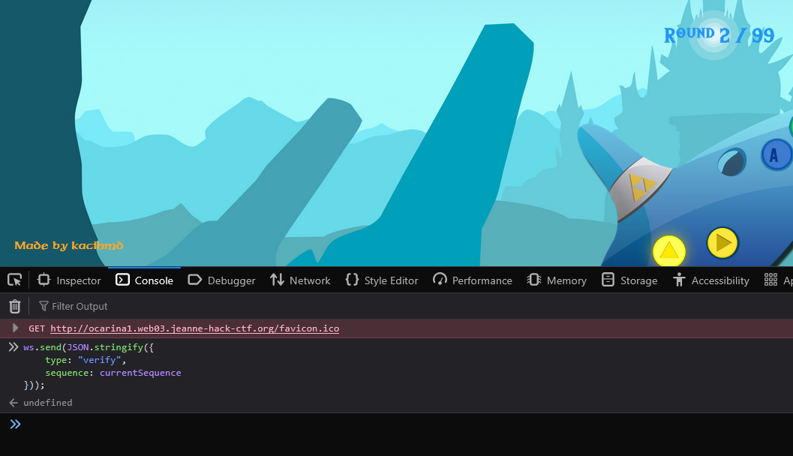  

Vì JS không có hàm 
```js
async function runLoop() {
    for (let i = 0; i < 100; i++) {
        ws.send(JSON.stringify({
            type: "verify",
            sequence: currentSequence
        }));
	await new Promise(resolve => {
        setTimeout(resolve,2000)
    });
    }
}
runLoop();
```

Mình loop được tới round 99 nhưng không có flag hiện ra nên tạm thời bỏ qua.  

# No share - level 2 (Web)
Hint: 
```python
def deny(share):
    return 'secret.pacman' in share.lower() or 'localhost' in share or '1' in share or ':' in share
```

