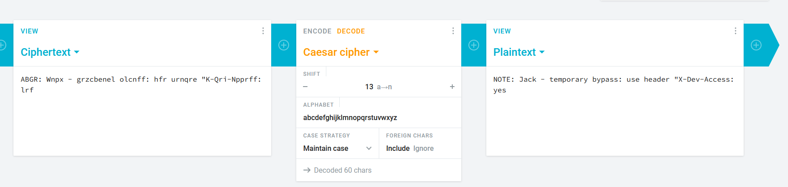
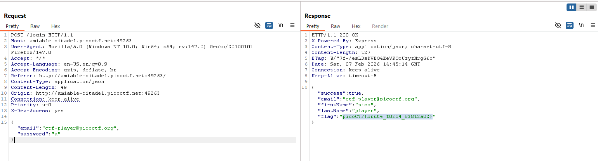

# Crack the Gate 1
Thử SQLi không hiệu quả, chuyển qua đọc thử source-code, mình tìm thấy đoạn comment khả nghi.  
```html
<!-- ABGR: Wnpx - grzcbenel olcnff: hfr urnqre "K-Qri-Npprff: lrf" -->
<!-- Remove before pushing to production! -->   
```

Trông như mã hóa Caesar, giải mã với shift = 13, tìm được thông điệp `NOTE: Jack - temporary bypass: use header "X-Dev-Access: yes`  
  

Thêm header lấy được flag.  
  
picoCTF{brut4_f0rc4_83812a02}
