## Old Sessions
### Analysis
Đề hint bug có thể nằm ở quản lý phiên đăng nhập.

Trước hết, mình thực hiện đăng nhập test các chức năng của trang web.  
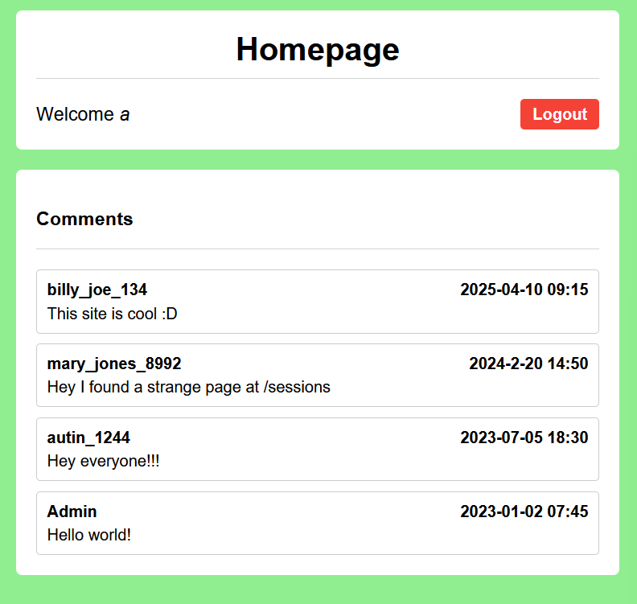   
Sau khi đăng nhập thành công, mình phát hiện hint đường dẫn mới.  
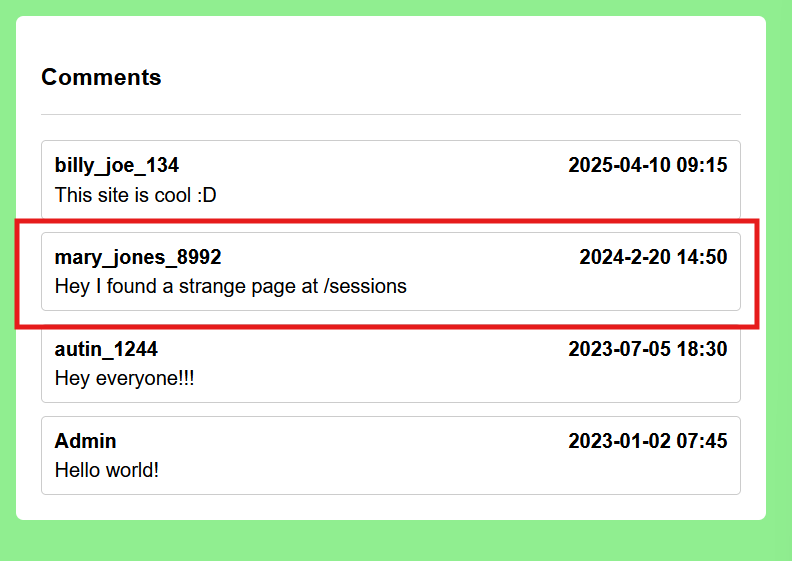  
Truy cập vào endpoint này, mình tìm được token của admin, key này được note là `permanent`. Vậy sẽ ra sao nếu mình thay `session cookie`?  
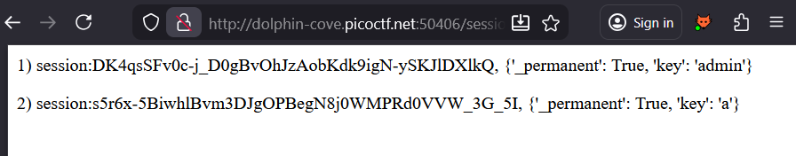  

### POC
- Đăng nhập vào 1 user mình tạo
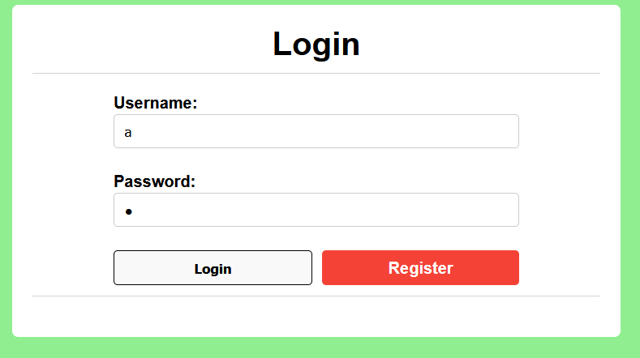  

- Truy cập `/sessions`
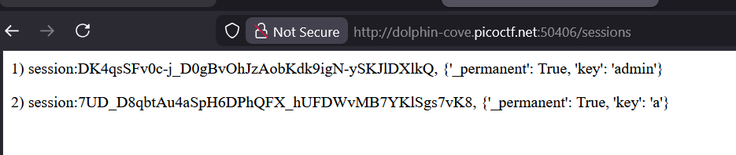

- Thay đổi `session cookie`
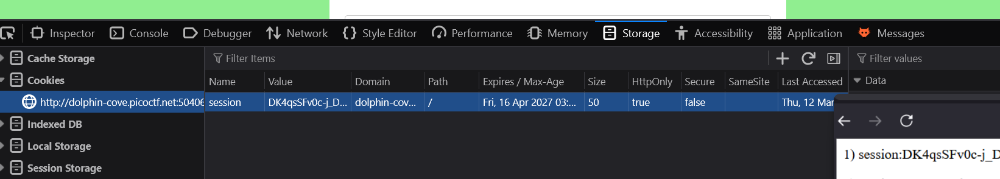

- Đăng nhập thành công user `admin` lấy được flag
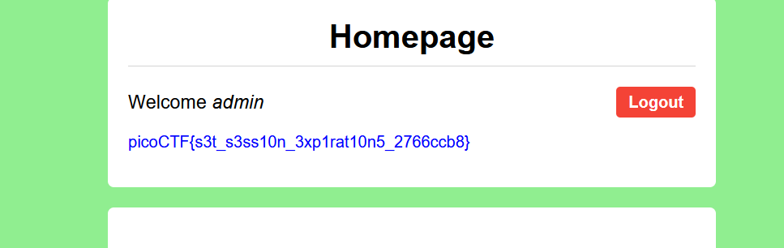

## Hashgate
### Analysis
Khi đăng nhập với thông tin đăng nhập guest, view page-source để tìm được thông tin đăng nhập.

Đăng nhập thành công, trang web show mình UID của user hiện tại.

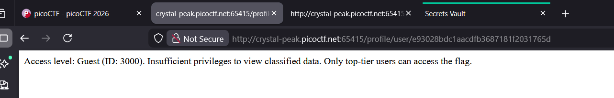

Tuy nhiên, mình để ý là UID hiện tại `3000` sẽ có giá trị md5 là `e93028bdc1aacdfb3687181f2031765d` và giá trị này nằm ở URL.

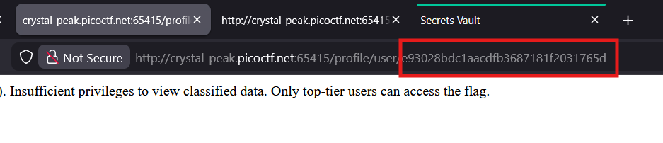

Vậy có nghĩa là đây có thể là hash md5 của id người dùng, sẽ ra sao nếu ta brute-force tìm id chính xác của admin?

### POC
- Truy cập trang web với credentials của guest.

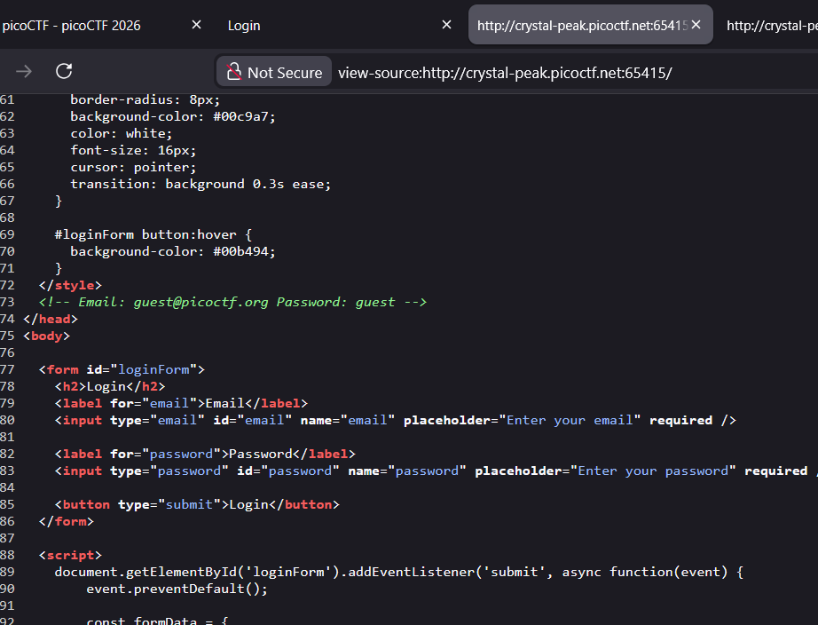

- Sử dụng script python để bruteforce id của admin, lấy được flag.

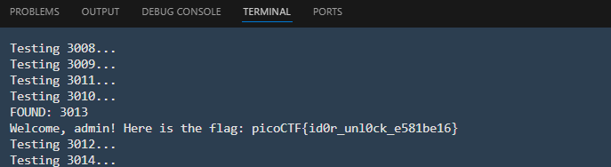

## Secret Vault
### Analysis
Từ source-code, đây là một trang js và sử dụng truy vấn postgre SQL để quản lý đăng 
nhập cũng như thêm xóa bài đăng trên trang cá nhân.

Câu truy vấn ở dòng 132 truyền thẳng `userID` và `content` vào truy vấn mà không sàng lọc, dẫn đến khả năng lỗi SQLi tại endpoint `/secrets/create`.

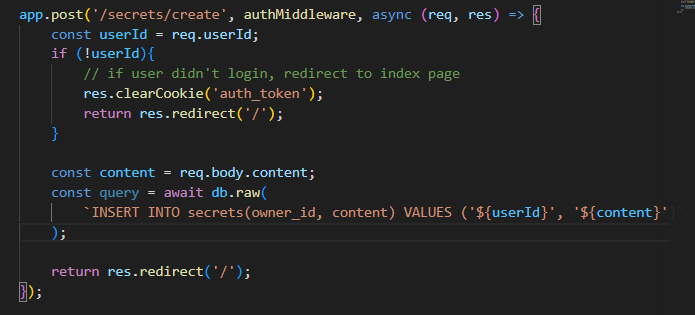

Gói tin cho mình thông tin chỉ có thể khai thác với `content`.

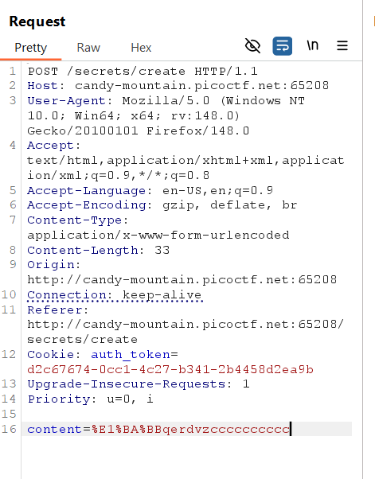

Mình thử gửi payload `a')%3bSELECT+pg_sleep(10)--` chứng minh SQL Injection thành công.

Table lưu người dùng sẽ là `users`.

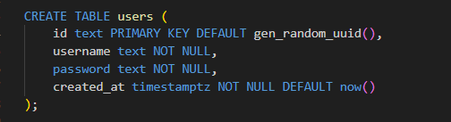

Vậy sẽ ra sao nếu mình sử dụng SQLi để thay đổi password user admin, lấy quyền truy cập?

### POC
- Tạo tài khoản và đăng nhập

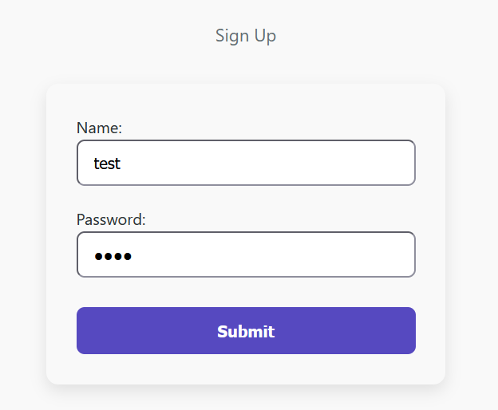

- Gửi secret và bắt gói tin đó

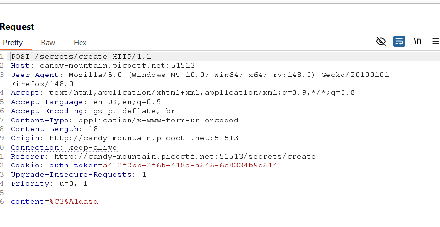

- Thay đổi giá trị content thành payload `a')%3bUPDATE+users+SET+password+%3d'1'+WHERE+username%3d'admin'--`, đổi password `admin` thành 1

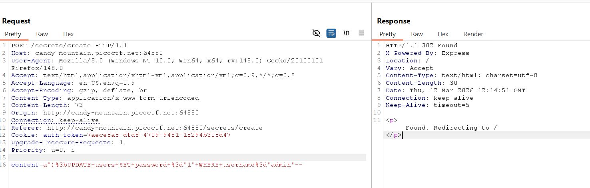

- Đăng nhập user admin, tìm được flag

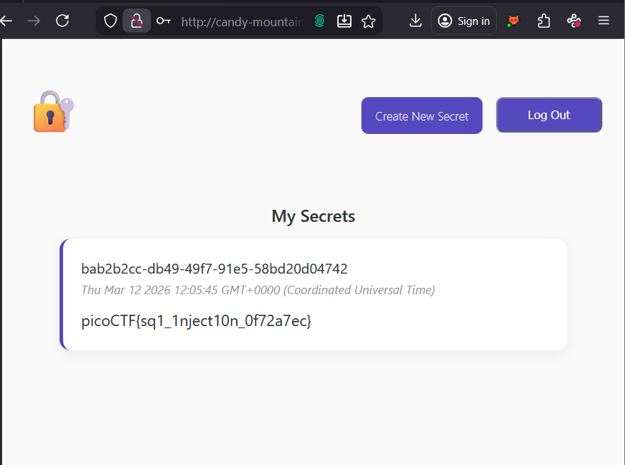

## Fool the Lockout
### Analysis

### POC