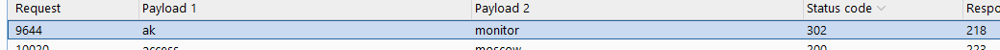
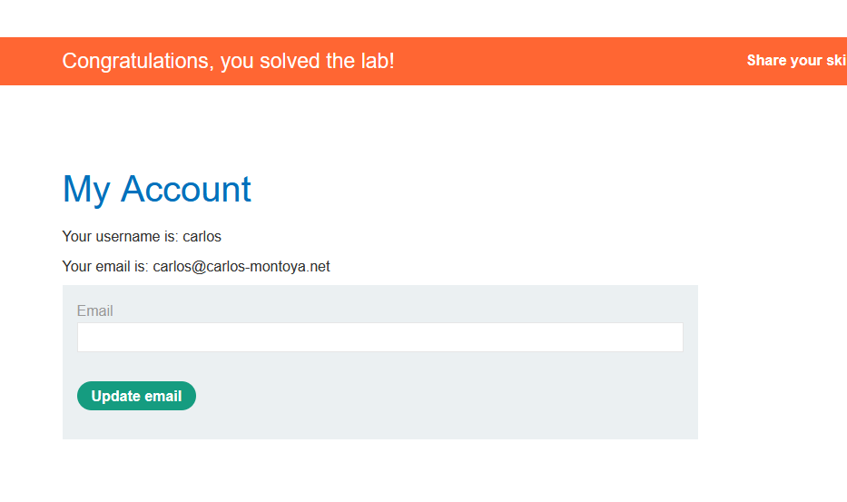

# Username enumeration via different responses
Lab bị lỗi cho phép bruteforce `username` và `password`.  

Sử dụng burp intruder để tấn công với option `cluster bomb`.  

Trong quá trình bruteforce, mình phát hiện có gói tin gửi là `Incorrect password` và `Invalid username`. Lọc các gói tin có phản hồi là `Incorrect password`, mình phát hiện chỉ `ak` là có phản hồi này.  

Lọc các gói tin có `ak`, mình tìm được gói tin status code khác `302`.  
  

username=ak password=monitor

# 2FA simple bypass
Lab này có thể bypass được xác thực 2 yếu tố. Yêu cầu đăng nhập vào tài khoản `carlos`.  

Từ nội dung của đề, mình đoán trang bị lỗi có thể chuyển trang mà không cần nhập mã xác thực, do chương trình bị nhầm lẫn trong quá trình xác thực đăng nhập và xác thực OTP.  

Đăng nhập vào `carlos`, sau đó đổi đường dẫn sang `my-account`.  
  

# Password reset broken logic
Đổi password `carlos` và đăng nhập để giải lab.  

