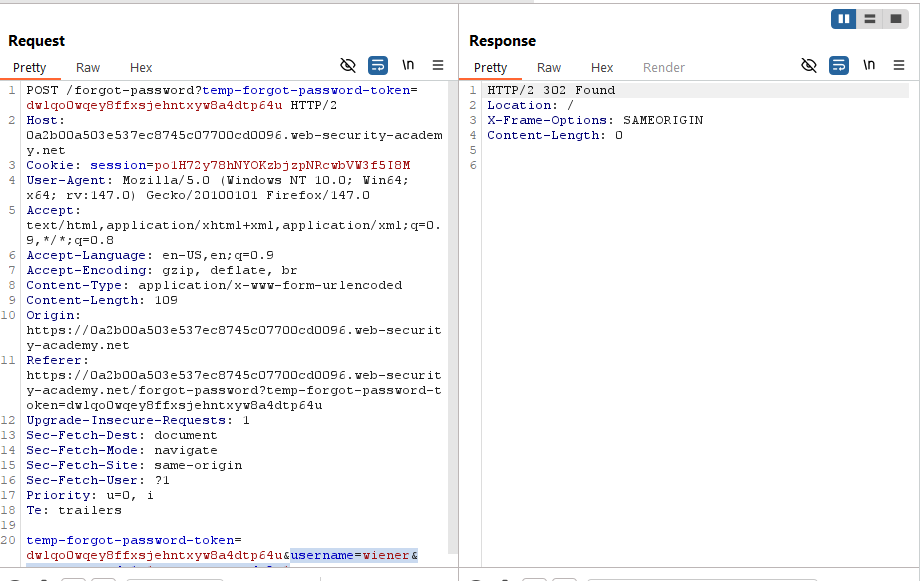
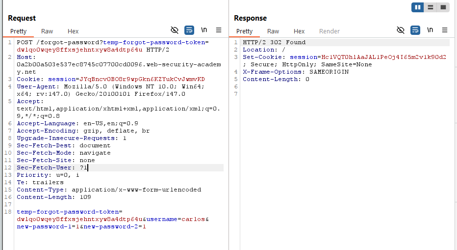
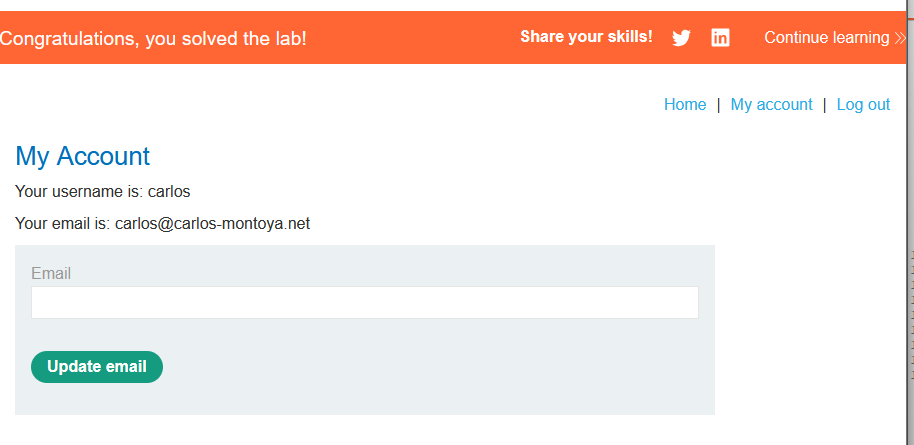
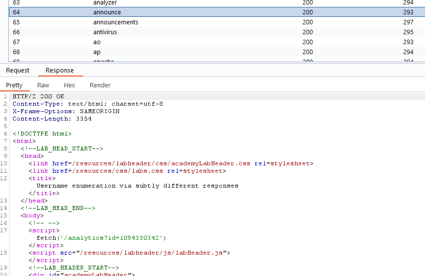
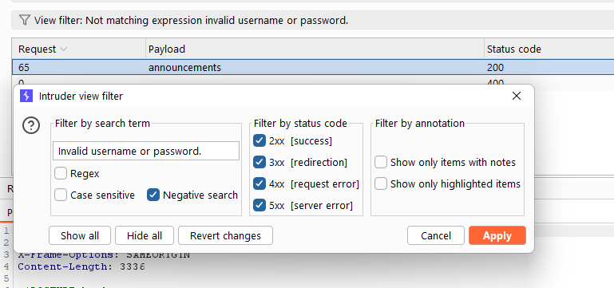
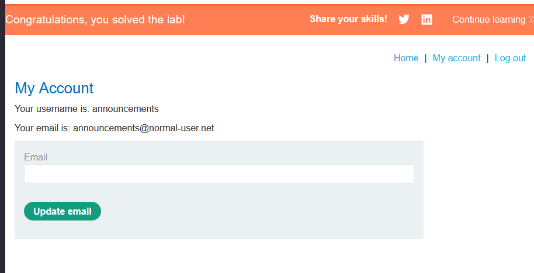

# Username enumeration via different responses
Lab bị lỗi cho phép bruteforce `username` và `password`.  

Sử dụng burp intruder để tấn công với option `cluster bomb`.  

Trong quá trình bruteforce, mình phát hiện có gói tin gửi là `Incorrect password` và `Invalid username`. Lọc các gói tin có phản hồi là `Incorrect password`, mình phát hiện chỉ `ak` là có phản hồi này.  

Lọc các gói tin có `ak`, mình tìm được gói tin status code khác `302`.  
  

username=ak password=monitor

# 2FA simple bypass
Lab này có thể bypass được xác thực 2 yếu tố. Yêu cầu đăng nhập vào tài khoản `carlos`.  

Từ nội dung của đề, mình đoán trang bị lỗi có thể chuyển trang mà không cần nhập mã xác thực, do chương trình bị nhầm lẫn trong quá trình xác thực đăng nhập và xác thực OTP.  

Đăng nhập vào `carlos`, sau đó đổi đường dẫn sang `my-account`.  
  

# Password reset broken logic
Đổi password `carlos` và đăng nhập vào user để giải lab.  

Sau khi thử chức năng quên mật khẩu với user được cấp `wiener`, server sẽ gửi mail có đường link xác nhận thay đổi mật khẩu, người dùng click đường link và nhập mật khẩu mới.  

Server gửi gói tin tới endpoint `forgot-password` yêu cầu thay đổi mật khẩu.  
  

Vậy sẽ ra sao nếu mình gửi gói tin tương tự nhưng đổi `username` thành `carlos`?  
  
 
Có vẻ như server không kiểm tra lại token, dẫn đến khai thác thành công.  
  

# Username enumeration via subtly different responses
Tìm username và password hợp lệ.  

Brute-force với wordlist được cung cấp, các gói tin giống nhau, chỉ khác tham số `GET id` tại endpoint `/analytics`.
  

Các id này được tạo ngẫu nhiên với cùng username và password, đồng thời khi truy cập trên trình duyệt thì trả về rỗng.  

Hướng khai thác khác, đề hint là sự khác biệt rất nhỏ, có thể tham số `GET id` tại endpoint `/analytics` nhằm đánh lạc hướng.  
Check thêm hint thì biết được sự khác biệt nằm ở thông báo `Invalid username or password.`, sử dụng `negative search`, tìm được username chính xác là `announcements`.  
  

Brute-force sử dụng `negative search` tìm được password là `daniel`.  
  

# Username enumeration via response timing
Sự khác biệt nằm ở thời gian phản hồi.  

Ý tưởng sử dụng python script để làm. 