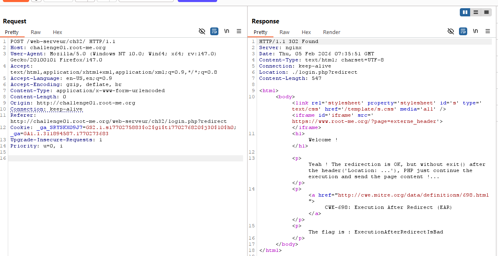
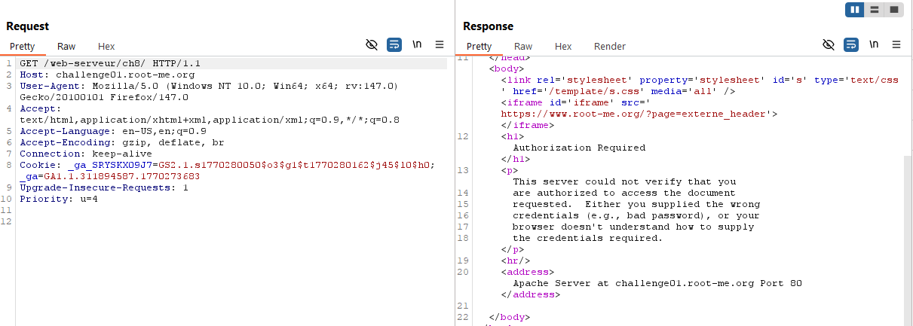
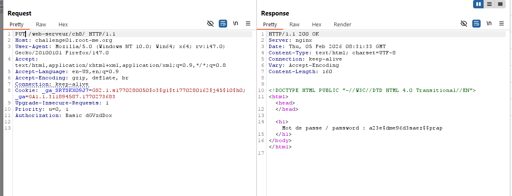
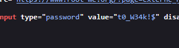
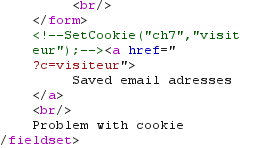

# HTTP - Improper redirect
Sử dụng burpsuite gửi gói tin tới `/` như sau.  
  
Flag **ExecutionAfterRedirectIsBad**

# HTTP - Verb tampering
Mình thử chọn cancel để check source code xem sao, nhưng có vẻ không có manh mối.  
  

Đọc tài liệu thì mình hiểu rằng, HTTP authorize này nó BASE64 thông tin đăng nhập, nhưng có vẻ không có cách nào để lừa trang web trả về đăng nhập người dùng hợp lệ.  

Đọc kỹ lại đề `Verb Tampering`, mình thử thay đổi method yêu cầu xem sao.  
 

FLAG **a23e$dme96d3saez$$prap**

# SQL injection - Authentication
Đề yêu cầu lấy password admin, nên mình đoán username có thể là `admin/administrator/root`.  

Sau một hồi thử injection với `'#`, `"#`,... thì chuỗi cho phép khai thác SQLi là `'--`.
```
admin'--
1
```
Sau đó view page source để lấy password bị ẩn.  
  
FLAG **t0_W34k!$**

# HTTP - Cookies
Kiểm tra source code, tìm được đoạn comment.  


Check thử cookie trong gói tin