# Shadow Fight 
Hint bị lỗi XSS  
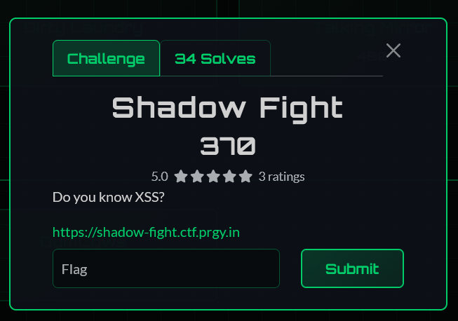  

Test thử `<script>alert(1)</script>` ở trường name thì nhận lỗi.  
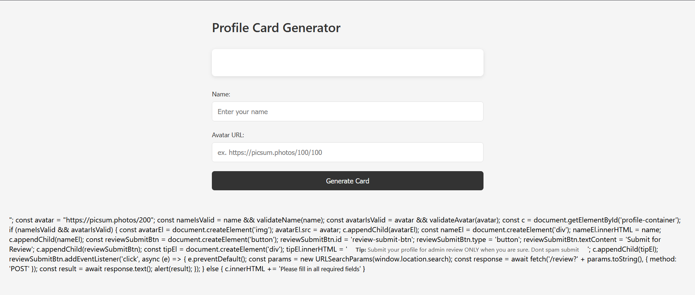  

View page source code, mình phát hiện frontend có JS xử lý khi nhập thông tin.  
**Phân tích code**  
```js
    // Biến name lưu giá trị ta nhập vào
    const name = "<h1>test</h1>";
    const avatar = "https://picsum.photos/200";
    // name và avatar sẽ được validate
    const nameIsValid = name && validateName(name);
    const avatarIsValid = avatar && validateAvatar(avatar);
    const c = document.getElementById('profile-container');
```
Tên và đường dẫn mình nhập vào được truyền và validate lại. Tuy nhiên, nội dung truyền vào lại không mã hóa mà truyền thẳng vào. Mình sử dụng  payload `a"; alert(1);//` có thể thoát khỏi dòng `name`.  
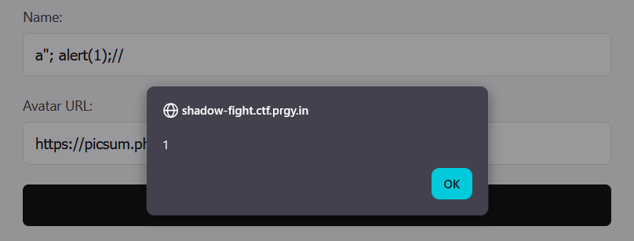  

```js
    if (nameIsValid && avatarIsValid) {
    ...
      // Khi submit for review thì gửi POST request đến /review với param trên URL
      reviewSubmitBtn.addEventListener('click', async (e) => {
        e.preventDefault();
        const params = new URLSearchParams(window.location.search);

        const response = await fetch('/review?' + params.toString(), {
          method: 'POST'
        });

        const result = await response.text();
        alert(result);
      });
    } else {
      c.innerHTML += '<small>Please fill in all required fields</small>'
    }
```

Nếu validate hợp lệ, web sẽ tạo một user card ở trên, đồng thời có thêm chức năng `submit to admin`. Khi chọn, web sẽ gửi một `POST request` chứa các tham số có trên đường dẫn.  

```js
      (function() {
        const container = document.createElement('div');
        container.id = 'secret';
        const shadow = container.attachShadow({ mode: 'closed' });
        shadow.innerHTML = '<p style="opacity: 0;">p_ctf{redacted-no-admin}</div>';
        document.querySelector('.card').appendChild(container);
      })();
```

Đoạn JS này nhằm tạo một element `secret` bên dưới profile card của user, trong nội dung có chuỗi `p_ctf{redacted-no-admin}` là fake flag. Flag này được bọc trong `shadow closed`, không truy cập được bằng JS. Nội dung fake flag có `no-admin`, phải lấy real flag từ admin panel.    

Luồng hoạt động `Điền form` -> `Tạo ele secret` -> `Lưu vào biến và validate` -> `Hiển thị card` -> `Submit gửi cho admin`.  


# Server OC 
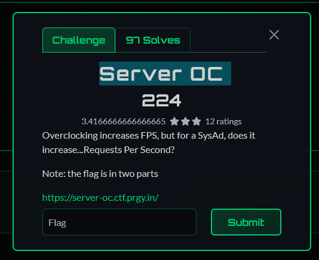

Đề hint `Request Per Second`, nên mình thử gửi yêu cầu thật nhanh để xem thử phản hồi của trang web.  
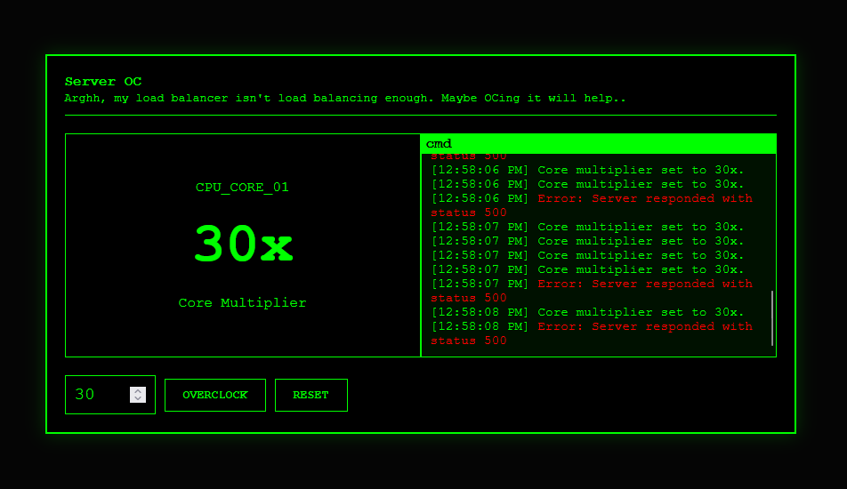  

Kiểm tra page source, mình tìm được 2 endpoint chưa không có trong chức năng là:
- `/leConfig`
- `/api/benchmark/url`

Truy cập `/api/benchmark/url` mình có thêm đường dẫn mới `/benchmark?url=http://localhost:3001/benchmark?internal=flag`  
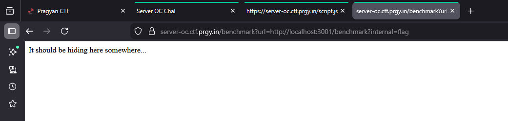  

Mình quay lại đường dẫn hiển thị ở api `/api/benchmark/url`.
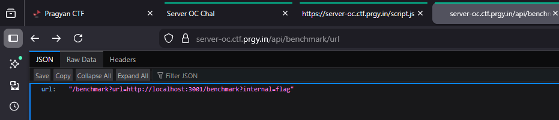  
```
url	"/benchmark?url=http://localhost:3001/benchmark?internal=flag"
```

Dựa vào cấu trúc đường dẫn của `localhost`, mình đoán trang hiện tại cũng có endpoint `/benchmark?internal=flag` tương tự.
```
https://server-oc.ctf.prgy.in/benchmark?internal=flag
```
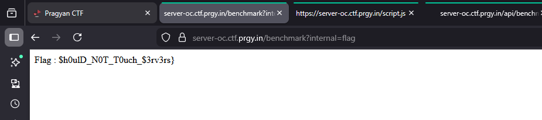

Tìm được nửa flag sau `$h0ulD_N0T_T0uch_$3rv3rs}`

Mình brute-force và tìm được hệ số `x76` phù hợp.  
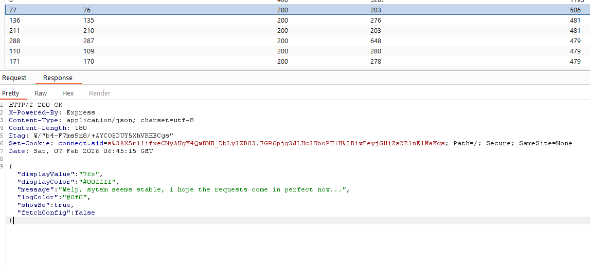  
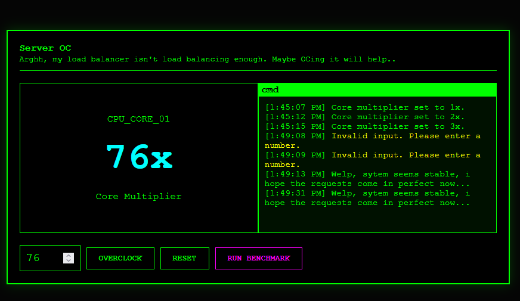  

Trang web hiện thêm tùy chọn `Run Benchmark`.  

Lưu ý thêm là giá trị 56-75 sẽ hiện là unstable OC.  
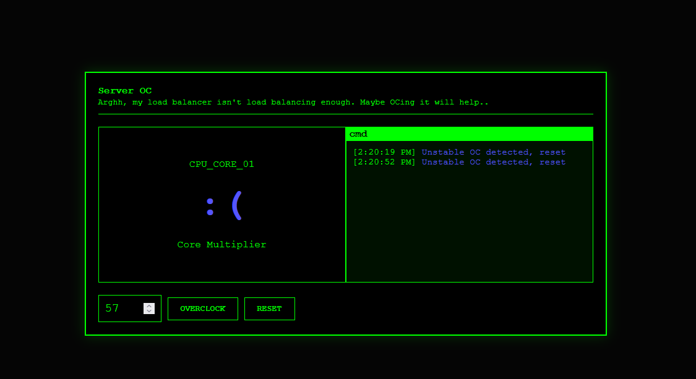

# Note Keeper 
