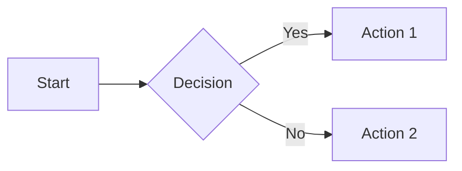

# Markdown — Template tổng hợp và ví dụ

Tệp này là một template tham khảo chứa hầu hết cú pháp Markdown (GFM + một số phần mở rộng phổ biến) cùng ví dụ cách dùng.

---

## Mục lục
1. [Tiêu đề](#tiêu-đề)
2. [Định dạng văn bản](#định-dạng-văn-bản)
3. [Danh sách](#danh-sách)
4. [Trích dẫn](#trích-dẫn)
5. [Mã nguồn](#mã-nguồn)
6. [Bảng](#bảng)
7. [Liên kết & Hình ảnh](#liên-kết--hình-ảnh)
8. [Ghi chú chân (Footnotes)](#ghi-chú-chân-footnotes)
9. [Task list & Kiểm tra](#task-list--kiểm-tra)
10. [Khác (HTML, YAML, math, mermaid)](#khác-html-yaml-math-mermaid)

---

## Tiêu đề
# Tiêu đề cấp 1
## Tiêu đề cấp 2
### Tiêu đề cấp 3
#### Tiêu đề cấp 4
##### Tiêu đề cấp 5
###### Tiêu đề cấp 6

---

## Định dạng văn bản
- In đậm: **Đây là chữ in đậm**
- In nghiêng: *Đây là chữ in nghiêng*
- Gạch ngang: ~~Đây là chữ gạch ngang~~
- Kết hợp: **_Đậm và nghiêng_**
- Ngắt dòng cứng (line break): kết thúc dòng bằng hai khoảng trắng + Enter  
  Dòng này là dòng tiếp theo (ngắt dòng cứng).

- Escape ký tự đặc biệt: \*not italic\*

---

## Danh sách
Unordered:
- Mục 1
- Mục 2
  - Mục con
  - Mục con 2

Ordered:
1. Bước 1
2. Bước 2
   1. Bước 2.1
   2. Bước 2.2

Nested mixed:
- Mục A
  1. 1.1
  2. 1.2

---

## Trích dẫn
> Đây là một blockquote.
>
> Có thể có nhiều dòng.

Nhiều cấp:
> Cấp 1
>> Cấp 2

---

## Mã nguồn
Inline code: `const x = 1`

Fenced code block (với highlight):
```javascript
// Ví dụ JavaScript
function hello(name) {
    return `Hello, ${name}!`;
}
console.log(hello("World"));
```

Fenced code block (Python):
```python
# Ví dụ Python
def add(a, b):
    return a + b
```

Shell / Terminal:
```bash
# Chạy lệnh trên Windows (PowerShell) hoặc bash
echo "Hello"
```

Blok code không highlight:
```
Plain text block
Line 2
```

Ghi chú: Đánh số dòng hoặc chú thích phụ thuộc trình render.

---

## Bảng
| Cột trái    | Cột giữa     | Cột phải |
|:----------- |:------------:| -------:|
| Text        | Centered     | Right   |
| Dữ liệu 1   | Dữ liệu 2    | 123     |

Ghi chú: Một số renderer hỗ trợ thay đổi chiều rộng, rowspan/colspan không có trong Markdown chuẩn.

---

## Liên kết & Hình ảnh
Liên kết inline: [GitHub](https://github.com)

Liên kết tham khảo:
[example-ref]: https://example.com "Example site"
Sử dụng tham khảo: [Example][example-ref]

Tự động link: https://example.com

Hình ảnh:
Inline: 

Tham khảo hình ảnh:
![Placeholder][img-ref]

[img-ref]: https://via.placeholder.com/100

---

## Ghi chú chân (Footnotes)
Được hỗ trợ bởi một số renderer:
Đây là một câu có chú thích.[^1]

[^1]: Đây là nội dung chú thích. Có thể nhiều dòng.

---

## Task list & Kiểm tra
- [x] Hoàn thành mục 1
- [ ] Viết template
- [ ] Kiểm tra lại

(GFM task lists hiển thị checkbox tương tác trên GitHub)

---

## HTML trong Markdown
Sử dụng thẻ HTML nếu cần:
<div style="background:#f6f8fa;padding:6px;border-radius:4px;">
  Đây là một box nhỏ với HTML.
</div>

<!-- Comment: bình luận ẩn trong Markdown -->

---

## Chimera: YAML front matter (dành cho static site generators)
---
title: "Tiêu đề trang"
date: 2025-11-03
tags:
  - markdown
  - template
---

---

## Toàn văn bản toán học (LaTeX) — tùy renderer
Inline: Euler's identity: $e^{i\pi} + 1 = 0$  
Block:
$$
\int_{0}^{\infty} e^{-x} \, dx = 1
$$

---

## Mermaid (lưu ý: phải bật hỗ trợ mermaid)


---

## Details / Summary (HTML)
<details>
  <summary>Nhấn để xem chi tiết</summary>
  
  Nội dung ẩn. Có thể chứa Markdown.
  
</details>

---

## Các mẹo & phím tắt
- Dùng `Ctrl+K Ctrl+C` / `Ctrl+K Ctrl+U` để comment/uncomment (VS Code).
- Dùng preview (VS Code: Ctrl+Shift+V) để xem kết quả.
- Kiểm tra renderer (GitHub, GitLab, MkDocs, Hugo) vì mỗi nơi có khác biệt nhỏ.

---

## Checklist nhanh các cú pháp thường dùng
- [x] Headings: # ...
- [x] Bold/Italic: **, *
- [x] Lists: -, *, +, số
- [x] Code: `inline` / ```fenced```
- [x] Tables: |...|
- [x] Links & Images
- [x] Blockquote: >
- [x] Task list: - [ ]
- [x] Footnotes: [^x]
- [x] HTML & YAML front matter
- [x] Mermaid & Math (nếu renderer hỗ trợ)

---

Nếu muốn, có thể cập nhật template này theo renderer mục tiêu (GitHub/GitLab/Markdown Extra/MkDocs/Hugo) để bật các phần mở rộng cần thiết.
