[Flag1](#flag-1)  
[Flag2](#flag-2)  
[Flag3](#flag-3)  
[Flag4](#flag-4)  

# Chức năng chính
Trang web là cho phép người dùng chơi rắn săn mồi, chat box đăng tải bình luận và gửi ý kiến phản hồi.

## 1. Trò chơi rắn săn mồi
Yêu cầu người dùng nhập tên để chơi, kết quả sẽ được lưu vào bảng xếp hạng bên cạnh
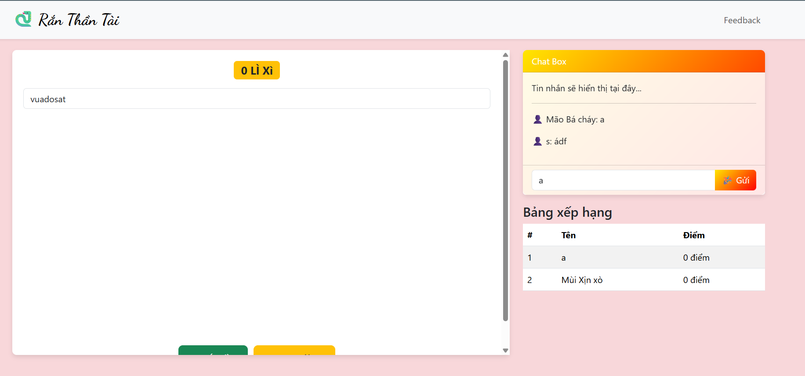
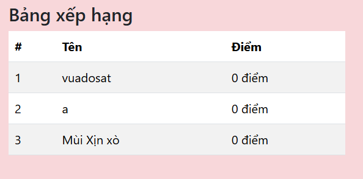

## 2. Chat box đăng tải bình luận

Cho phép người dùng đăng tải bình luận

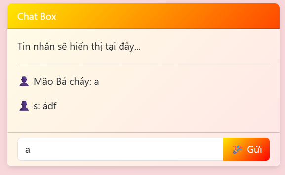


## 3. Gửi ý kiến phản hồi

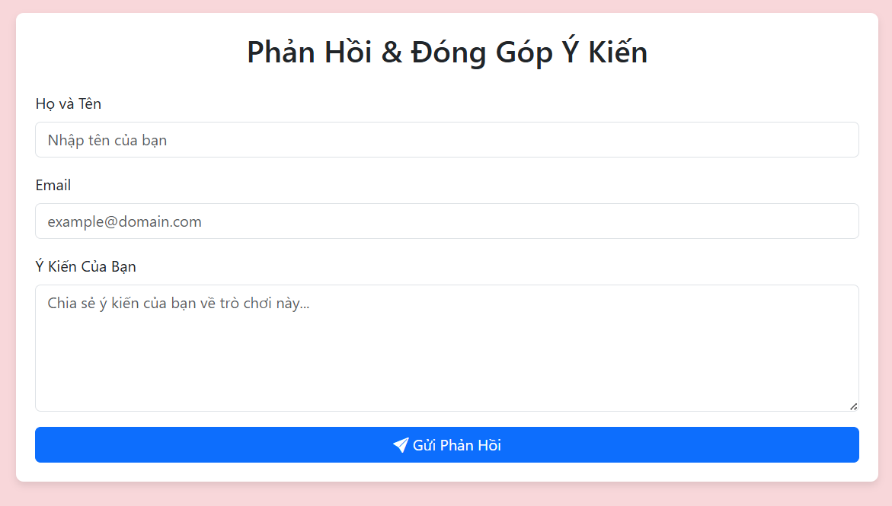

# Kiểm thử

## Lỗi HTML injection trong phần lưu tên bảng xếp hạng
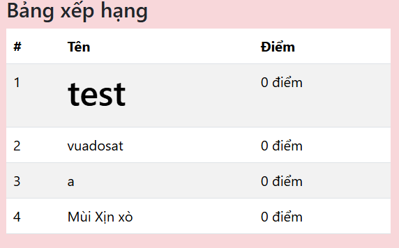

## Thông tin trong robots.txt
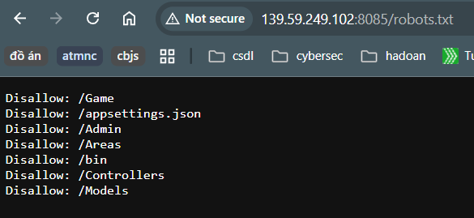

## Directory đáng nghi `/Admin/EditBackground`
Tìm được comment đáng nghi trong code fe  
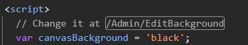

## Phát hiện các đường dẫn trong robots.txt
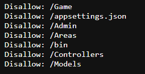  
>/Game  
/appsettings.json  
/Admin  
/Areas  
/bin  
/Controllers  
/Models  

## Phát hiện đường dẫn `/Game/Feedback/Submit` trong phần comment trang `/Feedback`
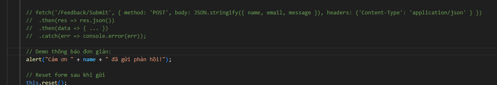  
Lệnh `fetch()` thực hiện gửi một yêu cầu HTTP Post có dạng
```
POST /Game/Feedback/Submit HTTP/1.1
Host: 139.59.249.102:8085
Content-Type: application/json
Accept: application/json
Content-Length: 57

{"name":"test","email":"test@gmail.com","message":"asdf"}
```

## Truy cập đến một đường dẫn không tồn tại `/black`
Khi load trang `/Game` sẽ truy cập đến một đường dẫn không tồn tại `/black`

# Tìm flag
## Flag 1
Những thông tin cần lưu ý trong `/Admin/EditBackground`  
- **Thẻ `<form>`**  
`<form method="post" asp-controller="Admin" asp-action="EditBackground">`  
- **Thẻ `<input>`**  
`<input class="form-check-input" type="radio" name="selectedBackground" id="bg_3.png" value="3.png"  />`

Dựa vào 2 thẻ trên, gói tin request sẽ có giao thức POST với tham số selectedBackground, giá trị biến có thể là 3.png hoặc bg_3.png
Nếu thực hiện thành công thì background của trò chơi sẽ thay đổi.  
Chỉnh gói tin từ GET sang POST và thêm tham số `selectedBackground`
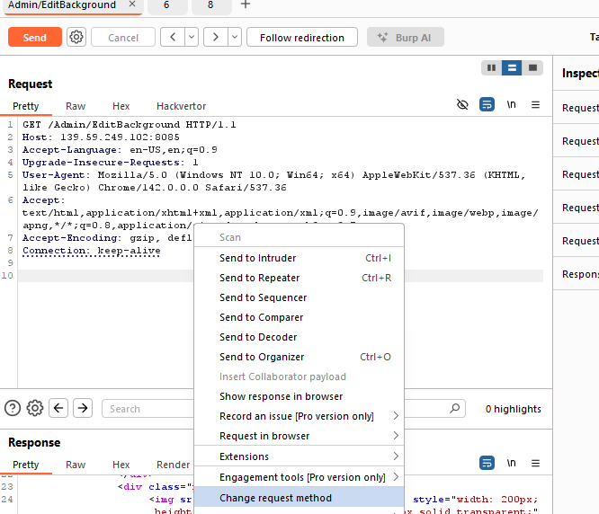  
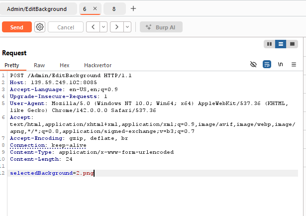  

Trả về mục review bị lỗi  
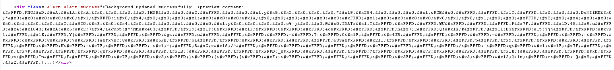

Đồng thời background trò chơi cũng bị thay đổi  
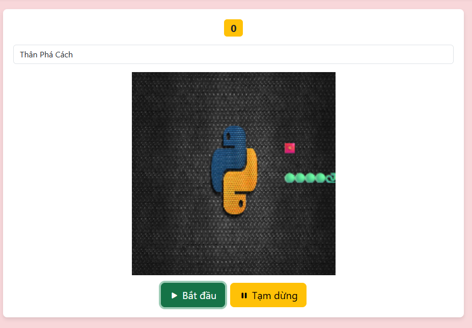

Tham số mà biến nhận vào là đường dẫn, phần preview sẽ đọc và trả kết quả file, phần lỗi có thể là do định file là ảnh --> Có thể bị Path Traversal.  
Thử đổi thành `./3.png` trả về kết quả tương tự với `3.png`

Xác định có lỗi Path Traversal, nhập payload `/tmp/FLAG_WEB`
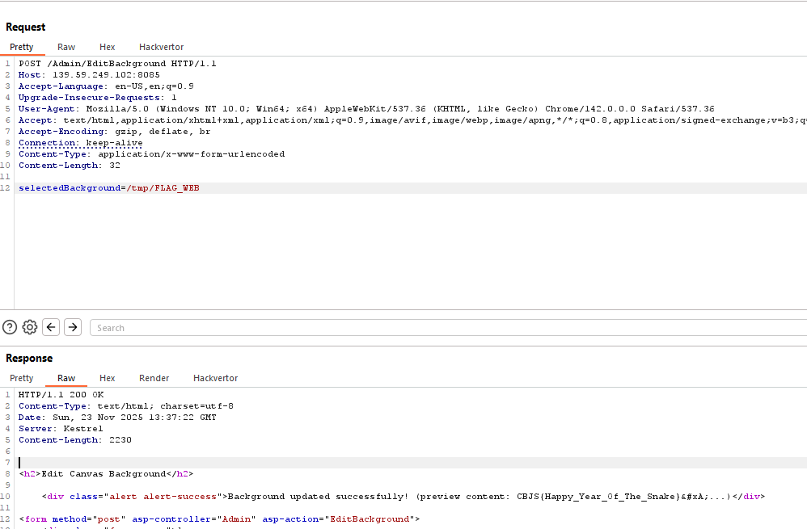

**FLAG** CBJS{Happy_Year_Of_The_Snake}
## Flag 2

Thử đọc file với lỗi Path Traversal tham số `POST selectedBackground` `/Admin/EditBackground`. Kết quả trả về lỗi  
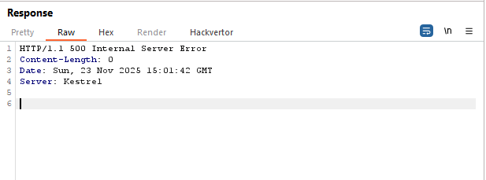

Với lỗi trên, có thể file không nằm trong đường dẫn hoặc bị chặn.  
**NOTE:** database nằm trên 1 server (1 container) khác so với ứng dụng web thì cũng không đọc được bằng path traversal.

Sử dụng hàm ``OPENROWSET()`` của MSSQL để đọc file. Truy vấn sẽ trở thành 
```
SELECT 1,(SELECT BulkColumn FROM OPENROWSET(BULK '/tmp/FLAG_DBSERVER', SINGLE_CLOB) AS T),3 
```
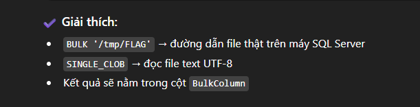  

Nhập payload `a'+UNION+SELECT+1,(SELECT+BulkColumn+FROM+OPENROWSET(BULK+'/tmp/FLAG_DBSERVER',+SINGLE_CLOB)+AS+T),3+--` ta sẽ có flag.  
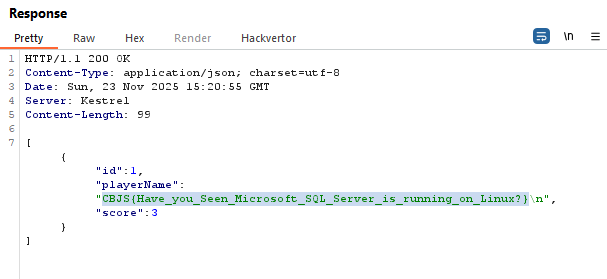

**FLAG** CBJS{Have_you_Seen_Microsoft_SQL_Server_is_running_on_Linux?}

## Flag 3

Lục trong code của trang `/Game` phát hiện trang lấy kết quả trả về bảng điểm từ API `/api/ranking`  
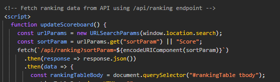  

Kết quả trả về của trang có dạng JSON thông tin người chơi và điểm số  
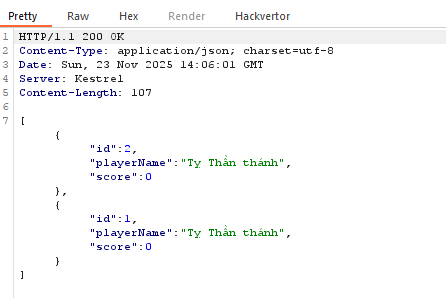  

API được gửi với giao thức HTTP GET với tham số `sortParam`. Dựa vào code của API, nếu không truyền giá trị thì `sortParam` sẽ mặc định là `Score`. Kết quả trả về sắp xếp theo điểm số từ cao đến thấp. Thử đổi `Score` thành `Id` --> vẫn như cũ

Thử truy cập API mà không truyền tham số --> báo lỗi  
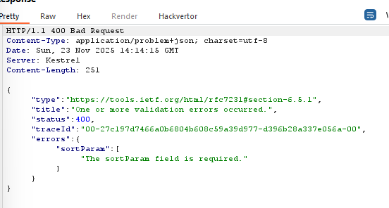

Thử fuzzing tìm đường dẫn bị ẩn, phát hiện đường dẫn `/Search`, truy cập trả về lỗi thiếu tham số `searchTerm`  
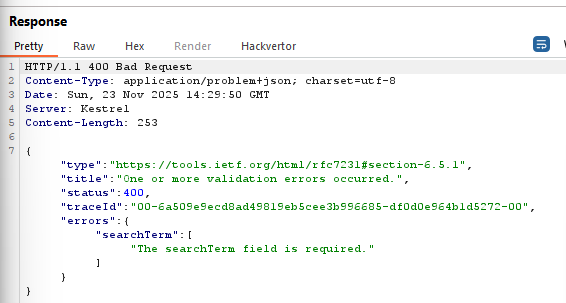  

Nhập `searchTerm=test` kết quả trả về là thông tin những người dùng có chuỗi `test` trong tên  
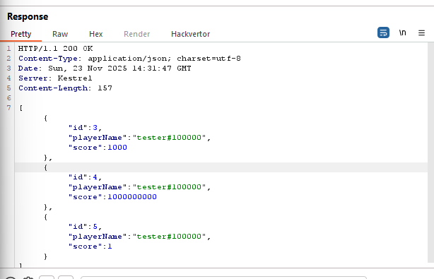  

Vì đây là trường tìm kiếm, rất có thể API bị bug SQLi, test với ký tự đặc biệt thì `'` trả về kết quả lỗi. Sử dụng payload `a'+OR+1=1--` test thì trả về kết quả toàn bộ người dùng  
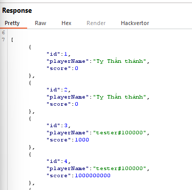  

**NOTE:** Để có thể build payload SQL, cần biết thông tin về hệ CSDL hệ thống đang sử dụng, với server Kestrel và ứng dụng được viết bằng .net, rất có thể sử dụng hệ csdl MSSQL  

Vì flag nằm trong CSDL ta sẽ tiến hành tìm thông tin về CSDL với UNION SELECT. Lưu ý, dữ liệu trả về sẽ có dạng `int,string,int` nên truy vấn trở thành `SELECT 1,payload,2`.

Tìm tên bảng với payload `a'+UNION+SELECT+1,name,3+FROM+sys.tables--`. Tìm được bảng `Cyberjutsu`  
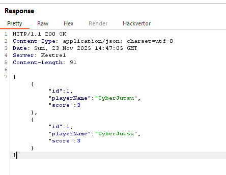

Tìm tên các cột có trong bảng với payload `a'+UNION+SELECT+1,column_name,3+FROM+information_schema.columns+WHERE+table_name%3d'CyberJutsu'--`, trả về cột `flag`  
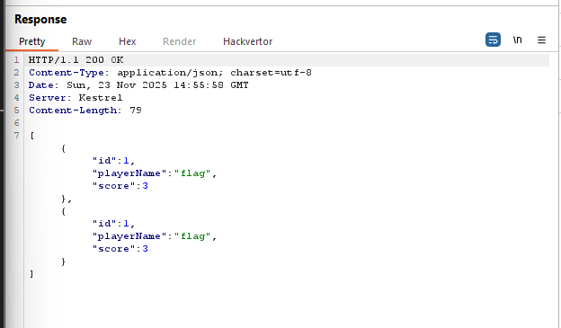  

Cuối cùng là đọc flag với payload `a'+UNION+SELECT+1,flag,3+FROM+CyberJutsu--`  
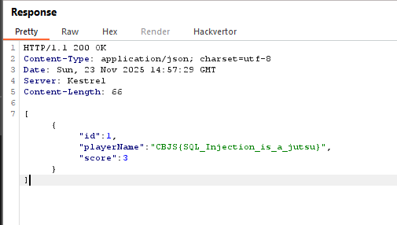

**FLAG** CBJS{SQL_Injection_is_a_jutsu}
## Flag 4
**Mục tiêu** Tìm flag trong Admin Panel  
Thử truy cập vào Directory đáng nghi `/Admin/EditBackground`, phát hiện trang web sử dụng để thay đổi background. Phát hiện flag trong code  
  
**FLAG** CBJS{Unauthorized_Access_On_Admin_Panel_Because_Lack_Of_Proper_Redirection}
## Bonus Flag
Truy cập các đường dẫn trong robots.txt phát hiện `Admin` có kết quả trả về khác nhất. Kiểm tra gói tin phát hiện bonus flag  
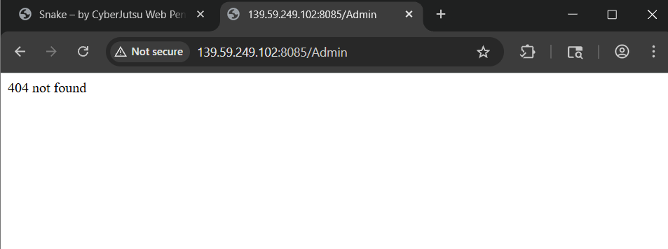  
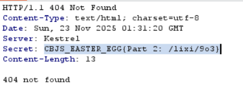

**FLAG** CBJS_EASTER_EGG{Part 2: /lixi/9o3}   

Kiểm tra code fe trang `/Game/Feedback` có đoạn `` với src mã hóa base64, điểm đáng ngờ là tại sao lại để display none  
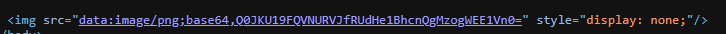  
Decode đoạn base64 trên tìm được bonus flag thứ 3  
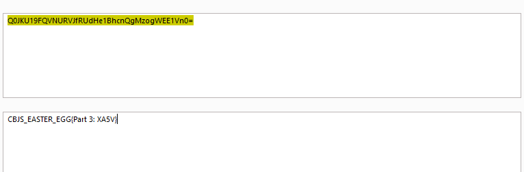
**FLAG** CBJS_EASTER_EGG{Part 3: XA5V}


## Nháp
