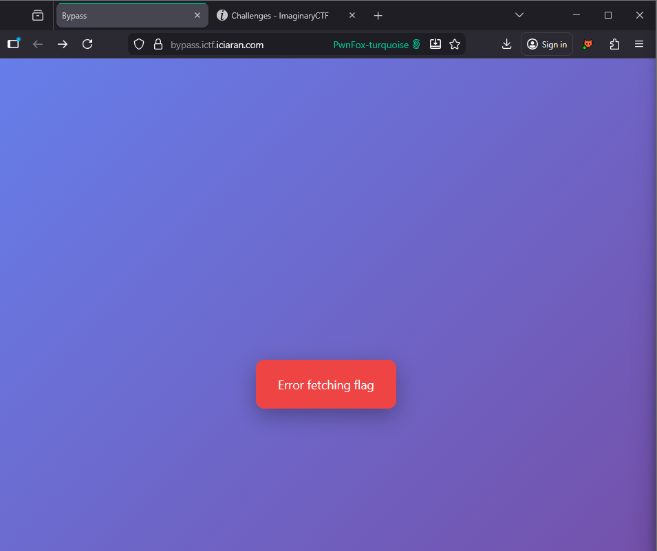
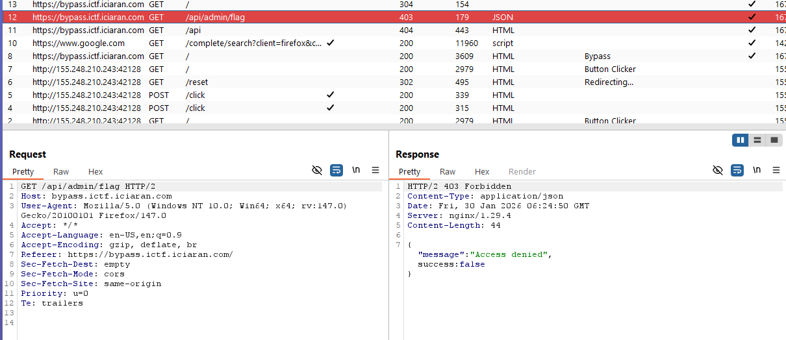
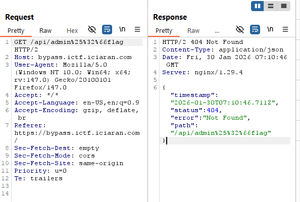
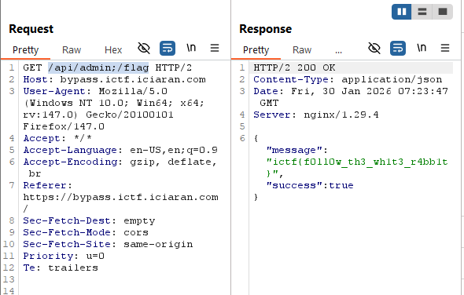

# 1. Phân tích
Trang web chỉ có một button Get Flag, nhấp vào hiện lỗi `error fetching flag`. 
 

Kiểm tra Burp tìm được endpoint đầu tiên `/api/admin/flag`. 
 

Phản hồi có "Access denied", nên mình đoán để lấy được flag mình phải có quyền admin hoặc tìm cách bypass. 

Kiểm tra source code đính kèm. 
File config nginx `bypass.conf` như sau. 
```nginx
server {
    listen 80;
    server_name bypass.ictf.iciaran.com;

    location /api/admin/flag {
        default_type application/json;
        return 403 '{"message": "Access denied", success: false}';
    }

    location /api {
        proxy_pass http://backend:8080;
    }

    location / {
        root   /usr/share/nginx/html;
        index  index.html index.htm;
    }
}
```
Với api `/api/admin/flag`, nếu có yêu cầu gửi đến sẽ trả về "Access Denied".
Nếu yêu cầu được gửi đến `/api` thì sẽ chuyển hướng đến backend ở port 8080. 

Trong file `AdminController.java`, endpoint `/api/admin` được định nghĩa như sau. 
```java
@RequestMapping("/api/admin")
public class AdminController {

  record GetFlagResponse(String message, boolean success) {
  }

  private final String flag;

  public AdminController(@Value("${flag}") String flag) {
    this.flag = flag;
  }

  @GetMapping(value = "/flag", produces = "application/json")
  GetFlagResponse getFlag() {
    return new GetFlagResponse(flag, true);
  }
```

Vậy mình chỉ cần truy cập được `/api/admin/flag` là backend trả về flag. Tuy nhiên, vấn đề ở đây là server nginx đã được cấu hình để chặn truy cập trực tiếp vào endpoint. 

Điểm yếu của file config hiện tại là sử dụng đường dẫn tuyệt đối chứ không phải regex, nên mình hoàn toàn có thể bypass được, chỉ cần đường dẫn không phải `/api/admin/flag` là có thể bypass được. 

Mình thử sử dụng encode, cũng như double encode nhưng cả 2 đều báo lỗi. 
 

Server hiện đang sử dụng 2 công nghệ khác nhau, nginx và springboot, mỗi cái sẽ có kiểu URL normalization khác nhau. 
Lợi dụng sự bất đồng bộ này, nếu ta thêm `;` thành `/api/admin;/flag` thì nginx sẽ gửi yêu cầu tới `/api/admin` -> hợp lệ, gửi đến backend Spring boot. 

Spring boot nhận đường dẫn `/api/admin;/flag`, chuẩn hóa lại thành `/api/admin/flag`, bypass thành công. 

# 2. POC
Gửi gói tin đến đường dẫn `/api/admin;/flag`. 
 

**FLAG ictf{f0ll0w_th3_wh1t3_r4bb1t}**