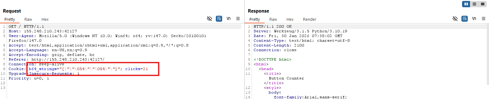
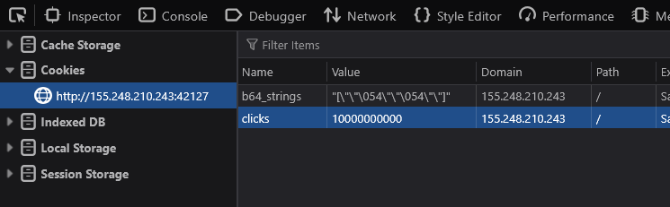
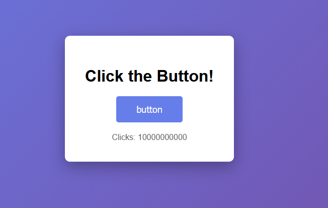
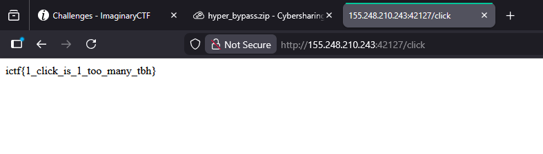

# 1. Phân tích
Dựa vào gói tin trên Burp, mình phát hiện giá trị lượt click lấy từ cookie trình duyệt. 
 

**Phân tích code**  
Sau khi đọc code, mình phân tích những file đáng chú ý như sau.  
Đoạn code js trong file `index.html`. 
```javascript
function getCookie(name) {
    const value = `; ${document.cookie}`;
    const parts = value.split(`; ${name}=`);
    if (parts.length === 2) return parts.pop().split(';').shift();
    return null;
}

function setCookie(name, value, days) {
    const d = new Date();
    d.setTime(d.getTime() + (days * 24 * 60 * 60 * 1000));
    document.cookie = name + "=" + value + ";expires=" + d.toUTCString() + ";path=/";
}

// Display current count
let count = parseInt(getCookie('clicks')) || 0;
document.getElementById('count').textContent = 'Clicks: ' + count;

// Handle button click
document.getElementById('btn').addEventListener('click', function() {
    count++;
    setCookie('clicks', count, 365);
    window.location.href = '/click';
});
```
Hàm `getCookie` thực hiện lấy từng cặp biến-giá trị cookie.Hàm `setCookie` gán giá trị cookie. Giá trị số lượt click sẽ được lưu trong biến `count`.   
Sau đó là gán thêm event cho button "Click here". Mỗi lượt click, sẽ thực hiện gán cookie và chuyển hướng sang trang `/click`. 

Route `/click` trong file server.py. 
```python
@app.route('/click')
def click():
    # Get click count from cookie
    clicks = request.cookies.get('clicks', '0')
    try:
        click_count = int(clicks)
    except ValueError:
        click_count = 0

    if click_count > 10000000000:
        return render_template('flag.txt')
    else:
        return redirect(url_for('index'))
```
Route này sẽ trả flag nếu lượt click `> 10000000000`.  

Luồng hoạt động `getCookie()` -> lưu biến `count` -> nếu nhấp button -> `setCookie()`. Mặc dù cookie đã thay đổi, nhưng biến count đã lưu giá trị từ trước khi nhấn. Do đó, bấm button sẽ tiếp tục số lượng count cũ.   

Vậy khai thác bài này bằng cách thay đổi cookie, gán giá trị lớn hơn `10000000000` là được.  

# 2. POC
1. Thay đổi cookie thành `10000000000`  

2. Tải lại trang, vì không nhấp button nên setCookie() không thể set lại số lượt click cũ. 
  
3. Nhấp button -> lượt click lớn hơn 10000000000.
 

**FLAG ictf{1_click_is_1_too_many_tbh}**