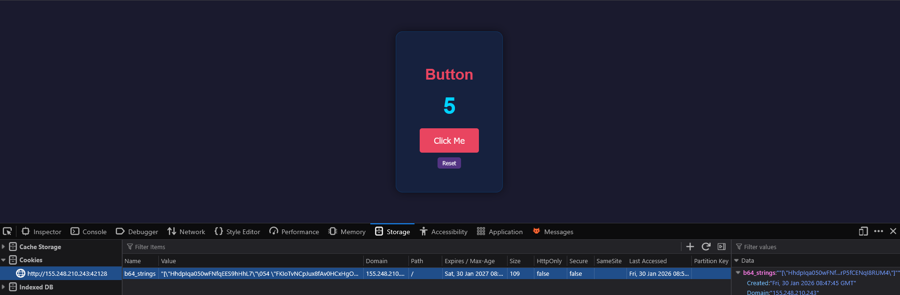

# 1. Phân tích
Mỗi khi nhấp button, mình nhận thấy có sự thay đổi trong cookie `b64_strings`.  
  

Phân tích code
Sau khi đọc code, mình phân tích những file đáng chú ý như sau.  
JS trong file `index.html`.  
```js
function generateRandomBase64(length) {
    const charset = 'ABCDEFGHIJKLMNOPQRSTUVWXYZabcdefghijklmnopqrstuvwxyz0123456789+/';
    let ret = '';
    for (let i = 0; i < length; i++) {
        ret += charset.charAt(Math.floor(Math.random() * charset.length));
    }
    return ret;
}

document.getElementById('mine-btn').addEventListener('click', function() {
    const data = generateRandomBase64(24); // Sufficient entropy
    const fd = new FormData();
    fd.append('data', data);

    fetch('/click', { method: 'POST', body: fd })
        .then(res => {
            const isDoc = res.headers.get('X-Document') === 'true';
            return res.text().then(t => ({t, isDoc}));
        })
        .then(({t, isDoc}) => {
            if (isDoc) {
                document.body.innerHTML = `<pre style="color:white; padding:20px;">${t}</pre>`;
            } else {
                document.getElementById('est-display').innerText = t;
            }
        });
});

document.getElementById('reset').addEventListener('click', () => {
    window.location.href = '/reset';
});
```

