Chia làm Vertical (user-admin), Horizontal (user-user), và Context-dependent (user-guest)

# Lab 01: Unprotected admin functionality
Yêu cầu truy cập admin panel và xóa user carlos.  

Test thử với `/admin` ở đuôi.  
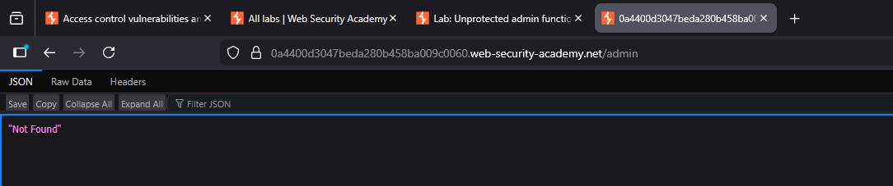  

Mình tiếp tục thử với `/robots.txt` xem config có chặn trang nào không.  
  

Mình phát hiện trang web đang chặn bot truy cập trang `/administrator-panel`.  
Truy cập và chọn delete carlos là xong.  
  

# Lab 02: Unprotected admin functionality with unpredictable URL
Yêu cầu truy cập admin panel và xóa user carlos.  

Hiện tại không thể truy cập `/robots.txt` và `/administrator-panel`.  
Mình có thử bruteforce đăng nhập nhưng không hiệu quả. Tuy nhiên, khi xem page source, mình phát hiện đoạn JS khả nghi.  
  
```JS
var isAdmin = false;
if (isAdmin) {
   var topLinksTag = document.getElementsByClassName("top-links")[0];
   var adminPanelTag = document.createElement('a');
   adminPanelTag.setAttribute('href', '/admin-n5yrfu');
   adminPanelTag.innerText = 'Admin panel';
   topLinksTag.append(adminPanelTag);
   var pTag = document.createElement('p');
   pTag.innerText = '|';
   topLinksTag.appendChild(pTag);
}
```

Đoạn code kiểm tra xem người dùng hiện tại có phải là admin không, nếu phải thì tạo đường dẫn với thẻ `<a>` dẫn tới admin panel. Đoạn code vô tình để lộ đường dẫn tới admin panel là `/admin-n5yrfu`.  

Truy cập đường dẫn và xóa user.  
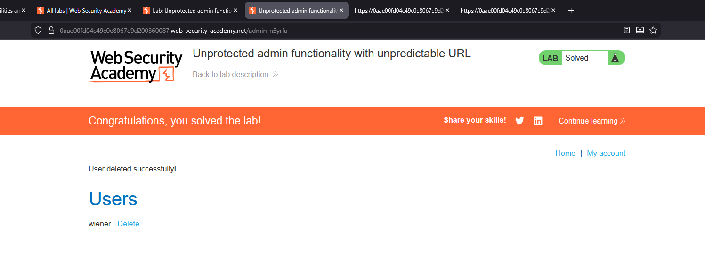   

# Lab 03: User role controlled by request parameter
Yêu cầu truy cập admin panel và xóa user carlos.  

Yêu cầu có đề cập đến `/admin`, mình thử truy cập xem sao.  
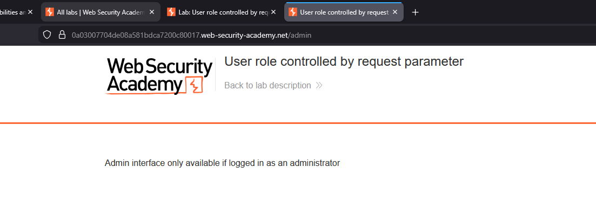  

Lab có cung cấp thông tin đăng nhập, thử đăng nhập và truy cập `/admin`, mình phát hiện dữ liệu khả nghi ở trường cookie.  
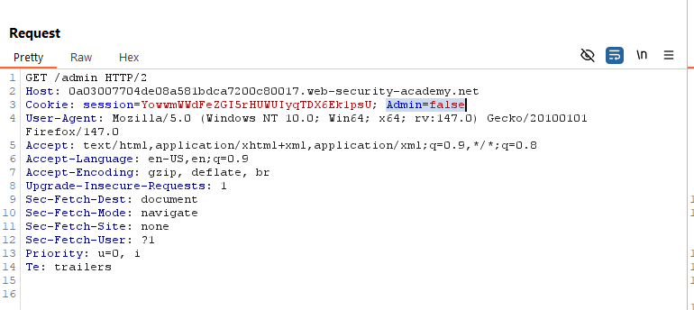  

Thử thay đổi thành True xem sao.  
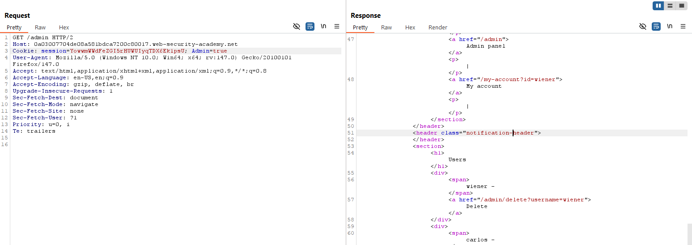  

Dựa vào HTML của admin panel, mình tìm được endpoint để xóa user carlos là `/delete?username=carlos`, thêm đoạn này vào sau `GET /admin` của gói tin là xong.  
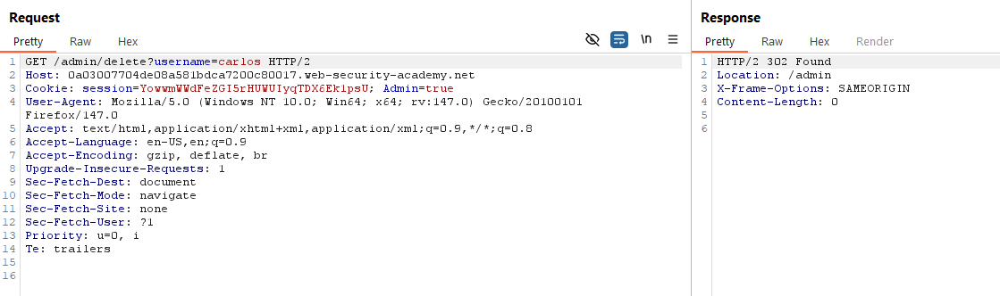  

# Lab 04: User role can be modified in user profile
Yêu cầu truy cập admin panel `/admin`, endpoint chỉ có thể truy cập được sử dụng `roleid=2`.  

Sử dụng thông tin đăng nhập được cung cấp, đăng nhập và truy cập thử admin panel.  
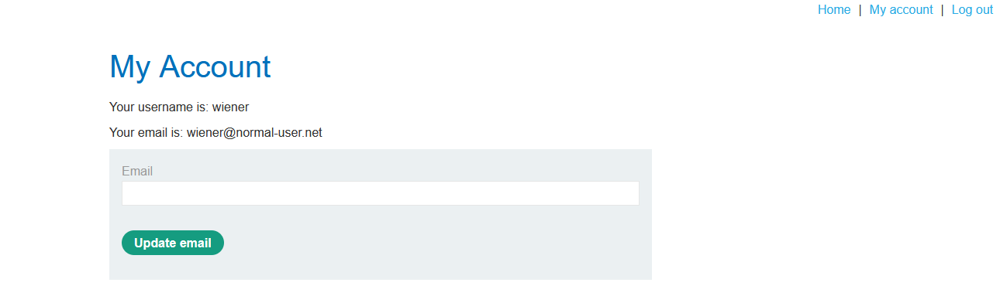  

Trong user panel, email có giá trị là `normal-user` khá đáng nghi.  

Khi thực hiện thay đổi email, trang web gửi yêu cầu, trong phản hồi có giá trị `roleId=1`.  
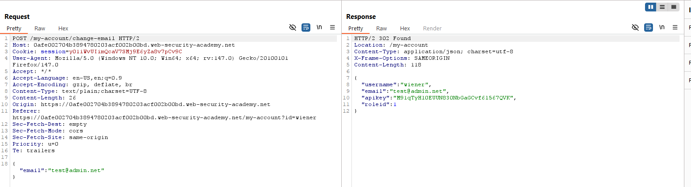  

Thử thêm biến `roleId=2` và gửi đi, phản hồi nhận lại đã thay đổi `roleId=2`.  
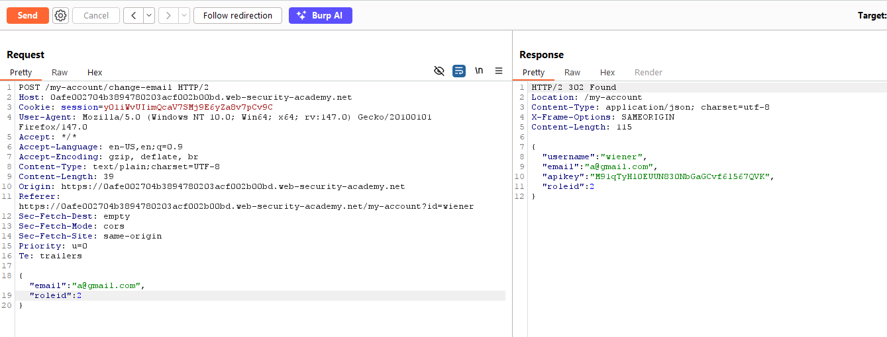  

Tiếp theo là truy cập `/admin` và xóa user được yêu cầu.  
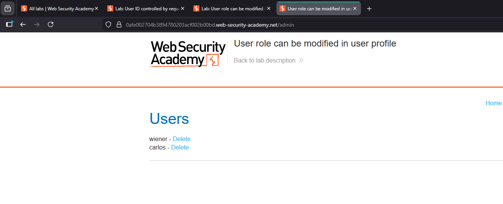  

# Lab 05: User ID controlled by request parameter 
Lab có lỗi quản lý truy cập theo chiều ngang, ở trang tài khoản người dùng, yêu cầu tìm API key của user carlos.  

Sau khi đăng nhập, truy cập trang user account sẽ hiện ra API của người dùng hiện tại.  
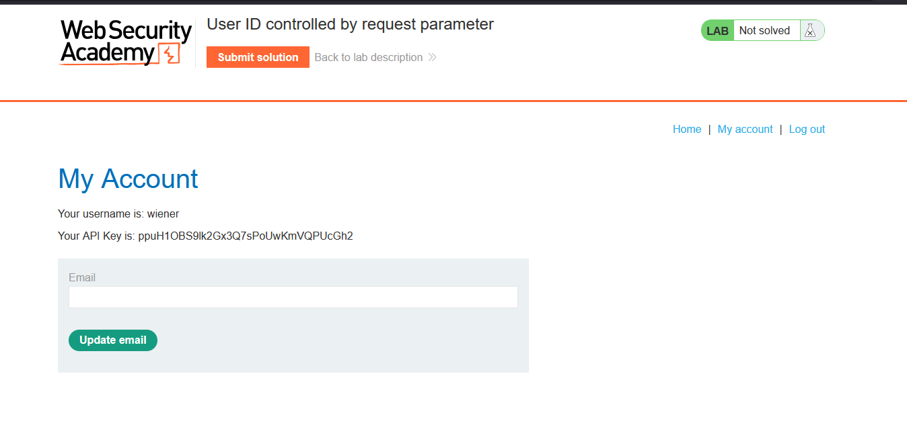  

Thử thay đổi email, ta có được 2 untrusted data là `email` và `csrf`.  
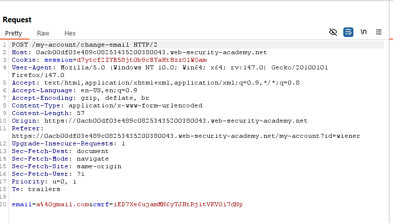  

Nếu để ý kỹ, trên URL có thêm untrusted data là `id=wiener`, vậy sẽ ra sao nếu mình đổi thành carlos.  
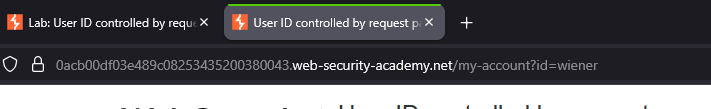  

Kết quả là mình có được key của carlos.  
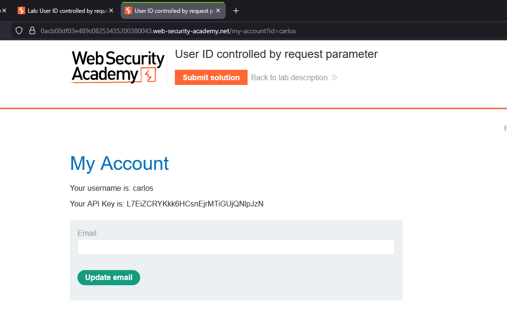  

# Lab 06: User ID controlled by request parameter, with unpredictable user IDs 
Lab có lỗi quản lý truy cập theo chiều ngang ở trang tài khoản người dùng, quản lý user bằng userId, yêu cầu tìm API key của user carlos.  

Lab này khác với lab trước, userID đã bị làm nhiễu, không thể đoán được.  
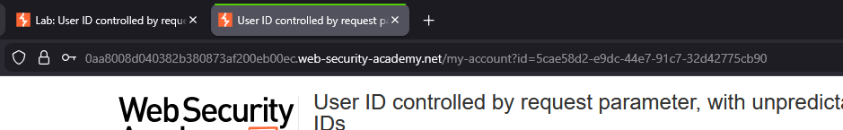  

Thử quăng ID vào Burp Decoder xem liệu id có được encode từ gì không, nhưng kết quả không thành công.  
  

Duyệt tiếp các chức năng, khi mình chọn một bài đăng bất kỳ, mình phát hiện tên tác giả bài đăng là đường dẫn có chứa userId.  
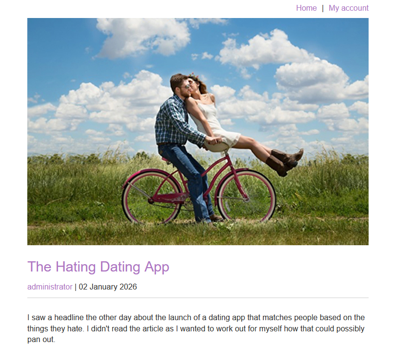  

Khi mình click vào tên tác giả, trỏ đến trang các bài post của user, tuy nhiên, tham số GET có chứa userID.   
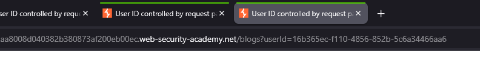  

Nắm được điều này, mình duyệt các bài post tìm coi có user `carlos` không, kết quả mình tìm được bài đăng.   
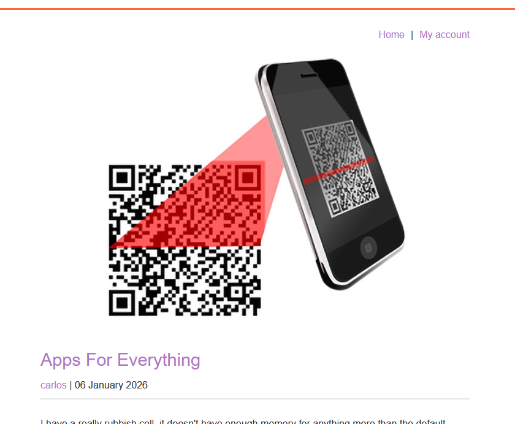  

Nhấp vào `carlos`, ta lấy được userId.  
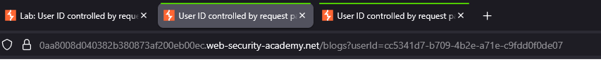  

Ta biết được endpoint `/my-account` bị lỗi IDOR. Truy cập endpoint `/my-account`, thay id hiện tại bằng id của carlos, mình lấy được key của user.  
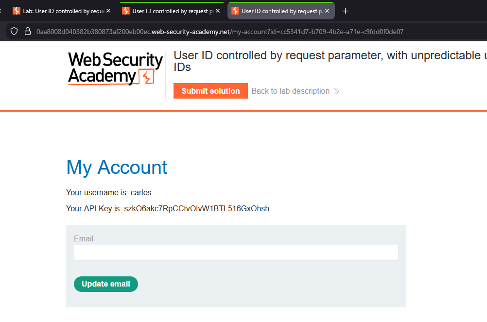

# Lab 07: User ID controlled by request parameter with data leakage in redirect 
Lab bị lỗi access control, làm lộ thông tin nhạy cảm trong gói tin trả về khi thực hiện chuyển hướng. Yêu cầu lấy API key của carlos.  

Mình nhận ra một hành vi đáng ngờ khi thay đổi id ở trang user account.  
Nếu một user không tồn tại, thì phản hồi không có body. Ngược lại, sẽ có body HTML.  
Thử với `test`
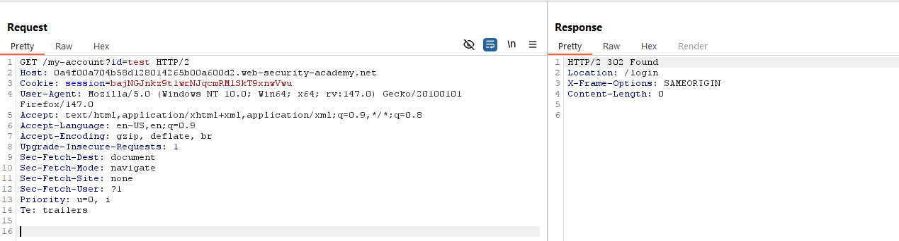  
Thử với `carlos`  
  

Đọc thử nội dung gói tin phản hồi khi thử với `carlos`, mình phát hiện server đã vô tình trả về panel của carlos, nhưng trên trình duyệt sẽ chuyển hướng, khiến ta vô tình bỏ quả gói tin. Panel này để lộ API key của `carlos`.  
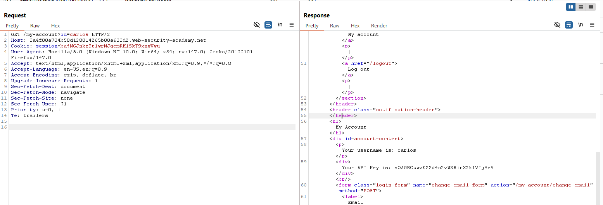   

# Lab 08: User ID controlled by request parameter with password disclosure
Trang user account của bài lab chứa password của người dùng hiện tại. Yêu cầu truy cập và lấy password user carlos.  

Đăng nhập, chúng ta sẽ có trang account như sau.  
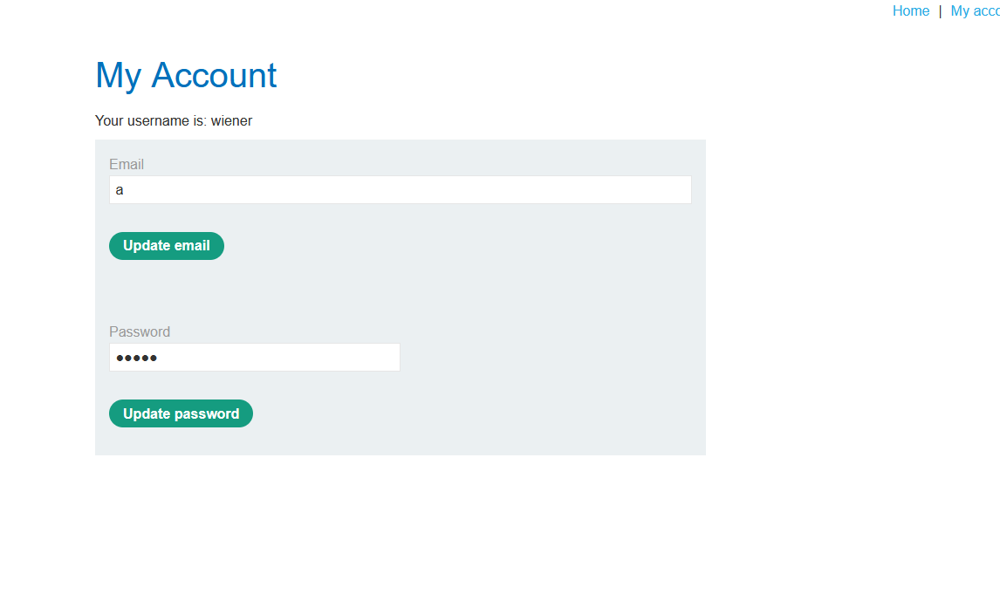  

Mặc dù password đã bị mask, nhưng giá trị lại được lưu trong HTMl, hoàn toàn có thể truy cập bằng devtool.  
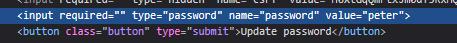  

Đề bài cho ta biết rằng trên hệ thống hiện tại đang có user carlos, thử thay đổi biến `GET userid=carlos`, xem ta có thể truy cập được thông tin người dùng khác không, kết quả thành công.  
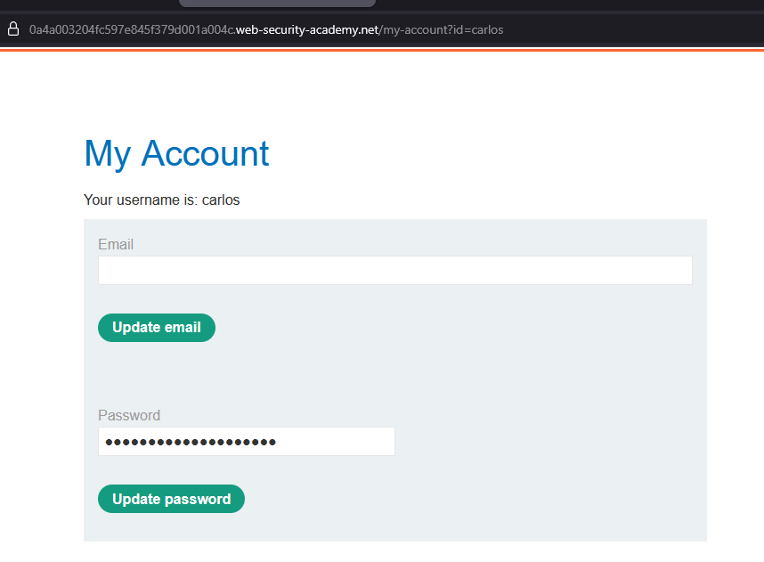  

Đề yêu cầu truy cập admin panel và xóa user carlos. Mình có thể thay đổi `userid` truy cập trang người dùng của admin. Từ đây, mình có thể lấy được password lưu ở trong HTMl. Mình sử dụng password lấy được, truy cập admin panel và xóa user carlos.  

Thay đổi `userId=administrator`, truy cập được trang account, từ đó lấy được passowrd admin là `p49w9iw31nwzvb059k83`.  
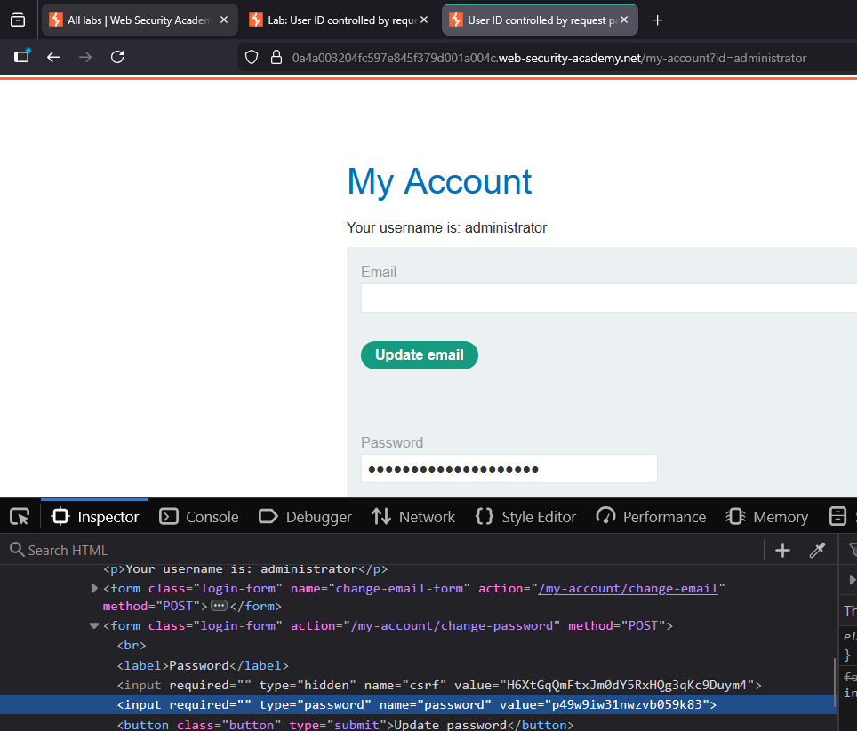  

Logout user hiện tại và đăng nhập user admin với password lấy được, đăng nhập thành công, mình có thêm chức năng admin panel, truy cập và xóa user.  
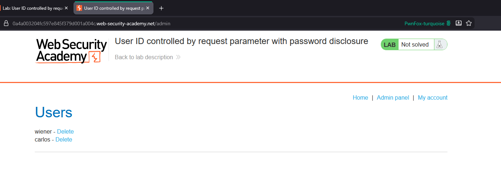  

# Lab 09: Insecure direct object references 
Lab lưu chat logs trên server, có thể truy cập bằng đường dẫn tĩnh. Yêu cầu lấy password và đăng nhập user carlos.  

Lỗi nằm ở việc lưu chat log, nên mình thử chức năng của `live chat` trước.  
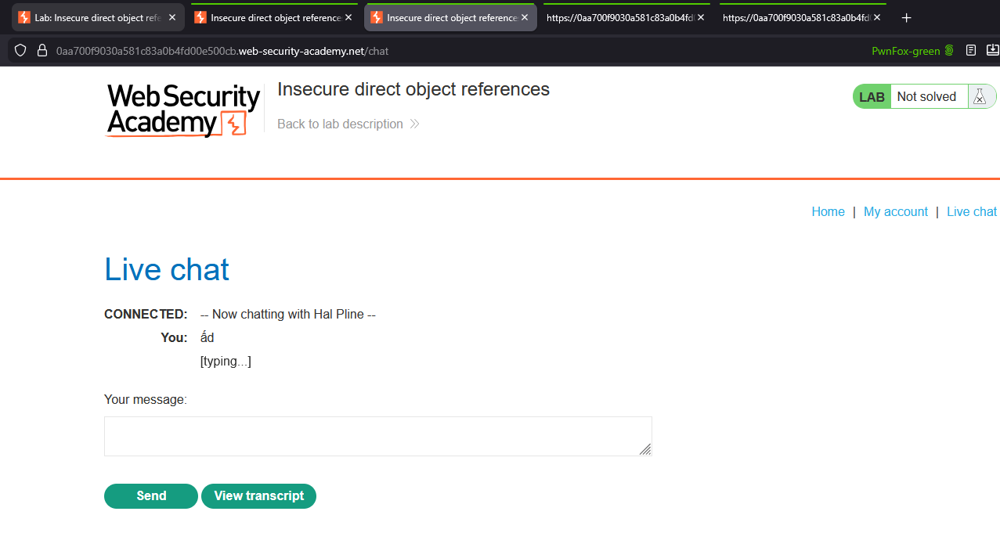  

Trang `live chat` sẽ có 2 chức năng chính là gửi tin nhắn Send và View Transcript. View Transcript sẽ tải về file text nội dung đoạn chat hiện tại.  
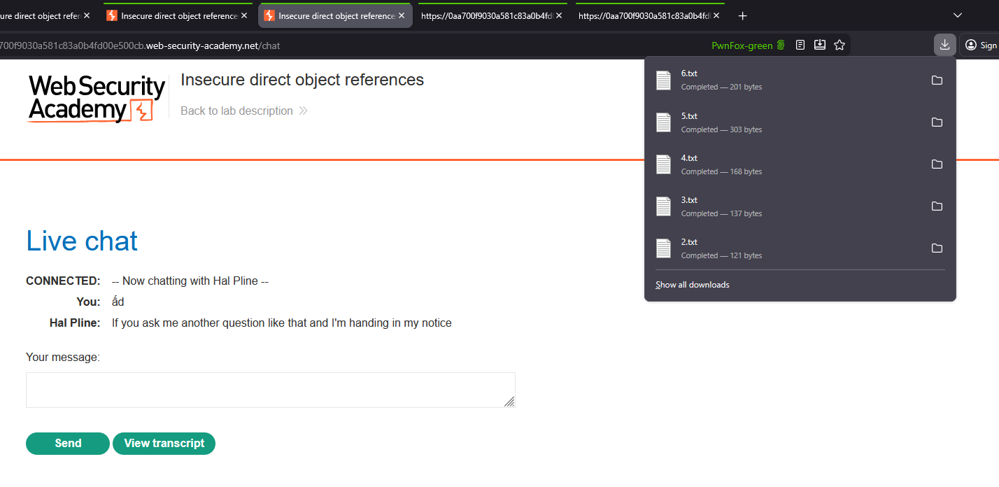  

Kiểm tra gói tin, không phát hiện điều gì bất thường.  
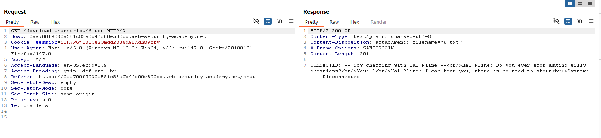  

Thử kiểm tra các bài post xem có đoạn chat nào không, kết quả là không.  
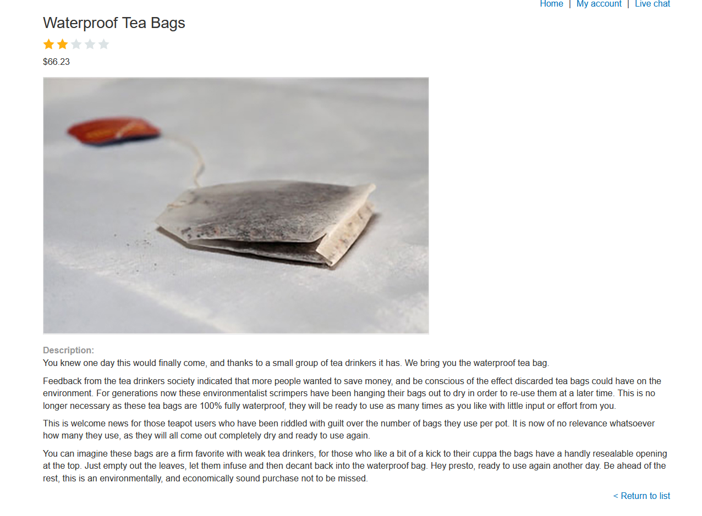  

Thử view source tìm đường dẫn tĩnh đến nơi lưu các đoạn chat, có vẻ chức năng View Transcript được quản lý bởi JS trong file này.   
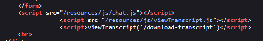  
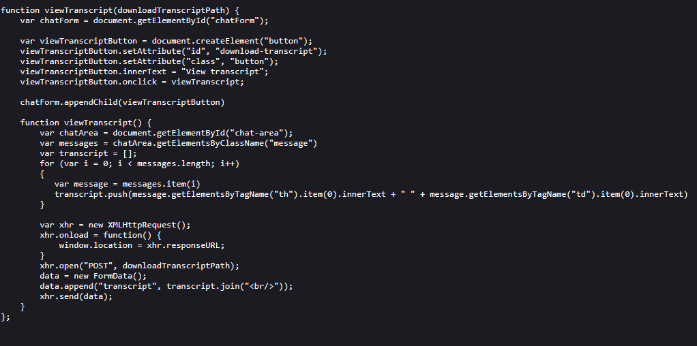   

Đoạn code cũng không giúp gì nhiều, thử với file js còn lại `chat.js`.  
  

Cả hai đoạn code cũng không giúp gì nhiều, tới đây mình chợt nhận ra, các transcript mình tải về nãy giờ bắt đầu từ id 2.  
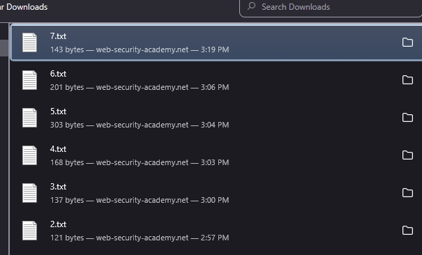  

Thử thay đổi tên file thành `1.txt`.  
  

Kết quả là mình lấy được đoạn chat khả nghi, vô tình lộ password `9up9pofmbxjbhxgndbap`.   
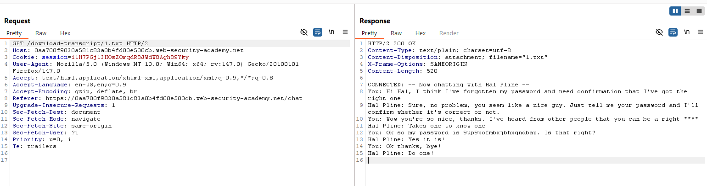   

# Lab 10: URL-based access control can be circumvented
Đề yêu cầu truy cập admin panel. Admin panel hiện đang được config để chặn truy cập bên ngoài. Tuy nhiên backend đang sử dụng framework bị lỗi liên quan đến `X-Original-URL` header. Yêu cầu xóa user `carlos`.   

Sau khi duyệt sơ để tìm các untrusted data, mình không tìm được thêm bất kỳ endpoint nào có thể khai thác được.  

Từ check pagesource, kiểm tra gói tin burp cũng không tìm thêm gì khả nghi.  

Đề có nhắc đến lỗi liên quan đến header `X-Original-URL`. Thử google xem đây là gì.  

Một bài blog trên Medium có cung cấp thông tin như sau, tham khảo https://medium.com/@cirilptomass/x-original-url-a-loophole-that-could-expose-your-web-app-71b050d6d07d.  
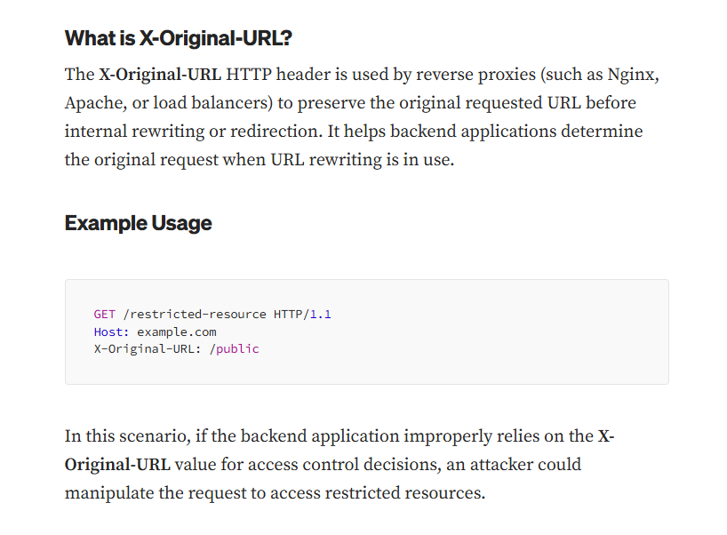  

Lỗi này chủ yếu xảy ở các framework như Symfony, tham khảo https://www.acunetix.com/vulnerabilities/web/url-rewrite-vulnerability/.  
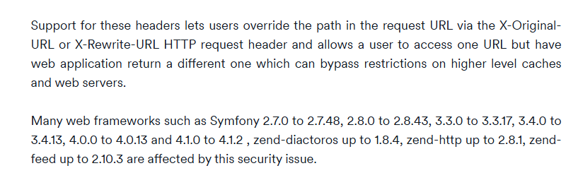  

Trong bài blog có cung cấp 1 example khai thác, đó là thêm header `X-Original-URL`.  

Mình thử thêm `X-Original-Url: /admin` vào gói tin bất kỳ tới target.  
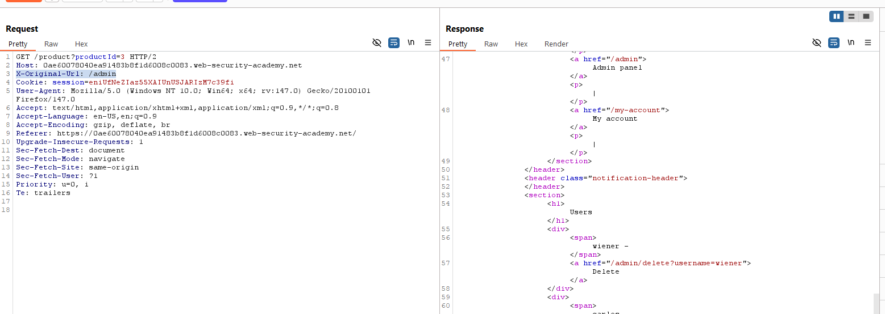  

Mình truy cập thành công admin panel, trang này cung cấp sẵn endpoint để xóa user carlos, thay header thành `X-Original-Url: /admin/delete?username=carlos`.  

Tuy nhiên bị lỗi thiếu tham số.  
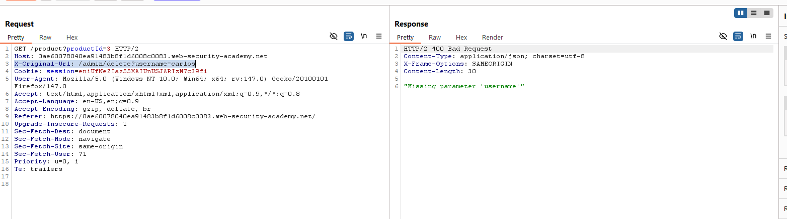 

Thử URL encode xem sao.  
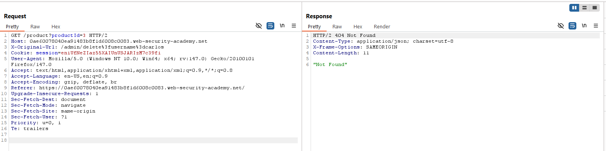  

Kết quả là Not Found, có vẻ lỗi này chỉ có thể parse đường dẫn, không thể thêm tham số. Vậy nếu mình thay tham số của HTTP GET thì sao. Header `X-Original-Url: /admin/delete`, `GET /product?username=carlos`, khai thác thành công.   
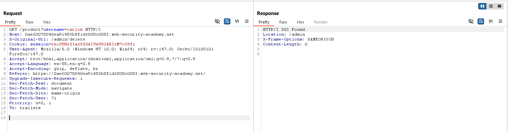  

# Lab 11: Method-based access control can be circumvented
Đề yêu cầu truy cập và làm quen với admin panel (có cung cấp credentials của admin), dựa vào các phương thức của admin panel để leo thang đặc quyền với user bình thường `wiener`.  

Thử sử dụng admin panel để thăng quyền 1 user lên admin, sau đó mình kiểm tra xem trình duyệt gửi bao nhiêu gói tin và gói tin đó là gì.  
Khi thay đổi quyền, trình duyệt sẽ gửi gói tin tới endpoint `/admin-roles` với 2 tham số là `username` và `action`.  
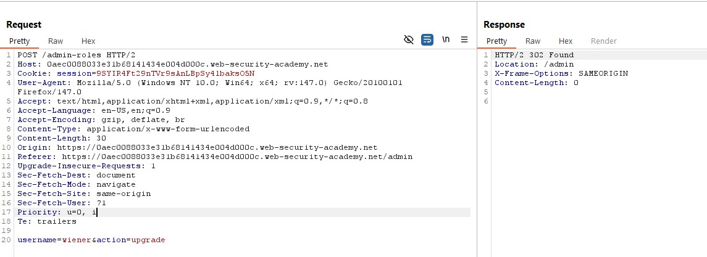  

Đăng nhập user bình thường và truy cập endpoint trên trình duyệt, mình nhận phản hồi thiếu tham số.  
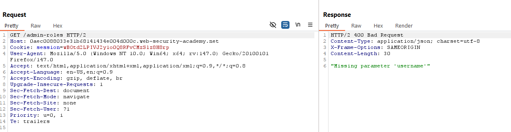  

Có vẻ server không chỉ chấp nhận request method POST mà còn nhận GET nữa, thử thêm 2 tham số là username và action tương tự như gói tin POST. Gói tin mình gửi sẽ chỉnh sửa `GET /admin-roles?username=wiener&action=upgrade`.  
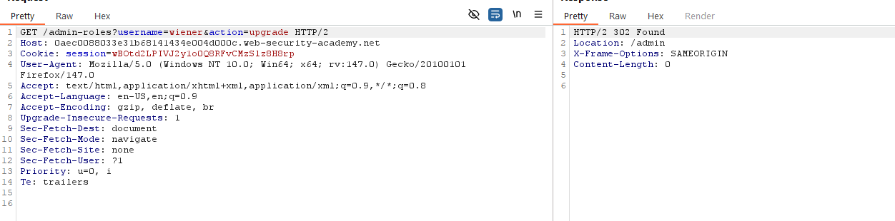

# Lab 12: Multi-step process with no access control on one step
Lab này có lỗi trong chức năng thay đổi quyền người dùng. Đề yêu cầu truy cập và làm quen với admin panel (có cung cấp credentials của admin), dựa vào các phương thức của admin panel để leo thang đặc quyền với user bình thường `wiener`.  

Admin panel cung cấp chức năng thay đổi quyền người dùng, khi mình chọn upgrade user, trang web sẽ chuyển tới 1 trang xác nhận trung gian thay vì như lab trước.  
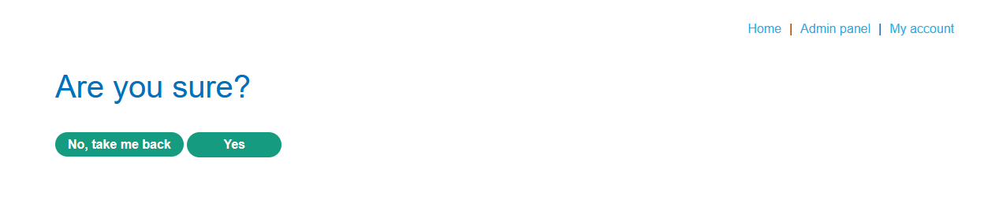  

Kiểm tra thử HTML của 2 button gửi tới đâu, mình phát hiện gói tin đổi quyền sẽ có method POST.  
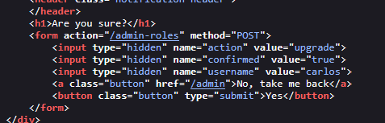 

Khi chọn Yes, trình duyệt gửi gói tin thêm tham số `confirmed=true`. 
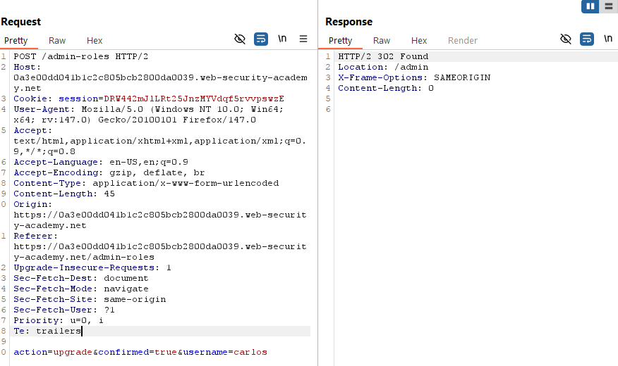 

Dựa trên thông tin trên, mình thử xây dựng một gói tin tương tự như gói POST ở trên. Đầu tiên, mình đăng nhập với thông tin của wiener, chọn 1 gói tin bất kỳ, chọn change request method và thêm các tham số tương tự như gói tin ở trên, kết quả cuối cùng sẽ là gói tin như sau.    
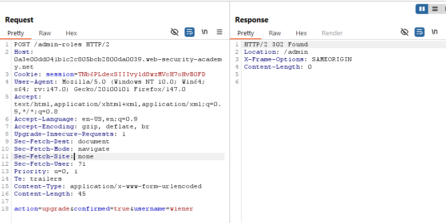  

Mình gửi gói tin và thành công leo thang đặc quyền user bình thường.  

# Lab 13: Referer-based access control 
Lab kiểm soát truy cập một số chức năng admin bằng header Referer. Đề yêu cầu truy cập và làm quen với admin panel (có cung cấp credentials của admin), dựa vào các phương thức của admin panel để leo thang đặc quyền với user bình thường `wiener`.  

Khi thực hiện thay đổi quyền, trình duyệt gửi gói tin.  
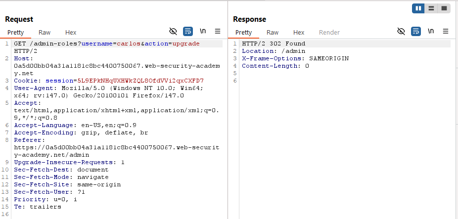  

Mình đăng nhập với user bình thường `wiener`.  

Mình thử xây dựng gói tin tương tự với gói tin thay đổi quyền của user admin, `GET /admin-roles?username=wiener&action=upgrade`, và thêm Referer `Referer: https://0a5d00bb04a31a1181c8bc4400750067.web-security-academy.net/admin`.  
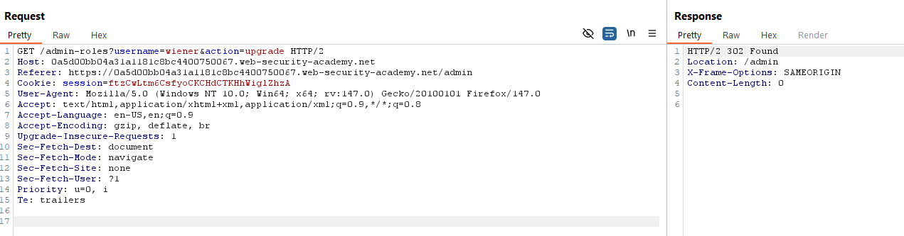  
