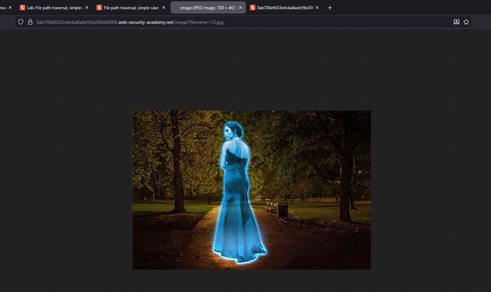
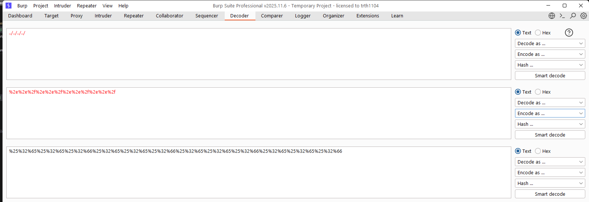

# Lab 01: File path traversal, simple case
Đề cung cấp thông tin lỗi trong chức năng hiển thị hình ảnh sản phẩm, yêu cầu truy cập đường dẫn `/etc/passwd`  

Mở một ảnh bất kỳ, mình tìm được endpoint xử lý đường dẫn file ở biến `GET filename`.  
  

Thay đổi giá trị biến `filename` thành payload
```
../../../../../../../etc/passwd
```

# Lab 02: File path traversal, traversal sequences blocked with absolute path bypass
Đề cung cấp thông tin lỗi trong chức năng hiển thị hình ảnh sản phẩm, yêu cầu truy cập đường dẫn `/etc/passwd`. Tuy nhiên trang web chặn sử dụng đường dẫn relative `../`.  

Tương tự như lab trên, tìm được endpoint xử lý đường dẫn hình ảnh. Do đã chặn đường dẫn tương đối relative, nên mình sử dụng đường dẫn tuyệt đối absolute.  

Payload
```
/etc/passwd
```

# Lab 03: File path traversal, traversal sequences stripped non-recursively
Đề cung cấp thông tin lỗi trong chức năng hiển thị hình ảnh sản phẩm, yêu cầu truy cập đường dẫn `/etc/passwd`. Tuy nhiên trang web lọc chuỗi `../` một cách không đệ quy.  

Đọc mô tả lab, mình hiểu là trang web sẽ lọc `../`, tuy nhiên không lọc đệ quy, có nghĩa là chỉ lọc 1 lần. Nếu mình nhập là `....//` thì trang web sẽ xóa `../` ở giữa chuỗi, dẫn đến kết quả từ `....//` -> `../`, vì không đệ quy, nên sẽ không xóa tiếp.  

Vậy payload thành
```
....//....//....//....//etc/passwd
```

# Lab 04: File path traversal, traversal sequences stripped with superfluous URL-decode
Đề cung cấp thông tin lỗi trong chức năng hiển thị hình ảnh sản phẩm, yêu cầu truy cập đường dẫn `/etc/passwd`. Trang web sẽ chặn `../`, sau đó thực hiện URL-decode 1 lần.   

Mình đọc thấy bị chặn, mình đã định bypass bằng URL-encode, tuy nhiên, đề có đề cập trang web chỉ thực hiện decode 1 lần. Nếu vậy mình thực hiện encode 2 lần thì sao.  

Sử dụng chức năng Decoder của Burp và encode 2 lần chuỗi `../../../../../etc/passwd`, mình có được payload.   
  
```
%25%32%65%25%32%65%25%32%66%25%32%65%25%32%65%25%32%66%25%32%65%25%32%65%25%32%66%25%32%65%25%32%65%25%32%66%25%32%66etc%25%32%66passwd
```

Với payload, trang web đầu tiên không tìm được chuỗi `../`, sau đó decode thêm một lần nữa. Tuy nhiên kết quả trả về khi đó là `%2e%2e%2f%2e%2e%2f%2e%2e%2f%2e%2e%2fetc%2fpasswd` cũng không tìm được `../` nên bypass thành công.  

# Lab 05: File path traversal, validation of start of path
Đề cung cấp thông tin lỗi trong chức năng hiển thị hình ảnh sản phẩm, yêu cầu truy cập đường dẫn `/etc/passwd`, tuy nhiên sẽ sử dụng full path để lấy đường dẫn hình ảnh.

Đường dẫn hình ảnh sẽ có định dạng như sau `filename=/var/www/images/38.jpg`  
  

Mình sử dụng relative path lùi về 3 lần là ra được đường dẫn gốc rồi. Payload  
```
/var/www/images/../../../etc/passwd
```

# Lab 06: File path traversal, validation of file extension with null byte bypass
Đề cung cấp thông tin lỗi trong chức năng hiển thị hình ảnh sản phẩm, yêu cầu truy cập đường dẫn `/etc/passwd`, tuy nhiên sẽ yêu cầu đuôi file.  

Mình có thể sử dụng NULL byte `%00` để bypass bài này. Payload
```
/var/www/images/../../../etc/passwd%00.jpg
```

Theo mình đoán, trang web có thể tìm trong input xem có kết thúc bằng chuỗi `.jpg`, `.png`,... NULL byte `%00` đánh dấu kết thúc một chuỗi đối với một số ngôn ngữ lập trình. Mình đoán khi chương trình xử lý payload `/etc/passwd%00.jpg`, đầu tiên kiểm tra ở cuối có `.jpg` không. Payload thỏa, nên sẽ đi xuống tiếp vào các hàm xử lý đường dẫn file (có thể là file_get_content() hoặc tương tự...), tuy nhiên khi hàm payload tới NULL `%00` sẽ dừng lại, bỏ quả `.jpg` phía sau.  