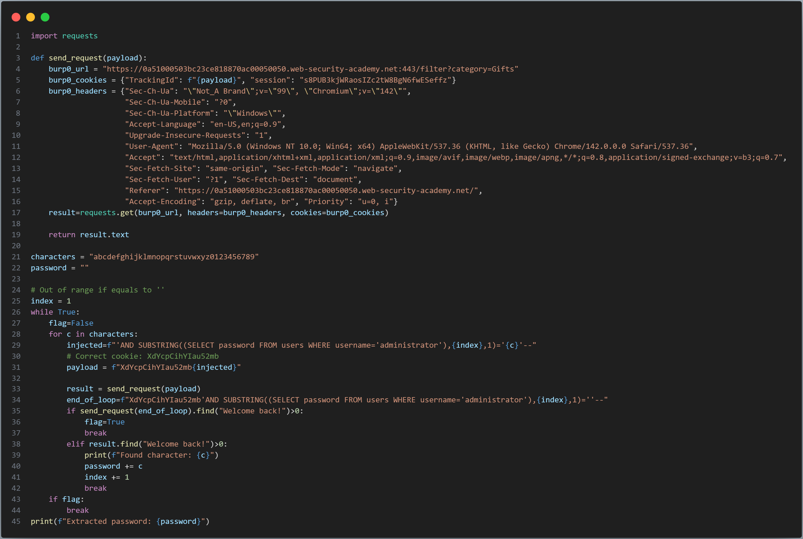
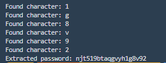
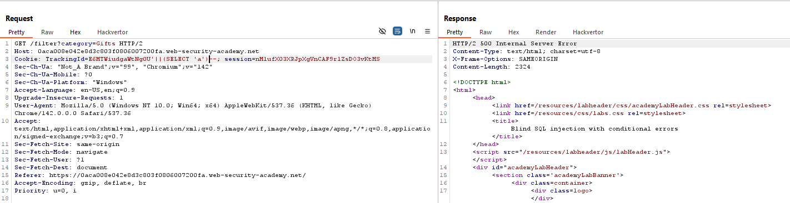
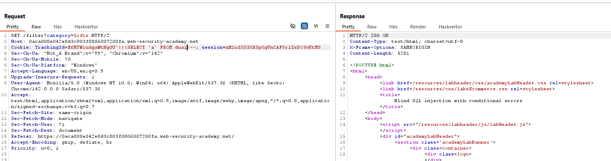
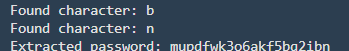
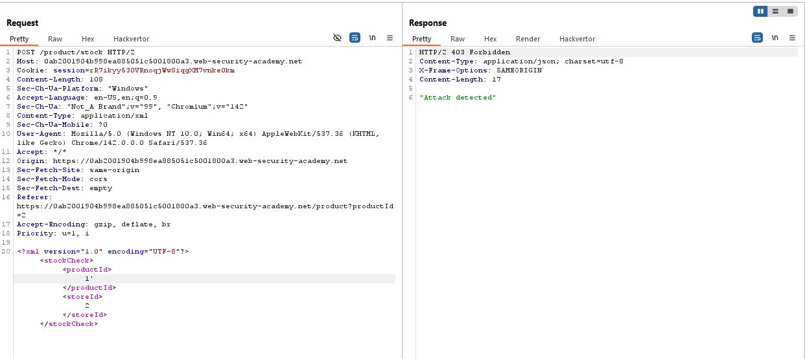
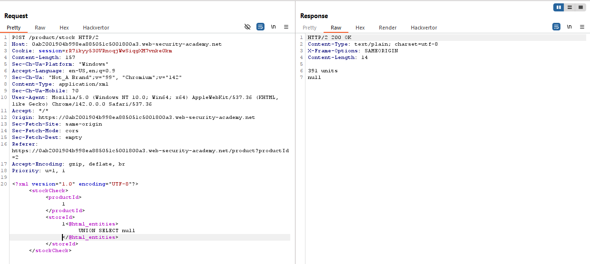
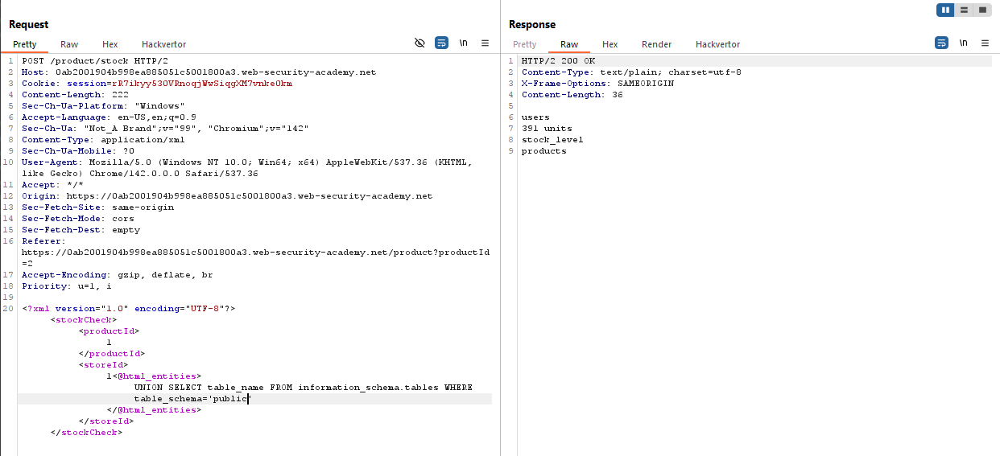
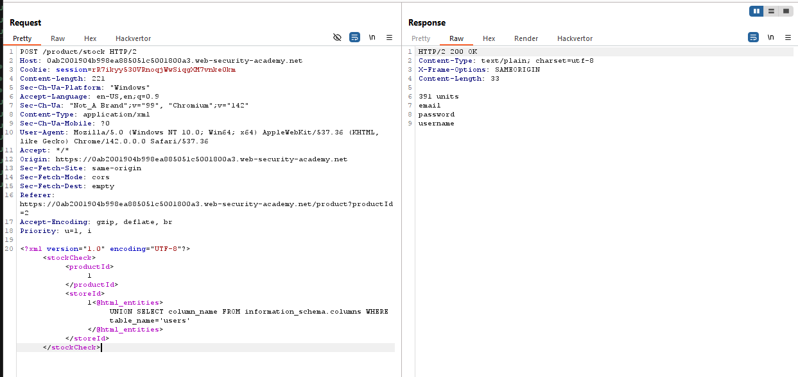
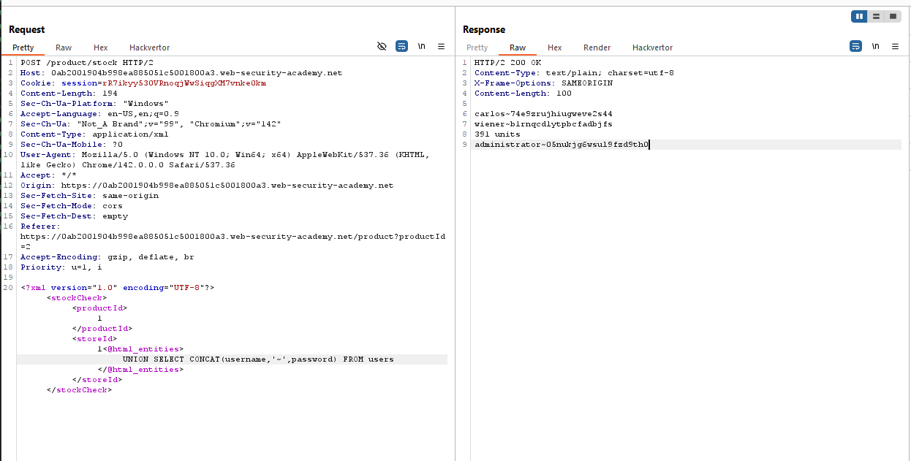

# Lab: Blind SQL injection with conditional responses
## Objective
The results of the SQL query are not returned, and no error messages are displayed. But the application includes a Welcome back message in the page if the query returns any rows.

The database contains a different table called users, with columns called username and password. You need to exploit the blind SQL injection vulnerability to find out the password of the administrator user.

To solve the lab, log in as the administrator user.

**NOTE**: Target `Cookie: TrachkingId` in request header
## Exploit
Because the website only returns two outcomes — the response contains the string `'Welcome Back!'` for a correct query, and otherwise for an incorrect one — we will send a series of requests to check each character of the password.

I used the 'Copy as Python Request' extension in Burp Suite and started writing a script to enumerate the password. The idea is to send requests with an injected query inside the cookie; the query uses SUBSTRING to extract each character of the password and compares it against a character set. If the response contains `'Welcome Back!'`, the character is correct and will be saved and appended to form the complete password.  
  
  

# Lab: Blind SQL injection with conditional errors
## Objective
This lab contains a blind SQL injection vulnerability. The application uses a tracking cookie for analytics, and performs a SQL query containing the value of the submitted cookie.

The results of the SQL query are not returned, and the application does not respond any differently based on whether the query returns any rows. If the SQL query causes an error, then the application returns a custom error message.

The database contains a different table called users, with columns called username and password. You need to exploit the blind SQL injection vulnerability to find out the password of the administrator user.

To solve the lab, log in as the administrator user.

## Exploit
We need to determine which database system the website is running on. First, we'll test using a string-concatenation technique
```sql
' || (SELECT 'a')
```
  

The string concatenation did not cause an error, which means the server is running Oracle or PostgreSQL. Note that Oracle requires a `SELECT` to include a `FROM` clause, so we test using `FROM dual`, the result is the website is running Oracle.
```sql
' || (SELECT 'a' FROM dual)
```
  

The only difference between a valid and an invalid query is the response status code: a correct query returns `HTTP/2 200`, while an incorrect one returns `HTTP/2 500`. My idea is to use a conditional query — if the condition is true return a valid expression `1`, otherwise return an invalid expression `1/0`, and the condition is checking each character of the password. We can achive this by using `CASE {row} WHEN {condition} THEN {return_if_true} ELSE {return_if_false}`

Testing payload
```sql
'||(SELECT CASE WHEN SUBSTR('test',1,1)='a' THEN 1 ELSE TO_NUMBER('a') END FROM dual)--
```
If the condition is true, it will return a --> no error --> `Status code 200`, while false, it will execute the function TO_NUMBER('a') --> this always returns error --> `Status code 500`

I successfully tested the payload above; now I just need to build a Python script to send requests to the server to enumerate the characters of the admin user's password.  
  
  

# Lab: SQL injection with filter bypass via XML encoding
## Context
The application has a filter that blocks dangerous characters such as ', ", <, >, or -- before inserting them into the SQL query.
| Character | XML encode |
| ----- | ---------- |
|   '   |   &apos;   |
|   "   |   &quot;   |
|   <   |   &lt;     |
|   >   |   &gt;     |

However, the filter does not process these XML-encoded entities. The XML parser will decode these special characters and pass them directly into the SQL query, allowing the filter to be bypassed.

## Objective
This lab contains a SQL injection vulnerability in its stock check feature. The results from the query are returned in the application's response, so you can use a UNION attack to retrieve data from other tables.

The database contains a users table, which contains the usernames and passwords of registered users. To solve the lab, perform a SQL injection attack to retrieve the admin user's credentials, then log in to their account.

## Exploit
The WAF will filter special characters, and if any special characters are detected, it will return an error.  


In the request, there are two parameters: storeId and productId, so these two columns must be numeric types. Therefore, we do not need to use quotation marks.

`UNION SELECT null,...` is used to determine the number of columns.  


Database version  


Find table names and column names.  
  
*Tables*  

*Columns*

Extract the username and password.  
