# Lab 01: Basic SSRF against the local server
Đề cung cấp thông tin lỗi SSRF trong chức năng kiểm tra số hàng trong kho, yêu cầu truy cập giao diện admin ở `http://localhost/admin` và xóa user carlos.  

Khi gửi yêu cầu, mình phát hiện ứng dụng gửi gói tin như sau.  
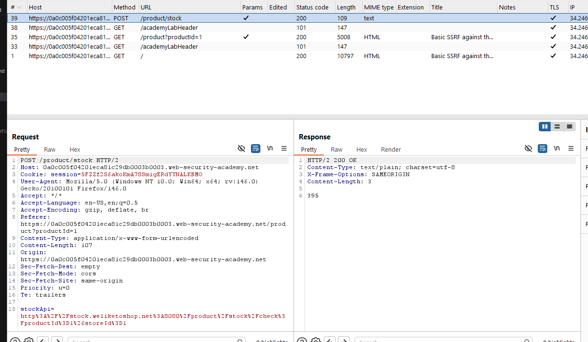   

Toàn bộ khai thác mình sẽ dựa trên gói tin tại endpoint `POST /product/stock`  
Thay đổi giá trị biến `stockapi` thành `http://localhost/admin` để truy cập giao diện admin, chuột phải và chọn Open Response in Browser hoặc chọn tab Render để xem giao diện.  
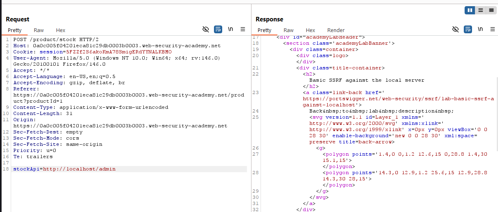  
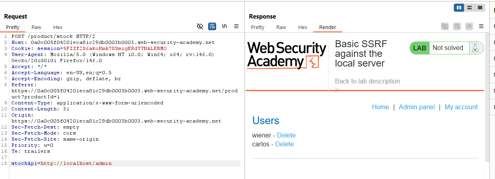  
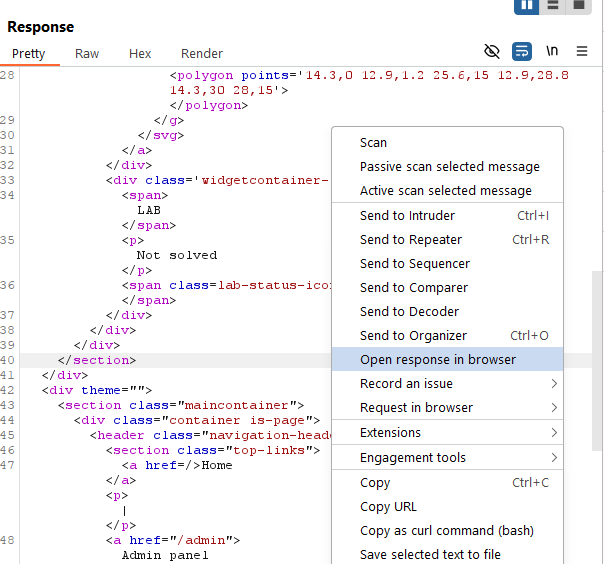  

Giao diện cho phép mình có thể xóa 2 user là carlos và wiener, phím `Delete` có vẻ là 1 thẻ `a`, thử check xem href dẫn đến đâu.   
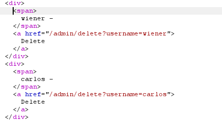   

Vậy để xóa user, cần gửi một yêu cầu `GET` đến `/admin/delete` với tham số `username` tương ứng. Và đương nhiên, để xóa cần quyền admin hoặc yêu cầu được gửi từ địa chỉ loopback.  

Payload cuối cùng điền vào stockapi
```
http://localhost/admin/delete?username=carlos
```

# Lab 02: Basic SSRF against another back-end system
Đề cung cấp thông tin lỗi SSRF trong chức năng kiểm tra số hàng trong kho, yêu cầu truy cập giao diện admin ở `192.168.0.X:8080` và xóa user carlos.  

Mình lấy gói tin check stock tương tự như lab trên.  
Đề không cung cấp địa chỉ chính xác, mình đành sử dụng Intruder để bruteforce địa chỉ chính xác. Payload fuzz của mình là `http://192.168.0.$$:8080/admin`, payload type sẽ là numbers trong khoảng từ 1-255, mình chọn gói tin dựa trên status code.    
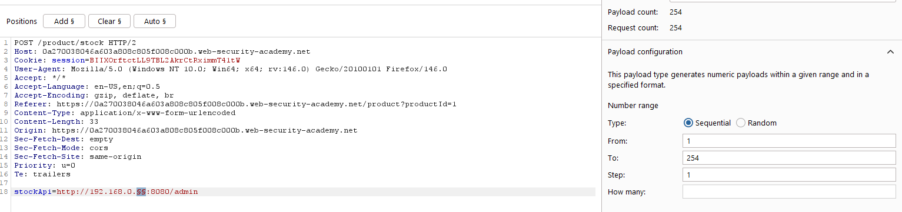  

Hoàn thành fuzz, mình tìm được 2 số cuối ip có status code hợp lệ là `1` và `49`.  
  

Trong đó `http://192.168.0.49:8080/admin` trả về admin panel.  
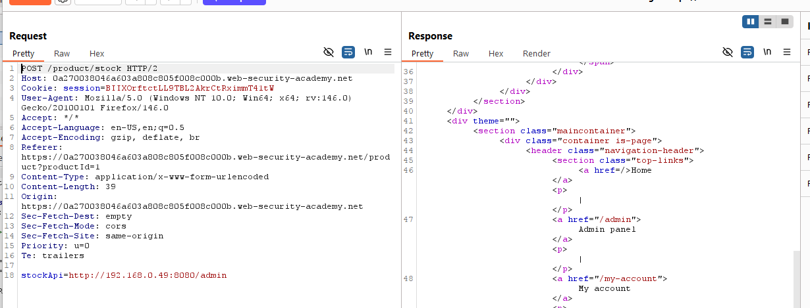   

Khai thác tương tự như lab trên, thuộc tính href để xóa user carlos có giá trị là `/http://192.168.0.49:8080/admin/delete?username=carlos`. Vậy payload là  
```
stockApi=http://192.168.0.49:8080/admin/delete?username=carlos
```
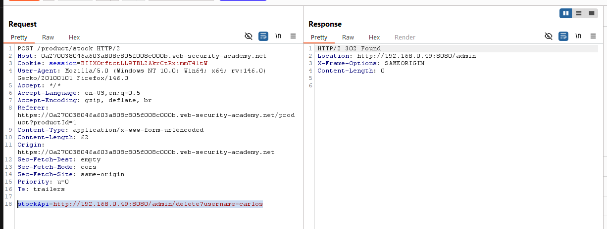  

# Lab 03: SSRF with blacklist-based input filter
Đề cung cấp thông tin lỗi SSRF trong chức năng kiểm tra số hàng trong kho, yêu cầu truy cập giao diện admin ở `http://localhost/admin` và xóa user carlos, tuy nhiên server có bộ lọc chống SSRF.  

Bộ lọc chống SSRF ở đây, thường lọc những chuỗi nhạy cảm như `localhost`, hoặc IP `127.0.0.1`. Tuy nhiên cách này hoàn toàn có thể bị bypass. Portswigger có đề cập đến một số cách để bypass, tham khảo https://portswigger.net/web-security/ssrf#circumventing-common-ssrf-defenses  
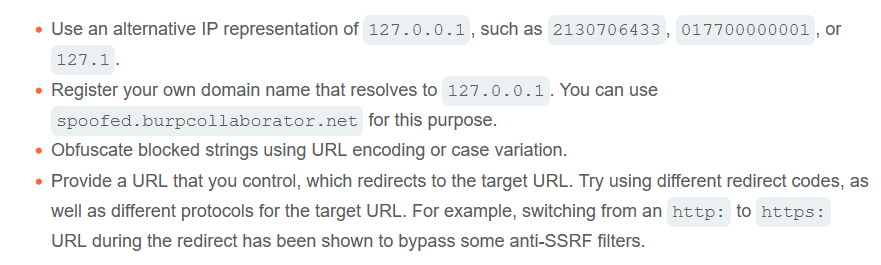  

Mình sẽ thử cách sử dụng `127.1`  
Đầu tiên thử nhập địa chỉ là `http://127.1` xem có bị chặn không đã.  
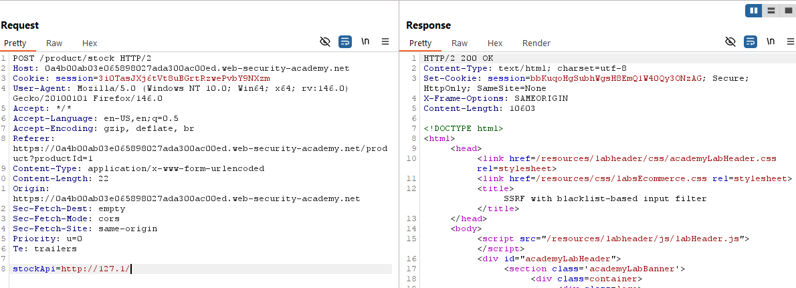  

Vậy là cách đầu bypass được, thử thêm `/admin`, tuy nhiên mình bị chặn.  
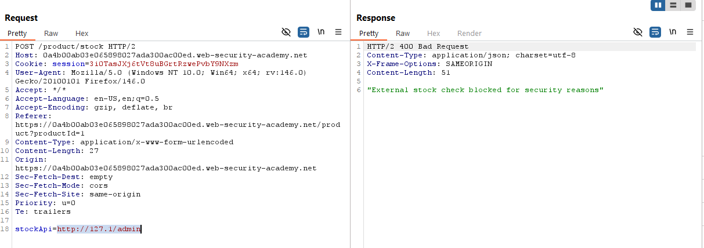  

Mình đoán server đang chặn chuỗi admin, mình thử nhập các chuỗi khác xem, như `/test` chẳng hạn.  
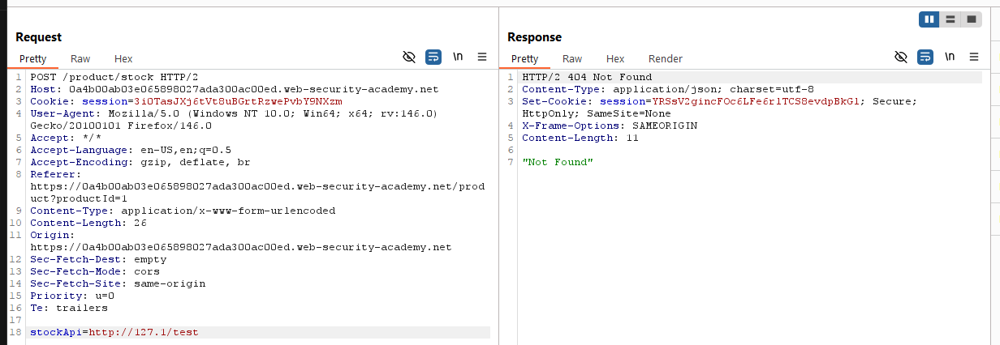  

Server chỉ trả về `404 Not Found` chứ không phải là thông báo bị chặn. Trong nội dung tham khảo, có đề cập đến việc bypass bằng URL encode, mình thử encode bằng Burp Decoder chuỗi admin xem sao.   
Chuỗi phải encode 2 lần mới bypass được, `admin` sẽ trở thành.
```
%25%36%31%25%36%34%25%36%64%25%36%39%25%36%65
```
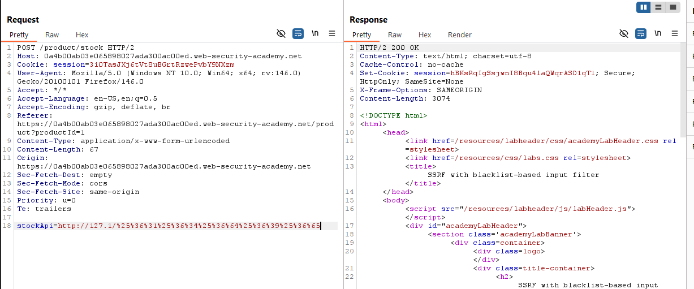  
Truy cập admin panel và xóa user carlos tương tự như các lab trước.  
```
http://127.1/%25%36%31%25%36%34%25%36%64%25%36%39%25%36%65/delete?username=carlos
```

# Lab 04: 