# Lab 01: Reflected XSS into HTML context with nothing encoded
Chèn script vào trường search  
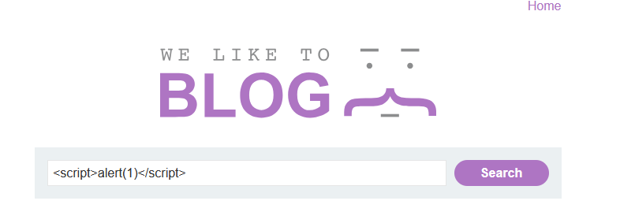

# Lab 02: Stored XSS into HTML context with nothing encoded
Chọn một post bất kỳ, mỗi post sẽ có chức năng đăng tải comment.
Ta có thể chèn script vào nội dung comment để thực hiện stored xss
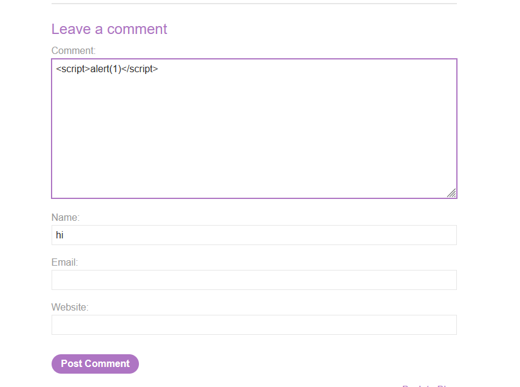

# Lab 03: DOM XSS in document.write sink using source location.search
Đề yêu cầu tìm khai thác sink document.write với source location.search. Location.search là thuộc tính trả về kết quả truy vấn trong URL, ví dụ `abc.com?params=1` thì location.search trả về `?params=1`

Vì là một lỗi JS, mình xem thử các đoạn code script của trang xem sao. Mình tìm được một đoạn JS ở endpoint `/?search=` xử lý untrusted data `location.search`  
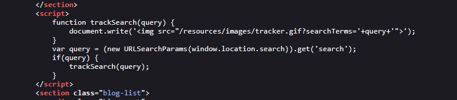  

Đoạn script tạo một thẻ `img` mới, untrusted data trong `location.search` sẽ được thêm vào đường dẫn trong thuộc tính `src=`  
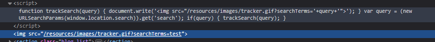  

Vì script không thực hiện sàng lọc ký tự đặc biệt, nên mình sẽ thoát khỏi dấu nháy đổi của `src` và chèn thuộc tính `onload=alert(1)`.  
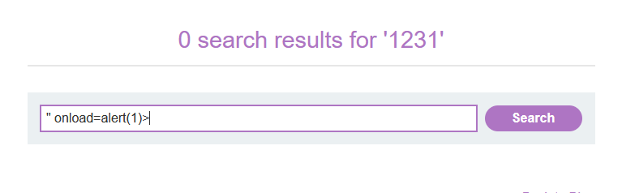  

# Lab 04: DOM XSS in innerHTML sink using source location.search
Lab này chắc cũng tương tự với lab trên, sink sẽ nằm `?search=`, xài Dev tool tìm source `location.search` cho nhanh  
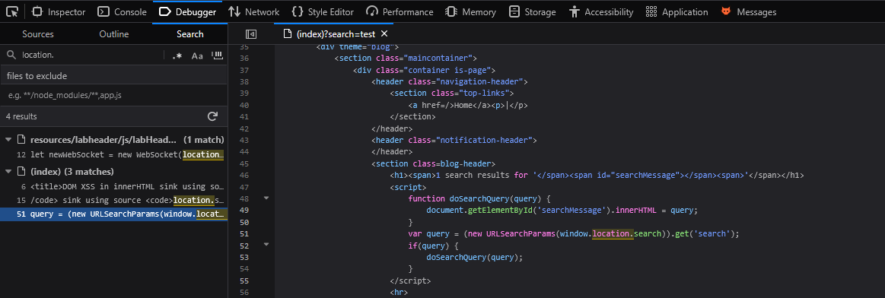  

Untrusted data được thay đổi bằng `innterHTML.getElementById('searchMessage')`, search `id="searchMessage"`, thì nó chính thẻ có nội dung `search results...gì gì đó`.

Vì `innerHTML` không nhận thẻ `script` cũng như `svg`  
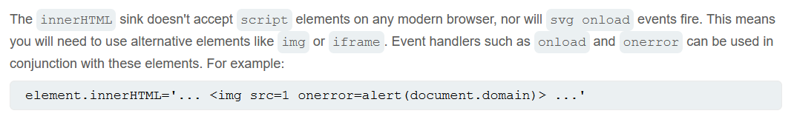 

Vậy thì xài ``
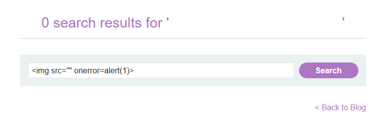  

# Lab 05: DOM XSS in document.write sink using source location.search inside a select element
Tìm được đoạn code JS với sink `location.search` trong thẻ `form`  
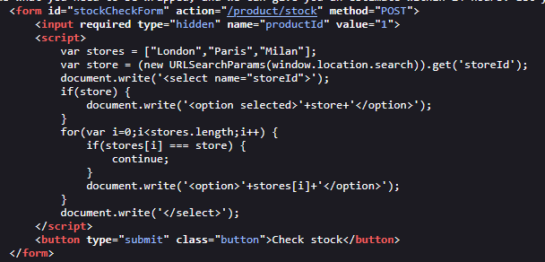  

Đoạn code thực hiện hiển thị danh sách các cửa hàng bằng thẻ `<select>` và `<option>`, nếu có biến `store` thì danh sách hiển thị giá trị biến `store`, còn không thì duyệt các giá trị có trong danh sách `stores`.

Biến `store` là một untrusted data được truyền trực tiếp từ tham số `GET storeId`. Thay đổi tham số này thì danh sách `<select>` sẽ hiển thị option này.  
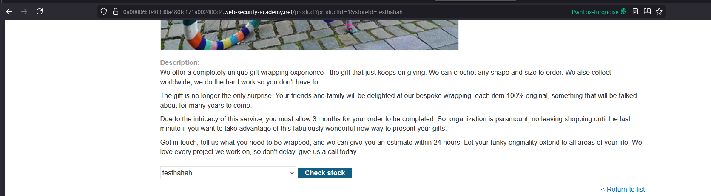  

`GET storeId` được bao trong `<option selected>'+store+'</option>`, payload cần thoát được tag `<option>`, sau đó mới chèn script.
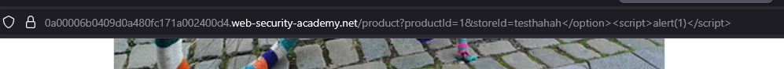  

# Lab 06: Lab: DOM XSS in jQuery anchor href attribute sink using location.search source
Tìm được code JS với sink `location.search` trong endpoint `Submit Feedback`  
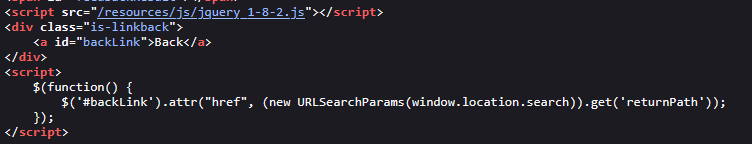  

Đoạn code thực hiện thêm thuộc tính `href` vào thẻ có `id=backLink`. Giá trị thuộc tính `href` sẽ được lấy từ tham số `GET returnPath`.  

Ta biết script có thể được thực hiện thông qua các URI scheme, tham khảo: https://en.wikipedia.org/wiki/List_of_URI_schemes#Official_IANA-registered_schemes  

Đề yêu cầu `href` của thẻ có `id=backLink` phải trả về script, vậy để làm bài này, ta sẽ thay đổi giá trị của `GET returnPath` thành scheme `javascript:alert(1)`  
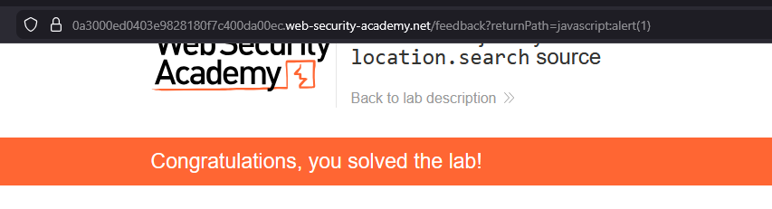  

# Lab 07: DOM XSS in jQuery selector sink using a hashchange event
Tìm được đoạn JS với sink `location.hash` ở trang index.  
  

Giải thích sơ, `location.hash` trả về giá trị sau dấu `#` trên URL, ví dụ `https://abc.com/#xyz` thì trả về `#xyz`, `onhashchange` sẽ kích hoạt dựa trên sự thay đổi của phần tử này.  

Đoạn code dựa vào quy tắc trên để cuộn đến các nội dung của trang. Vị trí được cuộn tới lưu trong biến `post`  
```javascript
var post = $('section.blog-list h2:contains(' + decodeURIComponent(window.location.hash.slice(1)) + ')');
```
Biến `post` sẽ là các thẻ `<h2>` nằm trong thẻ `<selection class="blog-list">`, các thẻ `<h2>` phải chứa nội dung giống với `location.hash.slice(1)`, `slice(1)` nhằm lược đi dấu `#`, `#xyz` --> `xyz` 


```javascript
if (post) post.get(0).scrollIntoView();
```
`post.get(0)` nhằm chuyền từ đối tượng jQuery -> DOM bình thường, `scrollIntoView()` sẽ cuộn đến thẻ `<h2>` đó

PortSwigger cung cấp khá thiếu thông tin về sink `$()` của jQuery cũng như tại sao phải sử dụng payload là `<iframe...`. Đại khái là sink không chỉ cho phép truy cập DOM mà còn cho phép tạo thêm các thẻ mới. Dựa vào đó, ta có thể tạo và kích hoạt script với `<img onerror...` và `<iframe onerror...`